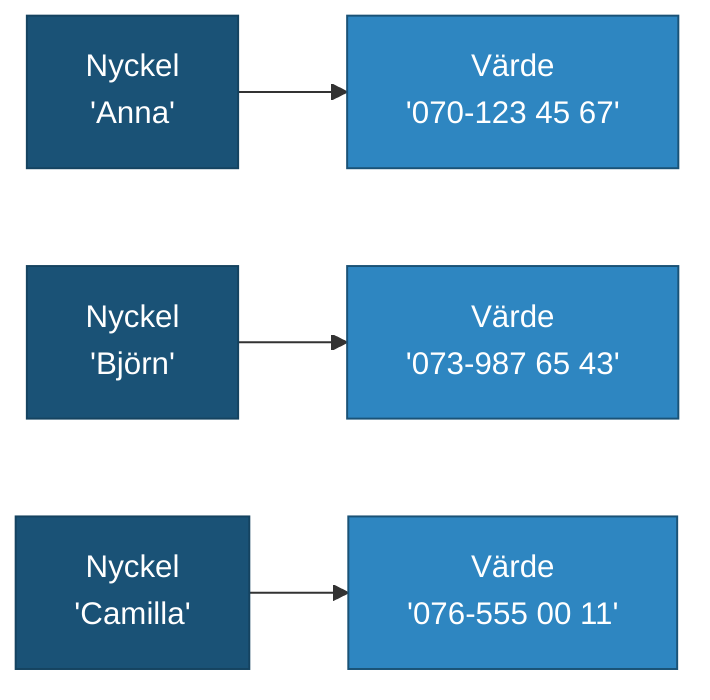

# Lästext — Dictionary

## Vad är ett dictionary?

En lista är bra för att hålla en sekvens av värden. Men ibland behöver du inte en _rad_ med data — du behöver en _uppslagstabell_.

Tänk på en telefonbok. Du letar inte igenom den från början till slut för att hitta Annas nummer. Du slår upp "Anna" och läser av numret direkt. Det är precis vad ett **dictionary** gör i kod.

Ett dictionary lagrar värden i **nyckel-värde-par**. Varje värde har en tillhörande nyckel — ett unikt ID du använder för att hämta värdet.

```csharp
// Nyckel: namn (string), Värde: telefonnummer (string)
Dictionary<string, string> phoneBook = new Dictionary<string, string>();
```

Telefonboksanalygin håller hela vägen: precis som ett namn i en telefonbok måste vara unikt (eller åtminstone tydligt), måste nyckeln i ett dictionary vara unik. Två poster kan inte ha samma nyckel.

**Se även:** [programmeringstermer/dictionary.md](../programmeringstermer/dictionary.md)

---

## Skapa och lägga till

Du skapar ett tomt dictionary och lägger sedan till par med `Add()`.

```csharp
Dictionary<string, string> phoneBook = new Dictionary<string, string>();

phoneBook.Add("Anna", "070-123 45 67");
phoneBook.Add("Björn", "073-987 65 43");
phoneBook.Add("Camilla", "076-555 00 11");
```

Varje anrop till `Add()` tar två argument: nyckeln och värdet. Ordningen de läggs till spelar ingen roll — du hämtar dem alltid via nyckeln, inte via position.



Du kan också använda indexer-syntaxen `dict["nyckel"] = value` för att lägga till eller uppdatera ett par. Skillnaden mot `Add()` är att indexer-syntaxen _skriver över_ om nyckeln redan finns, medan `Add()` kastar ett undantag.

```csharp
// Indexer — lägger till om nyckeln inte finns, uppdaterar om den finns
phoneBook["Anna"] = "070-999 00 00";
```

---

## Slå upp ett värde

Du hämtar ett värde med samma hakparentes-syntax som du använder för arrayer — men istället för ett numeriskt index anger du nyckeln.

```csharp
Dictionary<string, string> phoneBook = new Dictionary<string, string>
{
    { "Anna", "070-123 45 67" },
    { "Björn", "073-987 65 43" }
};

string annasNummer = phoneBook["Anna"];
Console.WriteLine(annasNummer);   // 070-123 45 67
```

Det viktiga att veta: om nyckeln _inte finns_ kraschar programmet med ett `KeyNotFoundException`. Det är precis som att söka i en telefonbok efter ett namn som inte finns där — men istället för ett tomt svar får du ett fel.

<details markdown="block">
<summary>Säker hämtning med TryGetValue</summary>

När du inte är säker på om nyckeln finns är `TryGetValue` det säkra alternativet. Den returnerar `true` om nyckeln hittades och lägger värdet i en `out`-variabel — annars returnerar den `false` utan att krascha.

```csharp
string number;
if (phoneBook.TryGetValue("David", out number))
{
    Console.WriteLine("Hittade: " + number);
}
else
{
    Console.WriteLine("David finns inte i telefonboken.");
}
```

Det är det rekommenderade sättet när du inte kan garantera att nyckeln finns.

</details>

---

## ContainsKey och Remove

Innan du slår upp ett värde kan du kontrollera om nyckeln existerar med `ContainsKey()`. Du tar bort ett par med `Remove()`.

```csharp
Dictionary<string, string> phoneBook = new Dictionary<string, string>
{
    { "Anna", "070-123 45 67" },
    { "Björn", "073-987 65 43" }
};

// Kolla om en nyckel finns
Console.WriteLine(phoneBook.ContainsKey("Anna"));    // True
Console.WriteLine(phoneBook.ContainsKey("David"));   // False

// Ta bort ett par
phoneBook.Remove("Björn");
Console.WriteLine(phoneBook.ContainsKey("Björn"));   // False
```

`Remove()` returnerar `true` om nyckeln hittades och togs bort, och `false` om nyckeln inte fanns. Det kastar inget undantag om nyckeln saknas.

---

## Loopa med foreach

För att gå igenom alla par i ett dictionary använder du `foreach` med typen `KeyValuePair<TKey, TValue>`. Via `.Key` och `.Value` kommer du åt nyckel respektive värde.

```csharp
Dictionary<string, int> highscores = new Dictionary<string, int>
{
    { "Anna", 9500 },
    { "Björn", 7200 },
    { "Carina", 11400 }
};

foreach (KeyValuePair<string, int> post in highscores)
{
    Console.WriteLine(post.Key + ": " + post.Value + " poäng");
}
```

En viktig detalj: ordningen i ett dictionary är **inte garanterad**. Om du behöver en bestämd ordning måste du sortera resultatet separat. Det är en av skillnaderna mot en lista, där elementen alltid är i den ordning du lade till dem.

---

## När använder man Dictionary?

Välj dictionary när du vill **slå upp** ett värde med ett meningsfullt ID — ett namn, en produktkod, en stad. Välj lista när du vill ha en **sekvens** av värden och ordningen spelar roll.

| | List\<T\> | Dictionary\<TKey, TValue\> |
|---|---|---|
| Hämta element | Via position: `list[2]` | Via nyckel: `dict["Anna"]` |
| Kolla om något finns | `Contains(value)` | `ContainsKey(key)` |
| Typisk användning | Shoppinglista, highscore-lista | Telefonbok, konfiguration, räknare |

Några vanliga användningsfall för dictionary:

- **Räknare** — räkna hur många gånger ett ord förekommer i en text (`Dictionary<string, int>`)
- **Konfiguration** — mappa inställningsnamn till värden (`Dictionary<string, string>`)
- **Snabb uppslagning** — hämta en produkt via artikelnummer utan att loopa igenom hela listan

**Se även:** [programmeringstermer/dictionary.md](../programmeringstermer/dictionary.md)
