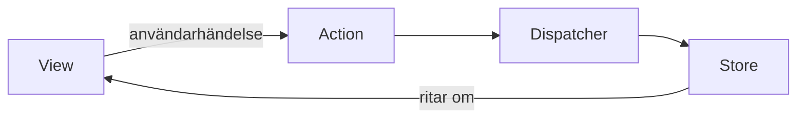
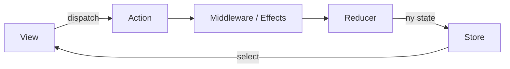

# Flux och Redux — Blazor med Fluxor

> Del 6 av [UI-arkitektur](../). **Bygger på:** [komponentarkitektur](../komponenter/) — men när många delar ändrar samma state blir det svårt att veta *varför* skärmen visar det den visar.

## När du läst detta ska du kunna

- Förklara enkelriktat dataflöde och varför det infördes
- Skriva en reducer som en ren funktion
- Använda Fluxor i Blazor — och avgöra när en scoped service räcker

## Bakgrund och idé

Facebook hade ett problem 2014: i stora appar med MVC/MVVM-liknande modeller kunde modell A uppdatera vy B som uppdaterade modell C som uppdaterade vy A… Ingen kunde längre svara på frågan *varför visar skärmen det här?* (Det klassiska exemplet var notisräknaren för chatten som visade fel siffra.) Svaret blev **Flux**: data får bara flöda i **en riktning**.



## Så läser du Flux-diagrammet
 vyn får aldrig ändra state direkt. Den skapar en **Action** — ett litet objekt som beskriver vad som hände ("LäggTillVara: mjölk"). **Dispatchern** skickar actionen till alla **stores**, som uppdaterar sig och meddelar vyn. Pilarna går i en cirkel, aldrig baklänges.

Redux (Dan Abramov och Andrew Clark, 2015) förenklade Flux, inspirerat av Elm:



## Så läser du Redux-diagrammet


1. Det finns **en enda store** — en enda källa till sanning för hela appen.
2. Vyn **dispatchar** en action.
3. **Middleware** (i Fluxor: *effects*) får se actionen först. Här bor allt som har sidoeffekter: HTTP-anrop, loggning, timers.
4. **Reducern** är en *ren funktion*: `(gammal state, action) → ny state`. Den ändrar aldrig något, den skapar ett nytt state-objekt.
5. Storen byter till den nya staten och vyn **selectar** (väljer ut) den del den behöver och ritar om.

Eftersom state aldrig muteras och varje ändring är en action kan du logga varje action och "spola tillbaka" appen — det kallas *time-travel debugging*.

Så här ser mekanismen ut utan något bibliotek. Lägg märke till att `Kundvagn`-klassen med sitt event inte används längre — state är nu en **immutabel record**:

```csharp
using System.Collections.Immutable;

// State: immutabel. Ändras aldrig — ersätts.
public record KundvagnState(ImmutableList<string> Varor)
{
    public static KundvagnState Tom { get; } = new(ImmutableList<string>.Empty);
}

// Actions: beskriver VAD som hände, inte hur state ska ändras
public interface IKundvagnAction;
public record LäggTillVara(string Vara) : IKundvagnAction;
public record TaBortVara(string Vara) : IKundvagnAction;

// Reducer: ren funktion (state, action) → ny state
public static class KundvagnReducer
{
    public static KundvagnState Reduce(KundvagnState state, IKundvagnAction action) => action switch
    {
        LäggTillVara a => state with { Varor = state.Varor.Add(a.Vara) },
        TaBortVara a   => state with { Varor = state.Varor.Remove(a.Vara) },
        _              => state
    };
}

// Store: håller nuvarande state och är den ENDA som byter ut den
public class Store<TState, TAction>(TState start, Func<TState, TAction, TState> reducer)
{
    public TState State { get; private set; } = start;
    public event Action<TState>? Ändrad;

    public void Dispatch(TAction action)
    {
        State = reducer(State, action);
        Ändrad?.Invoke(State);
    }
}
```

```csharp
var store = new Store<KundvagnState, IKundvagnAction>(KundvagnState.Tom, KundvagnReducer.Reduce);
store.Ändrad += s => Console.WriteLine($"[Vy] {string.Join(", ", s.Varor)}");

var föreÄndring = store.State;
store.Dispatch(new LäggTillVara("mjölk"));
store.Dispatch(new LäggTillVara("bröd"));
store.Dispatch(new TaBortVara("mjölk"));

Console.WriteLine($"Gamla staten är orörd: {föreÄndring.Varor.Count} varor");

// [Vy] mjölk
// [Vy] mjölk, bröd
// [Vy] bröd
// Gamla staten är orörd: 0 varor
```

## Samma sak med Fluxor

[Fluxor](https://github.com/mrpmorris/Fluxor) (Peter Morris) är Redux för .NET och används främst med Blazor. Biblioteket står för store och dispatcher — du skriver state, actions, reducers och effects.

```csharp
using System.Collections.Immutable;
using Fluxor;

[FeatureState]
public record KundvagnState(ImmutableList<string> Varor)
{
    // Fluxor skapar startvärdet via en parameterlös konstruktor
    private KundvagnState() : this(ImmutableList<string>.Empty) { }
}

public record LäggTillVaraAction(string Vara);
public record TaBortVaraAction(string Vara);

public static class KundvagnReducers
{
    [ReducerMethod]
    public static KundvagnState LäggTill(KundvagnState state, LäggTillVaraAction action)
        => state with { Varor = state.Varor.Add(action.Vara) };

    [ReducerMethod]
    public static KundvagnState TaBort(KundvagnState state, TaBortVaraAction action)
        => state with { Varor = state.Varor.Remove(action.Vara) };
}

// Effects: sidoeffekter (API-anrop, loggning). Reducers ska förbli rena.
public class KundvagnEffects(ILogger<KundvagnEffects> logger)
{
    [EffectMethod]
    public Task LoggaNyVara(LäggTillVaraAction action, IDispatcher dispatcher)
    {
        logger.LogInformation("Vara tillagd: {Vara}", action.Vara);
        return Task.CompletedTask;
    }
}
```

```razor
@* Components/Pages/KundvagnSida.razor *@
@page "/kundvagn"
@rendermode InteractiveServer
@inherits Fluxor.Blazor.Web.Components.FluxorComponent
@inject IState<KundvagnState> State
@inject IDispatcher Dispatcher

<input @bind="nyVara" />
<button @onclick="LäggTill">Lägg till</button>

<ul>
    @foreach (var vara in State.Value.Varor)
    {
        <li>@vara <button @onclick="() => Dispatcher.Dispatch(new TaBortVaraAction(vara))">x</button></li>
    }
</ul>

@code {
    private string nyVara = "";

    private void LäggTill()
    {
        Dispatcher.Dispatch(new LäggTillVaraAction(nyVara));
        nyVara = "";
    }
}
```

```csharp
using Fluxor;

var builder = WebApplication.CreateBuilder(args);

builder.Services.AddRazorComponents().AddInteractiveServerComponents();
builder.Services.AddFluxor(o => o.ScanAssemblies(typeof(Program).Assembly));

var app = builder.Build();
app.UseAntiforgery();
app.MapRazorComponents<App>().AddInteractiveServerRenderMode();
app.Run();
```

Glöm inte `<Fluxor.Blazor.Web.StoreInitializer />` högst upp i `Routes.razor` (eller `App.razor`) — utan den startar storen aldrig.

## Mappstruktur

en mapp per *feature* i storen, med state, actions, reducers och effects bredvid varandra:

```text
KundvagnFluxor/
├── Components/
│   ├── Pages/
│   │   └── KundvagnSida.razor
│   ├── App.razor
│   └── Routes.razor             ← <StoreInitializer />
├── Store/
│   └── KundvagnFeature/
│       ├── KundvagnState.cs
│       ├── Actions.cs
│       ├── KundvagnReducers.cs
│       └── KundvagnEffects.cs
└── Program.cs                   ← AddFluxor(...)
```

**Behöver du Fluxor?** Ofta inte. Mängden kod ovan jämfört med `KundvagnTjänst` på [förra sidan](../komponenter/#state-management-i-blazor--oftast-räcker-det-enkla) säger det mesta. Fluxor lönar sig när många komponenter läser och ändrar samma state, när du behöver kunna spåra *varför* state ändrades, eller när teamet redan kan Redux.

## I React-världen efter Redux

Redux kritiserades för mycket boilerplate, och React-världen har gått vidare till enklare bibliotek. Bra att känna till namnen:

| Bibliotek | År | Idé | Komplexitet | Status 2026 |
|---|---|---|---|---|
| Flux | 2014 | Dispatcher + flera stores | Medel | Historisk |
| Redux | 2015 | En store, rena reducers | Hög | Legacy / stora kodbaser |
| Recoil | 2020 | Atoms + selectors för härledd state | Medel | Stabil |
| Zustand | 2019 | Minimal store via hooks, ingen Provider | Låg | Populärt val |
| Jotai | 2021 | Atoms — minsta möjliga state-enheter | Låg | Växer snabbt |

---

← [Komponentarkitektur](../komponenter/) · [MVU](../mvu/) →
