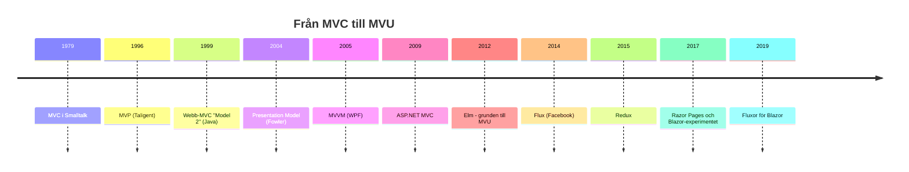

# UI-arkitektur: från MVC till Flux

Varje program med ett användargränssnitt måste lösa samma problem: användaren gör något, data ändras, och skärmen ska visa den nya datan. Det låter enkelt, men om du lägger allt i samma klass (eller samma `Form1.cs`) får du snabbt ett [God Object](../antipatterns.md) där knapptryck, affärsregler och databasanrop är ihoptrasslade.

UI-arkitekturerna i den här avdelningen är olika svar på frågan *hur delar vi upp det där?* De har vuxit fram ur varandra under nästan 50 år, och varje nytt mönster är en reaktion på något som skavde i det förra. Förstår du *varför* de uppstod blir det mycket lättare att välja rätt — och att känna igen mönstret i ett ramverk du aldrig sett förut.

Den här sidan ger översikten och jämförelsen. Varje mönster har sedan en egen sida med diagram, förklaring, mappstruktur och kod som kompilerar.

## När du läst detta ska du kunna

- Förklara skillnaden mellan MVC, MVP, MVVM, Flux/Redux och MVU
- Peka ut vilket mönster ASP.NET MVC, Razor Pages, WinForms, WPF/MAUI och Blazor bygger på
- Känna igen typisk mappstruktur för varje mönster
- Välja ett rimligt mönster för en ny applikation — och motivera valet

## Tidslinjen



**Så läser du tidslinjen:** åren visar när mönstret fick sitt namn eller sin första stora implementation, inte när det blev populärt. Sidorna följer sedan *släktlinjerna* snarare än exakt kronologi: först MVC och dess webbvariant, sedan grenen MVP → MVVM som växte fram i skrivbordsappar, och sist grenen Flux → Redux → MVU som bygger på enkelriktat dataflöde.

## Tre frågor som skiljer mönstren åt

Alla mönster nedan delar upp koden i ungefär samma tre delar: **data** (modellen), **det användaren ser** (vyn) och **något däremellan**. Det som skiljer dem är svaren på tre frågor:

1. **Var bor state?** — I en modell som kan ändras? I en ViewModel? I en enda central store?
2. **Vem får ändra den?** — Vem som helst, bara en controller/presenter, eller bara en ren funktion (reducer)?
3. **Hur når ändringen vyn?** — Vyn lyssnar på modellen, presentern pushar till vyn, databindning, eller hela vyn ritas om från ny state?

Håll de frågorna i huvudet medan du läser — de är nyckeln till [tabellen längst ner](#vilket-ska-jag-välja).

## Mönstren — läs dem i ordning

1. [MVC](mvc.md) — Smalltalk 1979, där allt började
2. [Webb-MVC och Razor Pages](webb-mvc.md) — MVC anpassat till HTTP
3. [MVP](mvp.md) — testbar logik i WinForms
4. [MVVM](mvvm.md) — databindning i WPF och MAUI
5. [Komponentarkitektur](komponenter.md) — Blazor och delad state med en scoped service
6. [Flux och Redux](flux-redux.md) — enkelriktat dataflöde, i Blazor via Fluxor
7. [MVU](mvu.md) — Elm-arkitekturen, rena funktioner hela vägen

Varje sida börjar med vilket problem i det förra mönstret den löser, så det går också bra att hoppa in direkt.

## Exemplet: en kundvagn

För att kunna jämföra använder alla mönster samma lilla domän: en kundvagn där man kan lägga till och ta bort varor. Det här är **modellen** — ren C#, ingen UI-kod. Den används av [MVC](mvc.md), [MVP](mvp.md) och [MVVM](mvvm.md).

```csharp
// Modellen: data + regler. Den vet ingenting om skärmar, knappar eller HTTP.
public class Kundvagn
{
    private readonly List<string> _varor = new();

    public IReadOnlyList<string> Varor => _varor;

    // Modellen ropar ut att den ändrats — vem som lyssnar är inte dess problem
    public event Action? Ändrad;

    public void LäggTill(string vara)
    {
        _varor.Add(vara);
        Ändrad?.Invoke();
    }

    public void TaBort(string vara)
    {
        if (_varor.Remove(vara))
            Ändrad?.Invoke();
    }
}
```

Lägg märke till `event Action? Ändrad` — det är [Observer-mönstret](../gof/behavioral/observer.md). Det är ryggraden i klassisk MVC, och det är exakt det som Flux och MVU senare gör sig av med.

## Fler du kommer stöta på

- **MVI (Model-View-Intent)** — MVU-tanken från JavaScript-biblioteket Cycle.js (2015), mycket vanlig i Android-utveckling. *Intent* motsvarar meddelanden.
- **Presentation Model** — Fowlers namn (2004) på det som blev MVVM. Dyker upp i äldre litteratur.
- **Supervising Controller / Passive View** — de två varianterna av MVP (se [MVP](mvp.md#passive-view-eller-supervising-controller)).
- **Atom-baserad state** (Jotai, Recoil, Signals i Angular/Solid) — i stället för en stor store har varje litet värde sin egen prenumeration, och härledda värden räknas om automatiskt.
- **Static SSR med interaktiva öar** — i .NET 8+ kan Blazor rendera sidor som vanlig serverrenderad HTML (som MVC) och bara göra vissa komponenter interaktiva. Det suddar ut gränsen mellan webb-MVC och komponentarkitektur.

## Vilket ska jag välja?

| Mönster | Typisk plattform | Var bor state? | Hur når ändringen vyn? | Välj när | Undvik när |
|---|---|---|---|---|---|
| [MVC](mvc.md) (klassisk) | Smalltalk, äldre GUI | Muterbar modell | Vyn lyssnar på modellen | Du vill förstå grunden | Stora appar — event-spaghetti |
| [Webb-MVC](webb-mvc.md) | ASP.NET MVC | Databas / tjänster | Ny HTML per förfrågan | Serverrenderade sajter, SEO, många sidor | Mycket interaktivitet i webbläsaren |
| [Razor Pages](webb-mvc.md#razor-pages--page-controller) | ASP.NET Core | Databas / tjänster | Ny HTML per förfrågan | Formulär- och CRUD-sidor, enklare än MVC | Du behöver ett API för andra klienter också |
| [MVP](mvp.md) | WinForms | Modell, presentern synkar | Presentern anropar vyn | WinForms där logiken ska vara testbar | Plattformen har bra databindning |
| [MVVM](mvvm.md) | WPF, MAUI, Avalonia | ViewModel | Databindning | XAML-plattformar | Plattform utan databindning |
| [Komponenter](komponenter.md) + scoped service | Blazor | Komponenten / tjänst | Re-render vid ändring | De flesta Blazor-appar | — börja alltid här i Blazor |
| [Flux/Redux](flux-redux.md) | Blazor (Fluxor), React | En central store | Vyn selectar ny state | Mycket delad state, spårbarhet, stort team | Små appar — boilerplaten kostar mer än den ger |
| [MVU](mvu.md) | Elm, Fabulous, MauiReactor | En enda immutabel modell | Vyn är en funktion av modellen | Du gillar funktionell stil och förutsägbarhet | Teamet är vant vid MVVM och verktygen saknas |

Och om valet står mellan plattformar snarare än mönster:

| | MVC + Razor | React | Blazor |
|---|---|---|---|
| Språk | C# | JS/TS | C# |
| UI-modell | Serverrenderat | Komponenter (klient) | Komponenter (server/klient) |
| Interaktivitet | Egen JS | Inbyggt | Inbyggt |
| Ekosystem | .NET | Enormt (npm) | .NET + JS interop |
| Fullstack i ett språk | Delvis | Med Node | **Ja** |
| Mognad för UI-bibliotek | Hög | Mycket hög | Medel |

En tumregel: **välj det mönster plattformen är byggd för.** WPF är byggt för MVVM, ASP.NET MVC för MVC och Blazor för komponenter. Att tvinga in MVP i WPF eller Redux i en liten Blazor-app ger dig all kostnad och lite av vinsten.

## TL;DR

- Alla mönstren delar upp **data**, **vy** och **något däremellan** — skillnaden är var state bor, vem som får ändra den och hur ändringen når vyn.
- **MVC** (1979): vyn lyssnar på modellen. **Webb-MVC**: ingen lyssnar — ny HTML per förfrågan.
- **MVP**: vyn är dum och nås via ett interface, presentern gör allt. Bra för testbar WinForms.
- **MVVM**: ViewModel känner inte till vyn, databindningen synkar. Standard i WPF och MAUI.
- **Flux/Redux**: enkelriktat flöde, en store, rena reducers. I Blazor via Fluxor — men en scoped service räcker oftast.
- **MVU**: hela appen är `Model → View → Meddelande → Update → Model`. Rena funktioner hela vägen.
