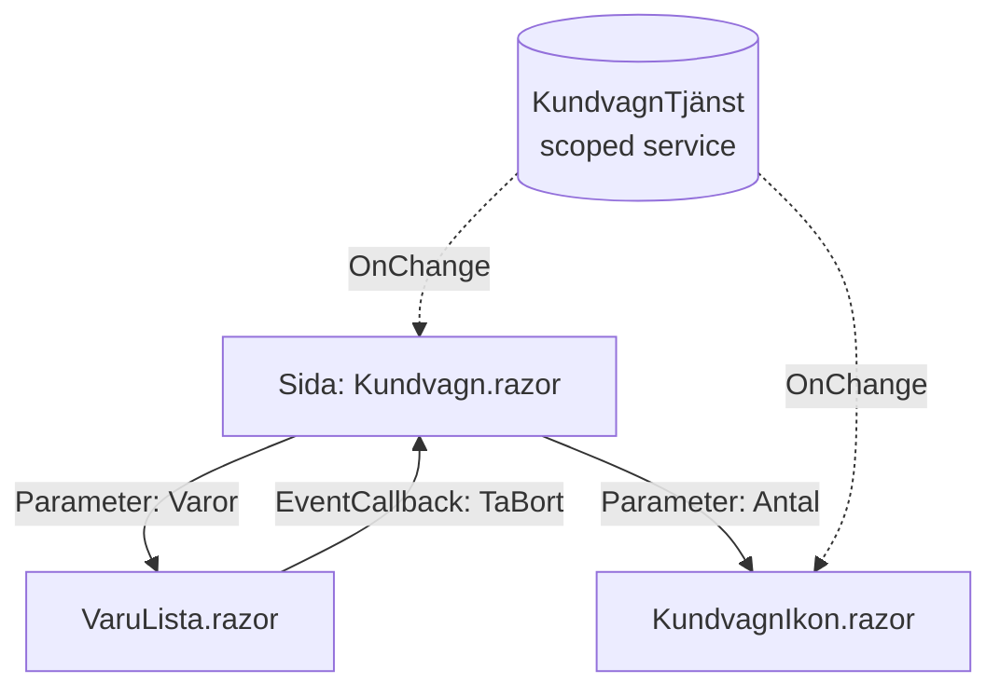

# Komponentarkitektur — Blazor

> Del 5 av [UI-arkitektur](index.md). **Bygger på:** [MVVM](mvvm.md) — vy och ViewModel slås ihop till en komponent, och skärmen ritas om från komponentens state.

## När du läst detta ska du kunna

- Förklara hur data flödar nedåt och händelser uppåt mellan komponenter
- Dela state mellan komponenter med en scoped service
- Översätta begrepp mellan React, MVC och Blazor

## Bakgrund och idé

React (2013) och sedan Blazor (2018) bygger UI av **komponenter**: små, självständiga bitar som har sin egen markup, sin egen state och tar emot data via parametrar. En komponent är på sätt och vis vy och ViewModel i samma fil — och hela sidan ritas om från komponentens state när något ändras.



## Så läser du diagrammet


1. Data flödar **nedåt** som parametrar (`[Parameter]`, motsvarar props i React).
2. Händelser flödar **uppåt** via `EventCallback` — barnet säger "användaren vill ta bort mjölk", föräldern bestämmer vad som händer.
3. State som flera komponenter längst bort från varandra behöver läggs i en **scoped service**. Komponenterna lyssnar på dess `OnChange` (streckade pilar) och ritar om sig.

Om du kommer från React eller MVC hjälper den här översättningstabellen:

| React | MVC / Razor | Blazor |
|---|---|---|
| Function component | Partial view / ViewComponent | `.razor`-komponent |
| Props | ViewModel / TagHelper-attribut | `[Parameter]` |
| `children` | `@RenderBody()` / sections | `RenderFragment ChildContent` |
| `useState` | – (stateless) | Fält + automatisk re-render |
| `useEffect` | – | Lifecycle-metoder |
| Context API | – | `CascadingValue` |
| React Router | Attribute routing | `@page "/route"` |
| Controlled inputs | Model binding | `@bind` / `EditForm` |

## State management i Blazor — oftast räcker det enkla

I Blazor behövs ingen Redux för att dela state. De vanliga valen, från enklast:

- **Lokalt state**: fält i komponenten
- **Delat state**: en **scoped service** med `event Action? OnChange`
- **Cascading values**: `<CascadingValue Value="tema">` (motsvarar Context i React)
- **Persistens**: `ProtectedBrowserStorage`, URL/query-sträng, databas

Den scoped servicen är egentligen MVC-modellen från 1979 igen — en klass som ropar ut när den ändrats:

```csharp
public class KundvagnTjänst
{
    public event Action? OnChange;

    public List<string> Varor { get; } = new();

    public void LäggTill(string vara)
    {
        Varor.Add(vara);
        OnChange?.Invoke();
    }
}
```

```razor
@* Components/KundvagnIkon.razor *@
@implements IDisposable
@inject KundvagnTjänst Kundvagn

<span>🛒 @Kundvagn.Varor.Count</span>

@code {
    protected override void OnInitialized() => Kundvagn.OnChange += Uppdatera;

    // InvokeAsync behövs om OnChange kan komma från en annan tråd
    private void Uppdatera() => InvokeAsync(StateHasChanged);

    // Avregistrera — annars läcker komponenten minne
    public void Dispose() => Kundvagn.OnChange -= Uppdatera;
}
```

⚠️ `builder.Services.AddScoped<KundvagnTjänst>()` betyder **per circuit** i Blazor Server och **per webbläsarflik** i WebAssembly — inte per HTTP-förfrågan som i MVC.

## Mappstruktur

standardmallen `dotnet new blazor`, plus en mapp för tjänsterna:

```text
KundvagnBlazor/
├── Components/
│   ├── Layout/
│   │   └── MainLayout.razor
│   ├── Pages/
│   │   └── Kundvagn.razor       ← @page "/kundvagn"
│   ├── Shared/
│   │   ├── VaruLista.razor      ← återanvändbara komponenter
│   │   └── KundvagnIkon.razor
│   ├── App.razor
│   └── _Imports.razor
├── Services/
│   └── KundvagnTjänst.cs        ← delad state
└── Program.cs
```

Läs mer om grunderna i [Blazor](../../aspnetcore/blazor.md).

---

← [MVVM](mvvm.md) · [Flux och Redux](flux-redux.md) →
