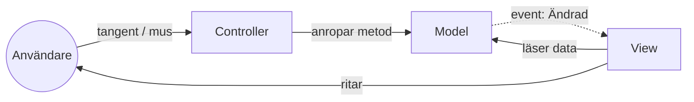

# MVC — Smalltalk 1979

> Del 1 av [UI-arkitektur](index.md). Här börjar allt. Modellen `Kundvagn` som används här finns i [översikten](index.md#exemplet-en-kundvagn).

## När du läst detta ska du kunna

- Förklara de tre rollerna i klassisk MVC och vem som pratar med vem
- Förklara varför modellen inte känner till vyn
- Känna igen Observer-mönstret i MVC

## Bakgrund och idé

Trygve Reenskaug formulerade MVC på Xerox PARC 1979 för Smalltalk. Problemet han löste: grafiska gränssnitt var nytt, och koden för *att rita* blandades med koden för *att reagera på musen* och *datan själv*. Lösningen blev tre roller med var sitt ansvar.



## Så läser du diagrammet


1. Användaren trycker på en tangent. Det är **Controllern** som tar emot input — inte vyn.
2. Controllern översätter input till ett anrop på **Modellen** (`LäggTill`, `TaBort`). Controllern har ingen egen data.
3. Modellen ändrar sig själv och skickar ut ett event (streckad pil = "jag säger bara till, jag vet inte vem som lyssnar").
4. **Vyn** prenumererar på eventet, läser den nya datan direkt från modellen och ritar om sig.

Det viktiga: modellen känner inte till vyn. Du kan ha tre vyer av samma modell (en lista, en summa, en ikon) och alla uppdateras automatiskt.

```csharp
// Vyn prenumererar på modellen och ritar om sig när den ändras
public class KundvagnVy
{
    public KundvagnVy(Kundvagn modell)
    {
        modell.Ändrad += () =>
            Console.WriteLine($"[Vy] Antal: {modell.Varor.Count} – {string.Join(", ", modell.Varor)}");
    }
}

// Controllern översätter användarens input till anrop på modellen
public class KundvagnController
{
    private readonly Kundvagn _modell;

    public KundvagnController(Kundvagn modell) => _modell = modell;

    public void HanteraKommando(string rad)
    {
        // "+mjölk" lägger till, "-mjölk" tar bort
        if (rad.StartsWith('+')) _modell.LäggTill(rad[1..]);
        else if (rad.StartsWith('-')) _modell.TaBort(rad[1..]);
    }
}
```

```csharp
var modell = new Kundvagn();
var vy = new KundvagnVy(modell);
var controller = new KundvagnController(modell);

foreach (var kommando in new[] { "+mjölk", "+bröd", "-mjölk" })
    controller.HanteraKommando(kommando);

// [Vy] Antal: 1 – mjölk
// [Vy] Antal: 2 – mjölk, bröd
// [Vy] Antal: 1 – bröd
```

## Mappstruktur

i en liten konsolapp räcker det med en mapp per roll:

```text
KundvagnMvc/
├── Models/
│   └── Kundvagn.cs
├── Views/
│   └── KundvagnVy.cs
├── Controllers/
│   └── KundvagnController.cs
└── Program.cs              ← kopplar ihop de tre
```

---

← [Översikt](index.md) · [Webb-MVC och Razor Pages](webb-mvc.md) →
