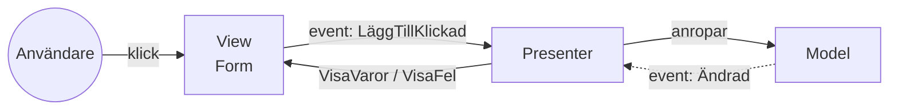

# MVP — WinForms

> Del 3 av [UI-arkitektur](index.md). **Bygger på:** [MVC](mvc.md) — men i WinForms tar kontrollerna själva emot input, och logik i `Form1.cs` går inte att testa. Modellen `Kundvagn` som används här finns i [översikten](index.md#exemplet-en-kundvagn).

## När du läst detta ska du kunna

- Förklara presenterns roll och varför vyn nås via ett interface
- Testa en presenter med en falsk vy, utan att öppna ett fönster
- Skilja Passive View från Supervising Controller

## Bakgrund och idé

I skrivbordsappar som Windows Forms tar kontrollerna själva emot musklick — det finns ingen plats för en separat Controller som fångar input. Samtidigt är logik i `Form1.cs` nästan omöjlig att testa, eftersom du måste starta ett fönster. MVP (Taligent 1996, populariserat i .NET runt 2004–2006) löser det genom att göra vyn **dum** och flytta all logik till en **Presenter**.



## Så läser du diagrammet


1. Användaren klickar i **vyn** (formuläret). Vyn gör ingenting själv — den berättar bara för presentern att något hände.
2. **Presentern** läser det vyn innehåller, validerar och anropar **modellen**.
3. Modellen säger till att den ändrats. Notera att det är *presentern* som lyssnar, inte vyn.
4. Presentern talar om för vyn exakt vad den ska visa (`VisaVaror`, `VisaFel`).

Skillnaden mot MVC: **vyn och modellen pratar aldrig med varandra.** All trafik går genom presentern. Och presentern pratar med vyn via ett **interface** — det är hela tricket.

```csharp
// Kontraktet: allt presentern behöver från vyn. Inget WinForms här!
public interface IKundvagnVy
{
    event Action? LäggTillKlickad;
    string NyVara { get; set; }
    void VisaVaror(IReadOnlyList<string> varor);
    void VisaFel(string meddelande);
}

public class KundvagnPresenter
{
    private readonly IKundvagnVy _vy;
    private readonly Kundvagn _modell;

    public KundvagnPresenter(IKundvagnVy vy, Kundvagn modell)
    {
        _vy = vy;
        _modell = modell;

        _vy.LäggTillKlickad += LäggTill;
        _modell.Ändrad += () => _vy.VisaVaror(_modell.Varor);
    }

    private void LäggTill()
    {
        if (string.IsNullOrWhiteSpace(_vy.NyVara))
        {
            _vy.VisaFel("Skriv ett varunamn först.");
            return;
        }

        _modell.LäggTill(_vy.NyVara.Trim());
        _vy.NyVara = "";
    }
}
```

Formuläret implementerar interfacet och gör bara det — läser och skriver kontroller. (Här byggs kontrollerna i kod för att exemplet ska bli komplett; i ett riktigt projekt gör du det i [designern](../../gui/windows-forms.md).)

```csharp
using System.ComponentModel;

public class KundvagnForm : Form, IKundvagnVy
{
    private readonly TextBox _txtVara = new() { Dock = DockStyle.Top };
    private readonly Button _btnLäggTill = new() { Text = "Lägg till", Dock = DockStyle.Top };
    private readonly ListBox _lstVaror = new() { Dock = DockStyle.Fill };

    public KundvagnForm()
    {
        Text = "Kundvagn";
        Controls.Add(_lstVaror);
        Controls.Add(_btnLäggTill);
        Controls.Add(_txtVara);

        _btnLäggTill.Click += (_, _) => LäggTillKlickad?.Invoke();
    }

    public event Action? LäggTillKlickad;

    // Utan attributet ger .NET 9+ felet WFO1000: designern ska inte försöka spara egenskapen
    [DesignerSerializationVisibility(DesignerSerializationVisibility.Hidden)]
    public string NyVara
    {
        get => _txtVara.Text;
        set => _txtVara.Text = value;
    }

    public void VisaVaror(IReadOnlyList<string> varor) => _lstVaror.DataSource = varor.ToList();

    public void VisaFel(string meddelande) => MessageBox.Show(meddelande, "Kundvagn");
}
```

```csharp
static class Program
{
    [STAThread]
    static void Main()
    {
        ApplicationConfiguration.Initialize();

        var form = new KundvagnForm();
        _ = new KundvagnPresenter(form, new Kundvagn());

        Application.Run(form);
    }
}
```

Vinsten syns i testet: presentern kan testas med en låtsasvy, utan att något fönster öppnas.

```csharp
using Xunit;

public class FalskVy : IKundvagnVy
{
    public event Action? LäggTillKlickad;
    public string NyVara { get; set; } = "";
    public string? SenasteFel { get; private set; }
    public IReadOnlyList<string> VisadeVaror { get; private set; } = [];

    public void Klicka() => LäggTillKlickad?.Invoke();
    public void VisaVaror(IReadOnlyList<string> varor) => VisadeVaror = varor;
    public void VisaFel(string meddelande) => SenasteFel = meddelande;
}

public class KundvagnPresenterTester
{
    [Fact]
    public void Tomt_varunamn_visar_fel()
    {
        var vy = new FalskVy();
        _ = new KundvagnPresenter(vy, new Kundvagn());

        vy.Klicka();

        Assert.Equal("Skriv ett varunamn först.", vy.SenasteFel);
    }

    [Fact]
    public void Ny_vara_visas_i_listan()
    {
        var vy = new FalskVy { NyVara = "mjölk" };
        _ = new KundvagnPresenter(vy, new Kundvagn());

        vy.Klicka();

        Assert.Equal(["mjölk"], vy.VisadeVaror);
    }
}
```

## Mappstruktur

vyerna består av interface + formulär, och testerna ligger i ett eget projekt:

```text
KundvagnApp.sln
├── KundvagnApp/                    (WinForms-projekt)
│   ├── Models/
│   │   └── Kundvagn.cs
│   ├── Presenters/
│   │   └── KundvagnPresenter.cs
│   ├── Views/
│   │   ├── IKundvagnVy.cs           ← kontraktet
│   │   ├── KundvagnForm.cs          ← implementationen
│   │   └── KundvagnForm.Designer.cs
│   └── Program.cs
└── KundvagnApp.Tests/              (xUnit-projekt)
    └── KundvagnPresenterTester.cs   ← testar presentern med FalskVy
```

## Passive View eller Supervising Controller

Varianten ovan kallas **Passive View**: vyn har noll logik. Fowler beskriver också **Supervising Controller**, där vyn får använda enkel databindning själv och presentern bara tar de svåra fallen.

---

← [Webb-MVC och Razor Pages](webb-mvc.md) · [MVVM](mvvm.md) →
