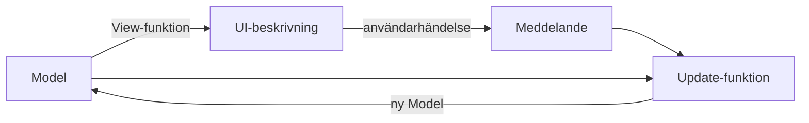

# MVU — Elm-arkitekturen

> Del 7 av [UI-arkitektur](index.md). **Bygger på:** [Flux och Redux](flux-redux.md) — Redux lånade sina idéer härifrån, MVU tar dem hela vägen.

## När du läst detta ska du kunna

- Förklara Model, View och Update och hur de bildar en loop
- Förklara skillnaden mellan MVU och Redux
- Skriva en update-funktion med pattern matching

## Bakgrund och idé

Redux lånade sina bästa idéer från programmeringsspråket Elm (Evan Czaplicki, 2012). I Elm är hela programmet byggt så här, och mönstret kallas **The Elm Architecture** eller **MVU** — Model, View, Update. Det är Redux taget till sin spets: det finns inga stores, inga events och inga objekt som ändrar sig. Bara data och rena funktioner.



## Så läser du diagrammet


1. **Model** är *all* state i appen, i ett enda immutabelt värde.
2. **View** är en funktion `Model → UI`. Den returnerar en *beskrivning* av hur skärmen ska se ut; ramverket räknar ut vad som faktiskt behöver ritas om.
3. När användaren gör något skapas ett **meddelande** (som en action i Redux).
4. **Update** är en funktion `(Model, Meddelande) → ny Model`. Den nya modellen skickas till View, och cirkeln börjar om.

Skillnaden mot Redux: i Redux är storen ett objekt som komponenter prenumererar på. I MVU **är** hela programmet loopen — det finns inget att prenumerera på, och vyn är alltid en ren funktion av modellen.

```csharp
using System.Collections.Immutable;

// Model: hela appens state
public record Modell(ImmutableList<string> Varor, string Inmatning);

// Meddelanden: allt som kan hända
public abstract record Meddelande;
public record InmatningÄndrad(string Text) : Meddelande;
public record LäggTillKlickad : Meddelande;
public record TaBortKlickad(string Vara) : Meddelande;

public static class KundvagnApp
{
    public static Modell Init() => new(ImmutableList<string>.Empty, "");

    public static Modell Update(Modell modell, Meddelande meddelande) => meddelande switch
    {
        InmatningÄndrad m => modell with { Inmatning = m.Text },
        LäggTillKlickad when !string.IsNullOrWhiteSpace(modell.Inmatning)
            => modell with { Varor = modell.Varor.Add(modell.Inmatning.Trim()), Inmatning = "" },
        TaBortKlickad m => modell with { Varor = modell.Varor.Remove(m.Vara) },
        _ => modell
    };

    // En riktig MVU-vy returnerar ett UI-träd. Här räcker en sträng för att visa idén.
    public static string View(Modell modell)
        => $"[{modell.Inmatning,-6}] Kundvagn: {string.Join(", ", modell.Varor)}";
}
```

```csharp
var modell = KundvagnApp.Init();

Meddelande[] händelser =
[
    new InmatningÄndrad("mjölk"),
    new LäggTillKlickad(),
    new LäggTillKlickad(),          // tom inmatning — ignoreras av Update
    new InmatningÄndrad("bröd"),
    new LäggTillKlickad(),
];

foreach (var händelse in händelser)
{
    modell = KundvagnApp.Update(modell, händelse);
    Console.WriteLine(KundvagnApp.View(modell));
}

// [mjölk ] Kundvagn:
// [      ] Kundvagn: mjölk
// [      ] Kundvagn: mjölk
// [bröd  ] Kundvagn: mjölk
// [      ] Kundvagn: mjölk, bröd
```

I .NET finns MVU främst via tredjepartsbibliotek: **Fabulous** (F#, för MAUI/Avalonia) och **MauiReactor** (C#). När MAUI lanserades nämnde Microsoft MVU som ett möjligt alternativ, men det officiella spåret blev MVVM.

## Mappstruktur

MVU-appar delas ofta upp per feature, där varje feature har sina tre delar:

```text
KundvagnMvu/
├── Features/
│   └── Kundvagn/
│       ├── Modell.cs          ← record
│       ├── Meddelanden.cs     ← alla meddelanden
│       ├── Update.cs          ← ren funktion
│       └── View.cs            ← ren funktion
└── Program.cs                 ← loopen: Init → View → Update → View …
```

---

← [Flux och Redux](flux-redux.md) · [Vilket ska jag välja?](index.md#vilket-ska-jag-välja) →
