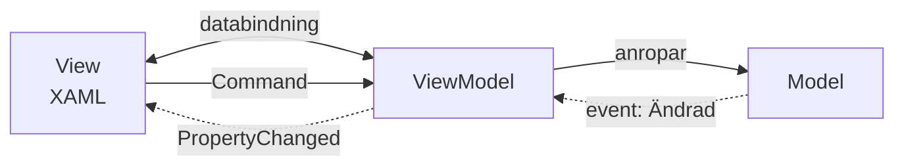

# MVVM — WPF och MAUI

> Del 4 av [UI-arkitektur](index.md). **Bygger på:** [MVP](mvp.md) — men låter databindningen göra synkningen som presentern skrev för hand. Modellen `Kundvagn` som används här finns i [översikten](index.md#exemplet-en-kundvagn).

## När du läst detta ska du kunna

- Förklara skillnaden mellan en ViewModel och en presenter
- Skriva en ViewModel med `INotifyPropertyChanged` och `ICommand`
- Korta ner en ViewModel med CommunityToolkit.Mvvm

## Bakgrund och idé

MVP fungerar, men presentern blir full av tråkig kod: `_vy.NyVara = ""`, `_vy.VisaVaror(...)`, om och om igen. Martin Fowler beskrev 2004 **Presentation Model**: lägg vyns *tillstånd* i en vanlig klass och låt något annat synka det mot skärmen. När WPF kom 2005–2006 med kraftfull **databindning** döpte John Gossman på Microsoft om idén till MVVM — Model-View-ViewModel. Databindningen gör synkningen åt dig.



## Så läser du diagrammet


1. **Vyn** (XAML) binder sina kontroller till egenskaper i **ViewModel**. Dubbelpilen betyder att bindningen går åt båda håll: skriver användaren i en textruta uppdateras egenskapen direkt.
2. Knappar binds till **Commands** i ViewModel — inga `Click`-händelser i code-behind.
3. ViewModel anropar **modellen** och lyssnar på dess ändringar.
4. När en egenskap i ViewModel ändras skickar den `PropertyChanged`, och ramverket uppdaterar alla kontroller som är bundna till den.

Skillnaden mot MVP: **ViewModel känner inte till vyn alls** — inte ens ett interface. Den exponerar bara egenskaper och kommandon. Samma ViewModel kan visas av en WPF-vy, en MAUI-vy och ett enhetstest.

```csharp
using System.ComponentModel;
using System.Runtime.CompilerServices;
using System.Windows.Input;

public class KundvagnViewModel : INotifyPropertyChanged
{
    private readonly Kundvagn _kundvagn;
    private string _nyVara = "";

    public KundvagnViewModel(Kundvagn kundvagn)
    {
        _kundvagn = kundvagn;
        _kundvagn.Ändrad += () =>
        {
            OnPropertyChanged(nameof(Varor));
            OnPropertyChanged(nameof(Sammanfattning));
        };
        LäggTillCommand = new RelayCommand(LäggTill, () => !string.IsNullOrWhiteSpace(NyVara));
    }

    public string NyVara
    {
        get => _nyVara;
        set
        {
            if (_nyVara == value) return;
            _nyVara = value;
            OnPropertyChanged();
            LäggTillCommand.MeddelaÄndring(); // knappen blir aktiv/inaktiv
        }
    }

    public IReadOnlyList<string> Varor => _kundvagn.Varor.ToList();
    public string Sammanfattning => $"Varor i kundvagnen: {_kundvagn.Varor.Count}";

    public RelayCommand LäggTillCommand { get; }

    private void LäggTill()
    {
        _kundvagn.LäggTill(NyVara.Trim());
        NyVara = "";
    }

    public event PropertyChangedEventHandler? PropertyChanged;

    private void OnPropertyChanged([CallerMemberName] string? namn = null)
        => PropertyChanged?.Invoke(this, new PropertyChangedEventArgs(namn));
}

// En minimal ICommand — i praktiken använder du ett bibliotek (se nedan)
public class RelayCommand(Action utför, Func<bool> kanUtföras) : ICommand
{
    public event EventHandler? CanExecuteChanged;
    public bool CanExecute(object? parameter) => kanUtföras();
    public void Execute(object? parameter) => utför();
    public void MeddelaÄndring() => CanExecuteChanged?.Invoke(this, EventArgs.Empty);
}
```

Vyn i XAML har ingen logik — bara bindningar:

```xml
<StackPanel>
    <TextBox Text="{Binding NyVara, UpdateSourceTrigger=PropertyChanged}" />
    <Button Content="Lägg till" Command="{Binding LäggTillCommand}" />
    <TextBlock Text="{Binding Sammanfattning}" />
    <ListBox ItemsSource="{Binding Varor}" />
</StackPanel>
```

ViewModel går att köra helt utan fönster. Här låtsas vi vara databindningen:

```csharp
var vm = new KundvagnViewModel(new Kundvagn());
vm.PropertyChanged += (_, e) => Console.WriteLine($"[Bindning] {e.PropertyName} ändrades");

Console.WriteLine(vm.LäggTillCommand.CanExecute(null)); // False — inget varunamn
vm.NyVara = "mjölk";
vm.LäggTillCommand.Execute(null);
Console.WriteLine(vm.Sammanfattning);

// False
// [Bindning] NyVara ändrades
// [Bindning] Varor ändrades
// [Bindning] Sammanfattning ändrades
// [Bindning] NyVara ändrades
// Varor i kundvagnen: 1
```

All `OnPropertyChanged`-kod är tjatig. Paketet **CommunityToolkit.Mvvm** genererar den åt dig — samma ViewModel blir så här kort:

```csharp
using CommunityToolkit.Mvvm.ComponentModel;
using CommunityToolkit.Mvvm.Input;

namespace MedToolkit;

public partial class KundvagnViewModel : ObservableObject
{
    private readonly Kundvagn _kundvagn;

    public KundvagnViewModel(Kundvagn kundvagn)
    {
        _kundvagn = kundvagn;
        _kundvagn.Ändrad += () => OnPropertyChanged(nameof(Sammanfattning));
    }

    [ObservableProperty]                                   // genererar egenskapen NyVara
    [NotifyCanExecuteChangedFor(nameof(LäggTillCommand))]
    private string _nyVara = "";

    public string Sammanfattning => $"Varor i kundvagnen: {_kundvagn.Varor.Count}";

    [RelayCommand(CanExecute = nameof(KanLäggaTill))]       // genererar LäggTillCommand
    private void LäggTill()
    {
        _kundvagn.LäggTill(NyVara.Trim());
        NyVara = "";
    }

    private bool KanLäggaTill() => !string.IsNullOrWhiteSpace(NyVara);
}
```

## Mappstruktur

en vy och en ViewModel per skärm, med matchande namn:

```text
KundvagnWpf/                  (MAUI ser likadan ut, plus Platforms/ och Resources/)
├── Models/
│   └── Kundvagn.cs
├── ViewModels/
│   └── KundvagnViewModel.cs
├── Views/
│   ├── KundvagnView.xaml       ← bara bindningar
│   └── KundvagnView.xaml.cs    ← nästan tom code-behind
├── App.xaml
└── App.xaml.cs                 ← sätter DataContext = new KundvagnViewModel(...)
```

---

← [MVP](mvp.md) · [Komponentarkitektur](komponenter.md) →
