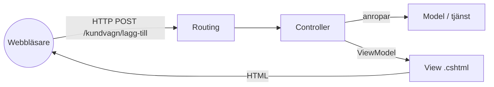
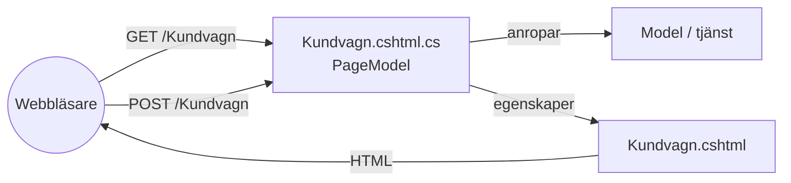

# Webb-MVC — ASP.NET MVC

> Del 2 av [UI-arkitektur](index.md). **Bygger på:** [MVC](mvc.md) — men på webben finns ingen vy som kan lyssna på modellen. Modellen `Kundvagn` som används här finns i [översikten](index.md#exemplet-en-kundvagn).

## När du läst detta ska du kunna

- Förklara varför webben inte kan använda klassisk MVC rakt av
- Följa en förfrågan genom routing, controller och vy
- Skilja på ASP.NET MVC och Razor Pages och välja mellan dem

## Bakgrund och idé

När webben kom försökte man återanvända MVC, men webben fungerar helt annorlunda: det finns ingen vy som ligger och lyssnar. Varje klick är en ny HTTP-förfrågan, servern bygger en ny HTML-sida och glömmer sedan allt. Javas "Model 2" (1999) och sedan Ruby on Rails (2004) och ASP.NET MVC (2009) anpassade mönstret till request/response.



## Så läser du diagrammet


1. Webbläsaren skickar en förfrågan. **Routingen** väljer controller och action utifrån URL:en.
2. **Controllern** (ett nytt objekt för varje förfrågan!) anropar modellen eller en tjänst.
3. Controllern packar det vyn behöver i en **ViewModel** och väljer vilken **View** som ska renderas.
4. Vyn blir HTML som skickas tillbaka. Sedan är förfrågan över — inget lever kvar i controllern.

Den stora skillnaden mot Smalltalk-MVC: **pilen från modellen till vyn är borta.** Vyn lyssnar inte på något — den renderas en gång per förfrågan. Därför är det controllern, inte modellen, som "äger" flödet.

```csharp
using Microsoft.AspNetCore.Mvc;

// Kundvagn är registrerad i DI — se Program.cs nedan
public class KundvagnController(Kundvagn kundvagn) : Controller
{
    public IActionResult Index() => View(new KundvagnViewModel(kundvagn.Varor));

    [HttpPost]
    public IActionResult LäggTill(string vara)
    {
        kundvagn.LäggTill(vara);
        return RedirectToAction(nameof(Index)); // Post-Redirect-Get: F5 skickar inte formuläret igen
    }
}

// Vyn får exakt det den behöver — inte hela domänmodellen
public record KundvagnViewModel(IReadOnlyList<string> Varor);
```

```csharp
var builder = WebApplication.CreateBuilder(args);

builder.Services.AddControllersWithViews();
// Singleton = en kundvagn för ALLA besökare. Bara för demo — på riktigt sparas den per användare.
builder.Services.AddSingleton<Kundvagn>();

var app = builder.Build();
app.MapDefaultControllerRoute(); // /{controller=Home}/{action=Index}/{id?}
app.Run();
```

Vyn (`Views/Kundvagn/Index.cshtml`) är Razor — HTML med C# insprängt:

```razor
@model KundvagnViewModel

<ul>
    @foreach (var vara in Model.Varor)
    {
        <li>@vara</li>
    }
</ul>

<form asp-action="LäggTill" method="post">
    <input name="vara" />
    <button>Lägg till</button>
</form>
```

## Mappstruktur

det här är vad mallen `dotnet new mvc` ger dig. ASP.NET hittar vyer via konvention: `KundvagnController.Index()` letar efter `Views/Kundvagn/Index.cshtml`.

```text
KundvagnWebb/
├── Controllers/
│   └── KundvagnController.cs
├── Models/
│   ├── Kundvagn.cs
│   └── KundvagnViewModel.cs
├── Views/
│   ├── Kundvagn/
│   │   └── Index.cshtml      ← namnet matchar controller + action
│   ├── Shared/
│   │   └── _Layout.cshtml    ← gemensam ram för alla sidor
│   └── _ViewImports.cshtml
├── wwwroot/                  ← css, js, bilder
└── Program.cs
```

Ett komplett exempel med ett riktigt externt API hittar du i [MVC och API](../../api/apimvc.md) — den här sidan upprepar inte det.

## Razor Pages — Page Controller

Razor Pages (ASP.NET Core 2.0, 2017) är Microsofts svar på att MVC ofta blir mycket ceremoni för enkla sidor: en controller i en mapp, en vy i en annan, en ViewModel i en tredje. I Razor Pages hör **en sida och dess logik ihop** — mönstret heter *Page Controller* (Fowler, 2002).



### Så läser du diagrammet
 URL:en pekar direkt på en sida — ingen separat routing till en controller. GET-förfrågan kör `OnGet()`, POST kör `OnPost()`. PageModel-klassen *är* både controller och ViewModel: vyn läser dess egenskaper direkt.

```csharp
using Microsoft.AspNetCore.Mvc;
using Microsoft.AspNetCore.Mvc.RazorPages;

public class KundvagnModel(Kundvagn kundvagn) : PageModel
{
    public IReadOnlyList<string> Varor => kundvagn.Varor;

    [BindProperty] // fylls automatiskt från formuläret vid POST
    public string NyVara { get; set; } = "";

    public void OnGet() { }

    public IActionResult OnPost()
    {
        if (!string.IsNullOrWhiteSpace(NyVara))
            kundvagn.LäggTill(NyVara.Trim());

        return RedirectToPage();
    }
}
```

### Mappstruktur

sidan och dess kod ligger bredvid varandra:

```text
KundvagnPages/
├── Pages/
│   ├── Kundvagn.cshtml       ← HTML/Razor
│   ├── Kundvagn.cshtml.cs    ← PageModel (logiken)
│   └── Shared/
│       └── _Layout.cshtml
├── Models/
│   └── Kundvagn.cs
└── Program.cs                ← AddRazorPages() + MapRazorPages()
```

---

← [MVC](mvc.md) · [MVP](mvp.md) →
