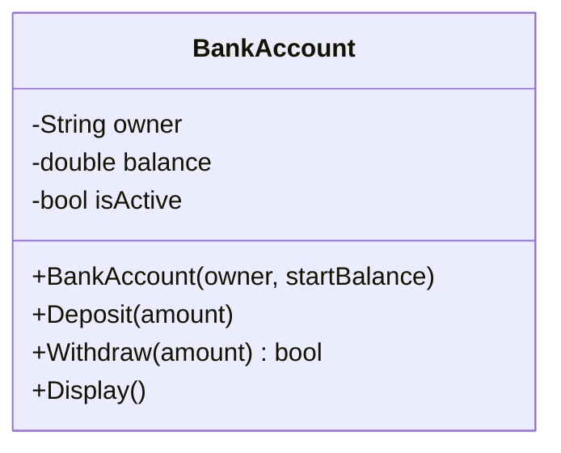
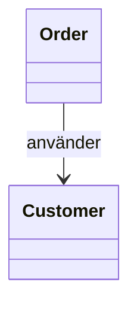
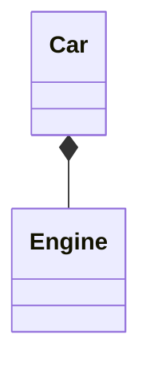
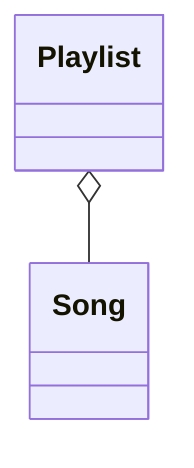
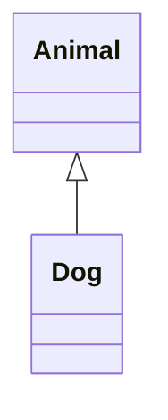
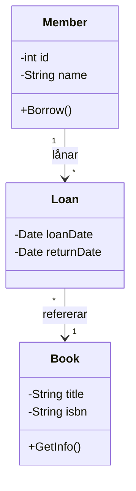
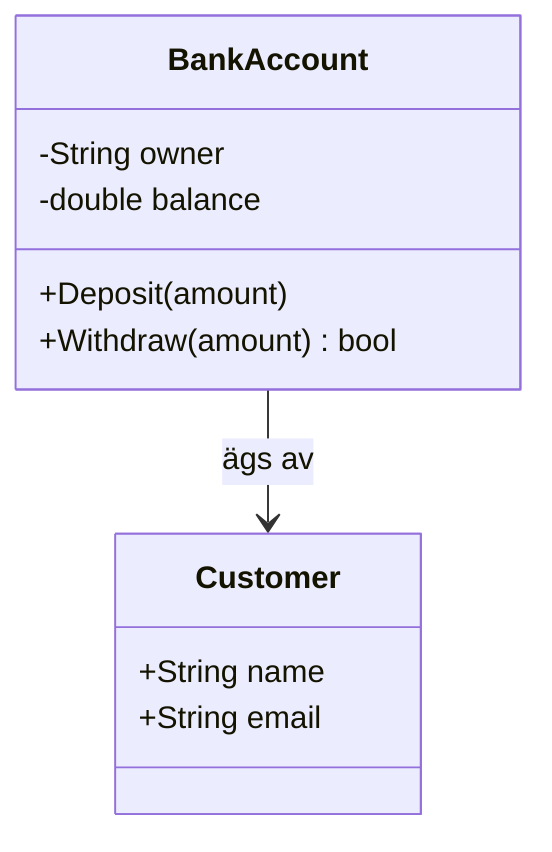

# UML-klassdiagram

UML (Unified Modeling Language) är ett gemensamt språk för att rita klasser och relationer — utan att skriva kod. Det används för att planera design och kommunicera med andra utvecklare.

> **Testa själv:** [mermaid.live](https://mermaid.live) — klistra in valfritt diagram och redigera i realtid.

## När du läst detta ska du kunna

- Rita ett UML-klassdiagram för en enkel klass
- Tolka synlighetssymbolerna `+` och `-`
- Rita relationer mellan klasser (association, komposition, arv)
- Förklara multiplicitet (1:1, 1:N, N:M)

## En klass i UML

En klass ritas som en ruta med tre sektioner: klassnamn, fält och metoder.



| Tecken | Meaning |
|--------|---------|
| `-` | `private` — bara klassen kan nå det |
| `+` | `public` — synligt utifrån |
| `#` | `protected` — synligt i subklasser |

## Från UML till C#

Samma information — olika form:

```csharp
public class BankAccount
{
    private string _owner;
    private double _balance;
    private bool   _isActive;

    public BankAccount(string owner, double startBalance) { ... }
    public void   Deposit(double amount) { ... }
    public bool   Withdraw(double amount) { ... }
    public void   Display() { ... }
}
```

Rita UML-diagrammet INNAN du öppnar VS Code. Det tvingar dig att tänka igenom designen.

## Relationer

### Association — använder

En `Order` känner till en `Customer`. Pilen pekar mot den klass som används.



I C# syns associationen som en egenskap — `Order` håller en referens till ett `Customer`-objekt:

```csharp
public class Order
{
    public int Id { get; set; }
    public Customer Customer { get; set; }  // referens till en annan klass
}

public class Customer
{
    public string Name { get; set; }
    public string Email { get; set; }
}
```

Typen och egenskapsnamnet heter ofta samma sak (`Customer Customer`) — typen är klassen, namnet är vad du kallar den i `Order`.

### Komposition — äger (stark)

Motorn existerar bara som del av bilen. Om bilen försvinner försvinner motorn. Fylld romb på ägarens sida.



I C# skapar ägaren objektet själv — `Engine` föds och dör med `Car`:

```csharp
public class Car
{
    private Engine _engine = new Engine();  // Car äger och skapar Engine
}

public class Engine
{
    public int HorsePower { get; set; }
}
```

### Aggregation — har (svag)

Spellistan innehåller låtar, men låtarna existerar även utan spellistan. Öppen romb.



I C# tar ägaren emot objekt utifrån — `Song` existerar oberoende och läggs bara till i listan:

```csharp
public class Playlist
{
    public List<Song> Songs { get; set; } = new();  // Songs skapas utanför
}

public class Song
{
    public string Title { get; set; }
    public string Artist { get; set; }
}
```

### Arv — är en

`Dog` ärver från `Animal`. Pil med öppen triangel mot basklassen.



I C# skrivs arv med `:` — `Dog` får alla medlemmar från `Animal` och kan lägga till egna:

```csharp
public class Animal
{
    public string Name { get; set; }
    public void Eat() { Console.WriteLine($"{Name} äter."); }
}

public class Dog : Animal  // Dog är en Animal
{
    public void Bark() { Console.WriteLine("Voff!"); }
}

// Användning
var hund = new Dog { Name = "Fido" };
hund.Eat();   // ärvd från Animal
hund.Bark();  // Dogs egen
```

## Multiplicitet

Multiplicitet beskriver hur många objekt som kan vara inblandade i en relation:

| Notation | Betydelse |
|----------|-----------|
| `1` | Exakt en |
| `0..1` | Noll eller en |
| `*` | Noll till många |
| `1..*` | En till många (minst en) |

### Exempel — Bibliotek



- En `Member` kan ha noll till många `Loan`
- Ett `Loan` tillhör exakt en `Member` och refererar exakt en `Book`
- En `Book` kan vara inblandad i många `Loan`

## Verktyg

| Verktyg | Typ | Pris |
|---------|-----|------|
| [Mermaid Live](https://mermaid.live) | I webbläsaren, kod → diagram | Gratis |
| draw.io | Online / offline | Gratis |
| PlantUML | Kod-baserad (text → diagram) | Gratis |
| Lucidchart | Online | Freemium |
| Visual Studio | Class Designer (inbyggt) | Ingår i VS |

### Mermaid i Markdown

Mermaid renderas automatiskt på GitHub, i Obsidian och på den här sidan. Skriv ett block med ` ```mermaid ` och diagrammet ritas upp direkt.



## TL;DR

UML-klassdiagram = ritning av klasser. Rita den innan du kodar — inte efter.

| Symbol i Mermaid | Betyder |
|------------------|---------|
| `-` i klass | private |
| `+` i klass | public |
| `-->` | association (använder) |
| `*--` | komposition (äger, stark) |
| `o--` | aggregation (har, svag) |
| `<\|--` | arv (är en) |
| `"1" --> "*"` | multiplicitet |
