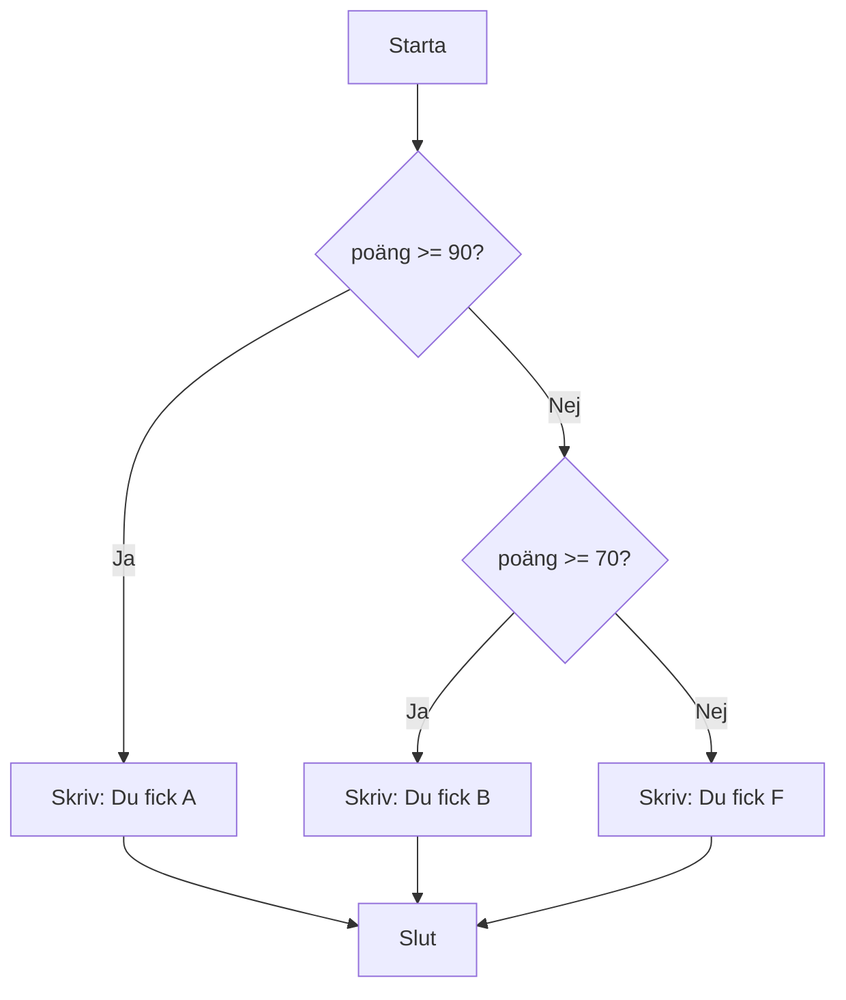

# Lästext — if / else

## Vad är ett villkor?

Program behöver fatta beslut. Ska rabatt ges eller inte? Är användaren inloggad? Är poängen tillräcklig för ett godkänt betyg? Det är just det ett villkor gör — det avgör om ett kodblock ska köras eller hoppas över.

I C# bygger alla villkor på ett **bool-uttryck**: ett uttryck som antingen är `true` eller `false`. Beroende på svaret väljer programmet vilken väg det ska ta.

---

## if — enklaste formen

`if` är det enklaste sättet att ställa en fråga i kod. Om villkoret är sant körs blocket inuti klamrarna. Om det är falskt händer ingenting och programmet fortsätter vidare.

```csharp
int ålder = 20;

if (ålder >= 18)
{
    Console.WriteLine("Du är myndig.");
}
```

Lägg märke till att klamrarna `{ }` inte är obligatoriska om blocket bara har en rad — men det är god vana att alltid skriva dem. Det minskar risken för logikfel när du lägger till fler rader senare.

---

## if / else — antingen eller

Ibland vill du göra något också när villkoret är falskt. Då lägger du till en `else`-gren. Det är ett "antingen-eller" — exakt en av grenarna körs alltid.

```csharp
int ålder = 15;

if (ålder >= 18)
{
    Console.WriteLine("Du är myndig.");
}
else
{
    Console.WriteLine("Du är inte myndig ännu.");
}
```

Tänk på det som en vägkorsning: du tar antingen vänster eller höger, men aldrig båda.

---

## if / else if / else — kedja av villkor

När du har fler än två möjliga utfall kan du kedja ihop villkor med `else if`. Villkoren testas uppifrån och ner, och **det första** som är sant vinner. Resten hoppas över.

```csharp
int poäng = 72;

if (poäng >= 90)
{
    Console.WriteLine("Du fick A — Utmärkt!");
}
else if (poäng >= 70)
{
    Console.WriteLine("Du fick B — Bra jobbat!");
}
else
{
    Console.WriteLine("Du fick F — Försök igen.");
}
```

Ordningen spelar roll. Om du vänder på de två första raderna och skriver `>= 70` innan `>= 90` — vad händer då med en som har 95 poäng?



---

## Jämförelseoperatorer

För att bygga villkor behöver du jämföra värden. Här är de operatorer du använder:

| Operator | Betydelse | Exempel |
|----------|-----------|---------|
| `==` | Lika med | `poäng == 100` |
| `!=` | Inte lika med | `namn != "Admin"` |
| `<` | Mindre än | `ålder < 18` |
| `>` | Större än | `poäng > 90` |
| `<=` | Mindre än eller lika med | `temperatur <= 0` |
| `>=` | Större än eller lika med | `poäng >= 70` |

En vanlig nybörjarfälla: `=` tilldelar ett värde, `==` jämför två värden. Det är en liten skillnad som ger stora fel.

---

## Logiska operatorer

Du kan kombinera flera villkor i ett enda uttryck med logiska operatorer.

**`&&` — och:** Båda villkoren måste vara sanna.

```csharp
int ålder = 22;
bool harKörkort = true;

if (ålder >= 18 && harKörkort)
{
    Console.WriteLine("Du får hyra bil.");
}
```

**`||` — eller:** Minst ett av villkoren måste vara sant.

```csharp
bool ärAdmin = false;
bool ärLärare = true;

if (ärAdmin || ärLärare)
{
    Console.WriteLine("Du har tillgång till materialet.");
}
```

**`!` — inte:** Vänder på sanningsvärdet. `true` blir `false`, och tvärtom.

```csharp
bool ärInloggad = false;

if (!ärInloggad)
{
    Console.WriteLine("Du måste logga in först.");
}
```

---

## Nästlade if

Det är möjligt att placera ett `if`-block inuti ett annat. Det kallas nästling.

```csharp
int ålder = 20;
bool harBiljett = true;

if (ålder >= 18)
{
    if (harBiljett)
    {
        Console.WriteLine("Välkommen in!");
    }
    else
    {
        Console.WriteLine("Du saknar biljett.");
    }
}
else
{
    Console.WriteLine("Du är för ung för att komma in.");
}
```

Nästling fungerar, men var försiktig. Mer än två nivåer djup brukar vara ett tecken på att koden kan förenklas — antingen med `&&`, eller genom att bryta ut logiken i en egen metod. Djup nästling är svår att läsa och ännu svårare att felsöka.

---

## Fördjupning — Labyrinth och logiska operatorer

I filmen *Labyrinth* (1986) vaktar två karaktärer två dörrar. En talar alltid sanning, en ljuger alltid — men du vet inte vem som är vem. Du får bara ställa en fråga.

Den klassiska lösningen: *"Om jag frågade den andre vakten vilken dörr som leder till slottet, vad skulle hen svara?"* — och välj sedan motsatsen.

Det fungerar för att `!(!x)` är samma som `x`. Lögnarens svar är `!sanning`, och om du vänder på det igen (`!`) får du tillbaka sanningen.

I kod:

```csharp
bool vaktenTalarSanning = false; // vi vet inte om detta är sant
bool dörrenÄrRätt = true;

// Vaktens svar om den ljuger:
bool svar = vaktenTalarSanning ? dörrenÄrRätt : !dörrenÄrRätt;

// Välj alltid motsatsen till vad den tillfrågade vakten säger:
bool rättVal = !svar;
```

Se scenen: [youtu.be/ReFhu8KYbmU](https://www.youtube.com/watch?v=ReFhu8KYbmU)

**Se även:** [switch.md](switch.md) för ett alternativ när du har många fasta värden att jämföra, och `operatorer.md` i `programmeringstermer/` för en fullständig genomgång av operatorer.
