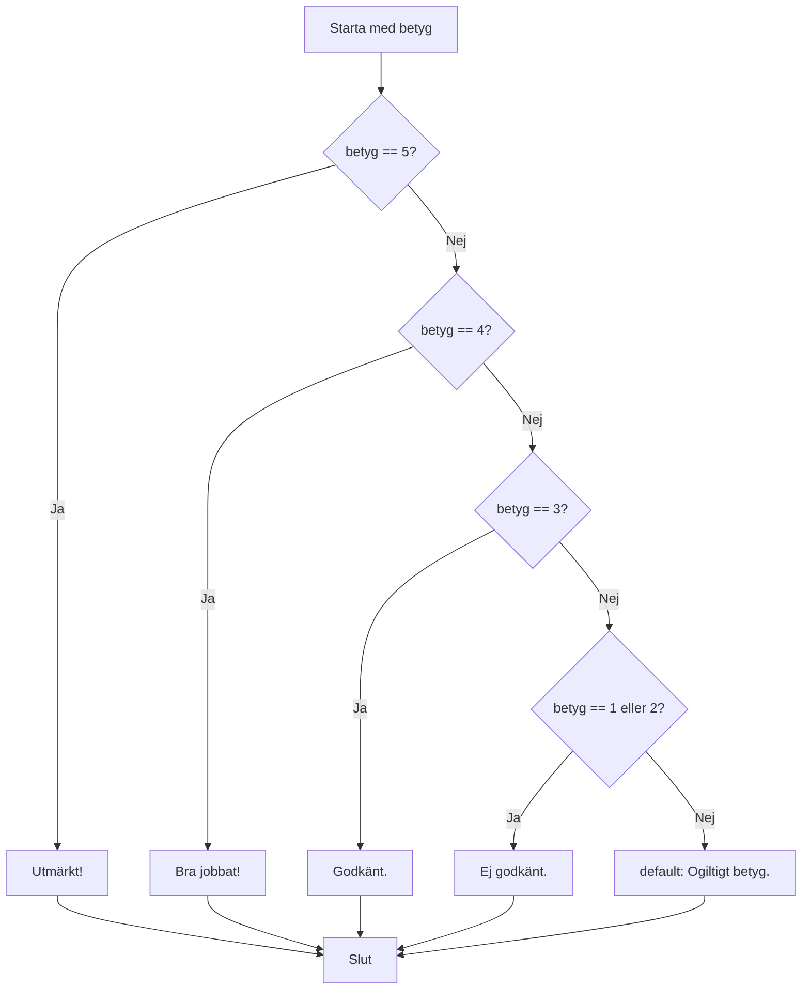

# Lästext — switch

## Vad är switch?

Ibland behöver du jämföra ett och samma värde mot många möjliga alternativ. Du kan göra det med en lång kedja av `if / else if / else` — men efter tre–fyra grenar börjar det bli svårläst. Då är `switch` ett tydligare alternativ.

`switch` tar ett värde, jämför det mot en lista av `case`-etiketter, och hoppar direkt till det som matchar. Det är rakt, lätt att läsa och snabbt att utöka med fler alternativ.

---

## Klassisk switch — case, break och default

Här är grundstrukturen. Värdet inne i `switch(...)` jämförs mot varje `case`. Det första som stämmer överens körs, sedan hoppar `break` ut ur hela `switch`-blocket.

```csharp
int betyg = 4;

switch (betyg)
{
    case 5:
        Console.WriteLine("Utmärkt!");
        break;
    case 4:
        Console.WriteLine("Bra jobbat!");
        break;
    case 3:
        Console.WriteLine("Godkänt.");
        break;
    case 1:
    case 2:
        Console.WriteLine("Ej godkänt.");
        break;
    default:
        Console.WriteLine("Ogiltigt betyg.");
        break;
}
```

Lägg märke till `case 1:` och `case 2:` ovanpå varandra utan `break` emellan. Det är ett avsiktligt fall-through — båda leder till samma utskrift. Det är ett av de få tillfällena där fall-through är acceptabelt och tydligt.

---

## default — fångst för okända värden

`default`-grenen körs om inget `case` matchade. Den är valfri, men nästan alltid en god idé. Det är din säkerhetsnät — precis som `else` i en `if`-kedja.

```csharp
string dag = "Lördag";

switch (dag)
{
    case "Måndag":
    case "Tisdag":
    case "Onsdag":
    case "Torsdag":
    case "Fredag":
        Console.WriteLine("Det är en vardag.");
        break;
    default:
        Console.WriteLine("Det är helg!");
        break;
}
```

Om `dag` innehåller ett oväntat värde — till exempel ett stavfel — fångas det av `default` istället för att tyst ignoreras.



---

## switch expression — modern syntax

Sedan C# 8 finns en kortare syntax som kallas **switch expression**. Den returnerar ett värde direkt istället för att köra kod i grenar. Perfekt när du vill tilldela ett resultat baserat på ett värde.

```csharp
int betyg = 4;

string text = betyg switch
{
    5 => "Utmärkt!",
    4 => "Bra jobbat!",
    3 => "Godkänt.",
    1 or 2 => "Ej godkänt.",
    _ => "Ogiltigt betyg."
};

Console.WriteLine(text);
```

`_` är wildcard och spelar samma roll som `default`. Denna syntax är kompakt och lämplig när du bara vill mappar ett värde till ett annat.

Switch expression passar bäst när du omvandlar ett värde till ett annat — till exempel betyg till text, en kod till ett meddelande, eller en enum-variant till en färg. Om du behöver köra mer komplex kod (flera satser, loopar, metodanrop) är den klassiska `switch`-satsen tydligare. Försök inte pressa in komplex logik i en switch expression — det minskar läsbarheten snarare än ökar den.

---

## När väljer man switch, och när if?

Det finns ingen strikt regel, men den här tumregeln fungerar bra:

| Situation | Välj |
|-----------|------|
| Jämföra ett värde mot fasta alternativ | `switch` |
| Villkor med intervall (`>`, `<`, `>=`) | `if / else if` |
| Kombinerade villkor (`&&`, `||`) | `if / else if` |
| Mer än fyra–fem fasta alternativ | `switch` (lättare att läsa) |

---

## Vanlig bugg: glömt break → fall-through

I den klassiska `switch`-satsen **måste** varje `case` avslutas med `break` (eller `return`, eller `throw`). Glömmer du det faller exekveringen rakt igenom till nästa `case` — oavsett om det matchar eller inte.

```csharp
// Varning: detta är ett exempel på ett fel
switch (betyg)
{
    case 5:
        Console.WriteLine("Utmärkt!");
        // saknas break här — koden faller igenom till case 4!
    case 4:
        Console.WriteLine("Bra jobbat!");
        break;
}
```

Om `betyg` är `5` skriver det ut båda raderna. C# tillåter inte oavsiktlig fall-through — kompilatorn ger ett fel om du glömmer `break` i ett `case` som har kod i sig. Det skyddar dig från den klassiska fällan.

**Se även:** [if_else.md](if_else.md) för en genomgång av villkorslogik med `if`, `else if` och logiska operatorer.
