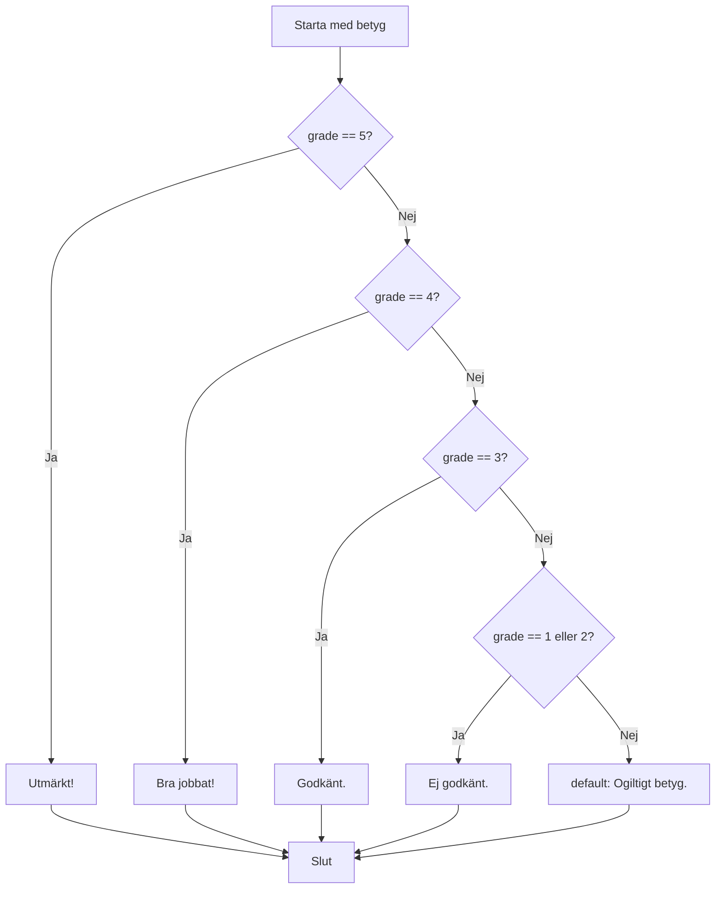

# Switch

Ibland behöver du jämföra ett och samma värde mot många möjliga alternativ. Du kan göra det med en lång kedja av `if / else if / else` — men efter tre–fyra grenar börjar det bli svårläst. Då är `switch` ett tydligare alternativ.

`switch` tar ett värde, jämför det mot en lista av `case`-etiketter, och hoppar direkt till det som matchar.

## När du läst detta ska du kunna

- Skriva en `switch`-sats med `case`, `break` och `default`
- Stapla case-etiketter för gemensam kod
- Använda switch expression (C# 8) för kortare syntax
- Välja mellan `switch` och `if/else`

## Switch-sats — klassisk syntax

```csharp
int grade = 4;

switch (grade)
{
    case 5:
        Console.WriteLine("Utmärkt!");
        break;
    case 4:
        Console.WriteLine("Bra jobbat!");
        break;
    case 3:
        Console.WriteLine("Godkänt.");
        break;
    case 1:
    case 2:
        Console.WriteLine("Ej godkänt.");
        break;
    default:
        Console.WriteLine("Ogiltigt betyg.");
        break;
}
```

- `case` matchar ett specifikt värde
- `break` avslutar det aktuella fallet
- `default` körs om inget case matchade — som `else` i en if-kedja

`case 1:` och `case 2:` staplade ovanpå varandra utan `break` emellan är ett avsiktligt fall-through — båda leder till samma utskrift.

## Flera case — gemensam kod

Du kan stapla case-etiketter om de ska göra samma sak.

```csharp
string day = "Lördag";

switch (day)
{
    case "Måndag":
    case "Tisdag":
    case "Onsdag":
    case "Torsdag":
    case "Fredag":
        Console.WriteLine("Det är en vardag.");
        break;
    default:
        Console.WriteLine("Det är helg!");
        break;
}
```

Om `day` innehåller ett oväntat värde fångas det av `default` istället för att tyst ignoreras.



## Switch expression — C# 8

Switch expression är en kortare variant som returnerar ett värde direkt. Jämför gammalt och nytt:

```csharp
// Klassisk switch
string dayName;
switch (dayNumber)
{
    case 1: dayName = "Måndag"; break;
    case 2: dayName = "Tisdag"; break;
    default: dayName = "Okänd"; break;
}

// Switch expression — C# 8
string dayName = dayNumber switch
{
    1 => "Måndag",
    2 => "Tisdag",
    3 => "Onsdag",
    4 => "Torsdag",
    5 => "Fredag",
    _ => "Helg eller okänd"
};

Console.WriteLine(dayName);
```

`_` är wildcard och spelar samma roll som `default`.

Switch expression passar bäst när du omvandlar ett värde till ett annat. Om du behöver köra mer komplex kod — flera satser, metodanrop, loopar — är klassisk switch tydligare.

## Switch med string och enum

`switch` fungerar på strängar, heltal, char, enum och mer.

```csharp
string color = "röd";

string hex = color switch
{
    "röd"  => "#FF0000",
    "grön" => "#00FF00",
    "blå"  => "#0000FF",
    _      => "#000000"
};

Console.WriteLine(hex);  // #FF0000
```

## Switch vs if/else — när väljer du vad?

| Situation | Använd |
|-----------|--------|
| Samma variabel mot fasta värden | `switch` |
| Villkor med intervall (`>`, `<`, `>=`) | `if / else if` |
| Kombinerade villkor (`&&`, `\|\|`) | `if / else if` |
| Mer än fyra–fem fasta alternativ | `switch` (lättare att läsa) |
| Tilldela ett värde baserat på ett uttryck | Switch expression |

## Fallgrop: glömt break

I den klassiska `switch`-satsen **måste** varje `case` avslutas med `break` (eller `return`, eller `throw`). Glömmer du det faller exekveringen rakt igenom till nästa `case`.

```csharp
// Fel — koden faller igenom
switch (grade)
{
    case 5:
        Console.WriteLine("Utmärkt!");
        // saknas break — faller igenom till case 4!
    case 4:
        Console.WriteLine("Bra jobbat!");
        break;
}
```

Om `grade` är `5` skrivs båda raderna ut. C# tillåter inte oavsiktlig fall-through — kompilatorn ger ett fel om du glömmer `break` i ett `case` som har kod i sig.

## TL;DR

`switch` matchar ett värde mot flera `case`. Tydligare än långa `if/else if`-kedjor när du testar en och samma variabel mot fasta värden. Switch expression (C# 8) är en kompakt variant som returnerar ett värde direkt.
