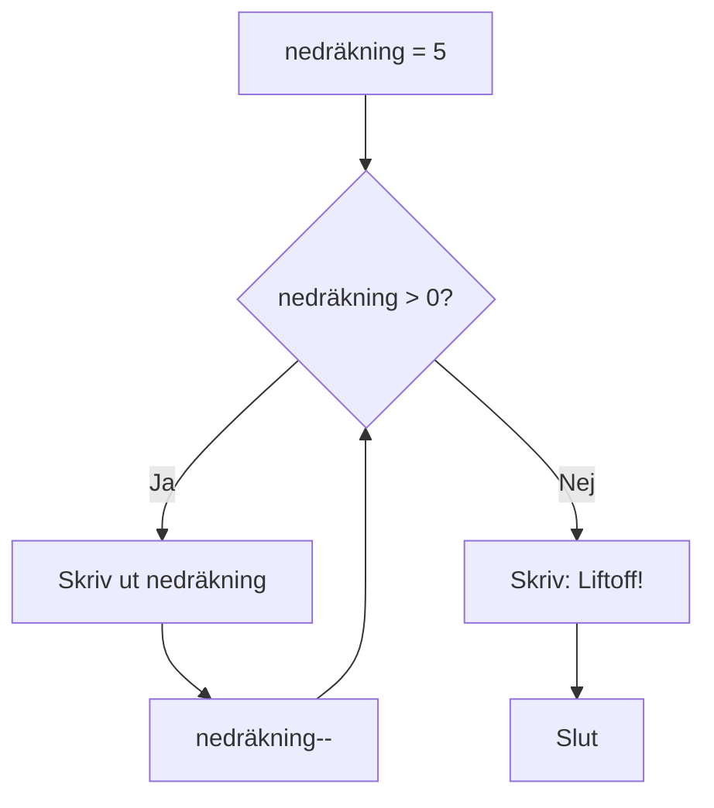

# Lästext — Loopar

## Vad är en loop?

Tänk dig att du ska skriva ut räknetabellen för 3. Du skulle kunna skriva tio separata `Console.WriteLine`-rader. Men vad händer när du behöver 100 rader? Eller 10 000? Att copy-pasta kod är inte programmering — det är ett tecken på att det finns ett bättre sätt.

En loop låter dig köra samma kodblock upprepade gånger, med ett variabelt värde som ändras för varje varv. Det är ett av de kraftfullaste verktygen i programmering, och du kommer använda det i nästan varje program du skriver.

---

## while — körs medan villkoret är sant

`while` är den enklaste loopen. Innan varje varv kontrolleras ett villkor. Är det sant körs blocket. Är det falskt stannar loopen.

```csharp
int nedräkning = 5;

while (nedräkning > 0)
{
    Console.WriteLine("T minus " + nedräkning + "...");
    nedräkning--;
}

Console.WriteLine("Liftoff!");
```

Loopen fortsätter så länge `nedräkning > 0` är sant. För varje varv minskar `nedräkning--` värdet med ett. När det når noll är villkoret falskt och loopen stannar.



---

## Oändlig loop — faran med while

Vad händer om du glömmer `nedräkning--`? Villkoret är alltid sant — loopen kör för evigt. Det kallas en **oändlig loop** och är ett av de vanligaste misstagen för nybörjare.

```csharp
// Varning: detta är ett exempel på ett fel
int nedräkning = 5;

while (nedräkning > 0)
{
    Console.WriteLine("T minus " + nedräkning + "...");
    // nedräkning-- saknas — loopen stannar aldrig
}
```

Programmet låser sig och måste avslutas med tvång. Kontrollera alltid att din loop har ett sätt att nå sitt slutvillkor.

En variant av samma misstag: räknaren rör sig åt **fel håll**.

```csharp
// Varning: detta är ett exempel på ett fel
int check = 5;

while (check > 0)
{
    check++; // borde vara check-- — nu ökar värdet bort från 0, aldrig mot det
    Console.WriteLine($"Checking {check}");
}
```

Villkoret `check > 0` är alltid sant eftersom `check` bara blir större. Resultatet är detsamma — en oändlig loop — men orsaken är subtilare: koden ändrar räknaren, men i fel riktning.

---

## for — för ett exakt antal iterationer

`for` är byggd för situationer när du vet exakt hur många varv du vill köra. Den packar tre saker på en rad: startvärde, villkor och steg.

```csharp
for (int i = 1; i <= 10; i++)
{
    Console.WriteLine("3 × " + i + " = " + (3 * i));
}
```

De tre delarna i parentes:

| Del | Kod | Vad den gör |
|-----|-----|-------------|
| Initiering | `int i = 1` | Skapar och sätter räknarvariabeln |
| Villkor | `i <= 10` | Kontrolleras innan varje varv |
| Steg | `i++` | Körs efter varje varv |

`i++` är kortform för `i = i + 1`. Du kan lika gärna skriva `i += 2` om du vill hoppa varannan, eller `i--` om du räknar nedåt.

<details markdown="block">
<summary>Djupare: variabeln i utanför loopen</summary>

Variabeln `i` skapas inuti `for`-satsen och finns bara där. Den försvinner när loopen är klar. Om du behöver värdet utanför loopen — till exempel för att veta var loopen stannade — måste du deklarera variabeln före `for`:

```csharp
int i;
for (i = 1; i <= 10; i++)
{
    Console.WriteLine(i);
}
Console.WriteLine("Loopen stannade vid: " + i);
```

Det är ovanligt att behöva göra så, men bra att veta.

</details>

---

## foreach — enklaste sättet att loopa genom en samling

När du har en samling — till exempel en array — och vill besöka varje element är `foreach` det renaste valet. Du slipper hålla koll på index och risken för att råka gå utanför samlingens gränser.

```csharp
string[] veckodagar = { "Måndag", "Tisdag", "Onsdag", "Torsdag", "Fredag" };

foreach (string dag in veckodagar)
{
    Console.WriteLine("Dag: " + dag);
}
```

Läs det som: "för varje `dag` i `veckodagar`, gör det här". Variabeln `dag` får automatiskt värdet av nästa element i samlingen för varje varv.

`foreach` går alltid framåt och kan inte hoppa över eller ändra element. Det är just det som gör den säker och enkel att läsa.

---

## Jämförelsetabell — vilken loop ska du välja?

| Situation | Loop |
|-----------|------|
| Du vet hur många varv i förväg | `for` |
| Du loopar genom en samling | `foreach` |
| Du loopar tills ett villkor uppfylls | `while` |
| Du vill köra blocket minst en gång | `do-while` |

Om du är osäker: börja med `foreach` om du har en samling, annars `for`. `while` är bäst när antalet varv styrs av något som ändras under körning — till exempel användarinput eller en nätverksfråga.

---

## do-while — kör alltid minst en gång

`do-while` liknar `while`, men med en avgörande skillnad: villkoret kontrolleras **efter** blocket, inte innan. Det innebär att koden inuti alltid körs minst en gång — oavsett om villkoret är sant eller falskt från start.

```csharp
string svar;

do
{
    Console.Write("Skriv 'ja' för att fortsätta: ");
    svar = Console.ReadLine();
}
while (svar != "ja");

Console.WriteLine("Bra! Du fortsätter.");
```

Skillnaden mot `while` är ordningen:

| Loop | Ordning |
|------|---------|
| `while` | Kontrollera villkor → kör blocket → upprepa |
| `do-while` | Kör blocket → kontrollera villkor → upprepa |

Det gör `do-while` till ett naturligt val för menyval och inmatningsvalidering — du vill alltid visa frågan minst en gång innan du vet vad användaren svarat.

```csharp
int val;

do
{
    Console.WriteLine("1 - Starta spelet");
    Console.WriteLine("2 - Avsluta");
    Console.Write("Ditt val: ");
    val = int.Parse(Console.ReadLine());
}
while (val != 1 && val != 2);

Console.WriteLine("Du valde: " + val);
```

---

**Se även:** `arrayer.md` i `programmeringstermer/` under `06_datastrukturer` för en genomgång av arrays och hur `foreach` används tillsammans med dem.
