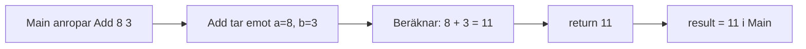
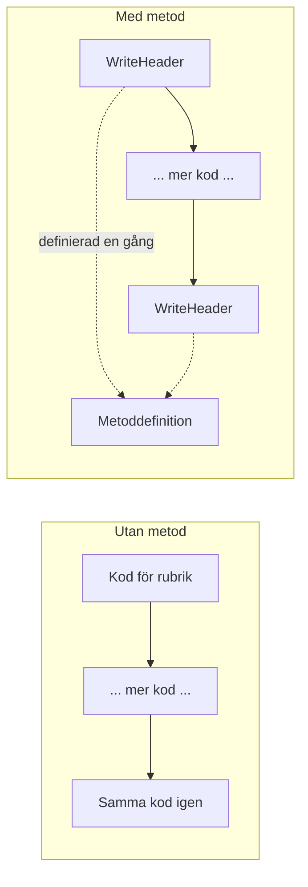

# Lästext — Metoder

## Vad är en metod?

Program upprepar sig. Hälsa användaren. Beräkna summan. Kontrollera om ett tal är jämnt. Utan metoder skriver du samma logik om och om igen — och varje gång du vill ändra något måste du hitta alla kopior och ändra dem en efter en.

En metod löser det. Den är ett **namngivet kodblock** som du definierar en gång och sedan anropar hur många gånger du vill. Istället för att kopiera koden pekar du bara på metodens namn.

Det handlar inte bara om att spara rader. Det handlar om att ge koden en tydlig struktur där varje del har ett namn och ett ansvar.

```csharp
// Utan metod — du upprepar dig
Console.WriteLine("Hej, Anna! Välkommen till kursen.");
Console.WriteLine("Hej, Erik! Välkommen till kursen.");
Console.WriteLine("Hej, Sara! Välkommen till kursen.");

// Med metod — du skriver logiken en gång
PrintGreeting("Anna");
PrintGreeting("Erik");
PrintGreeting("Sara");
```

Metoden `PrintGreeting` är definierad en gång. Anropas tre gånger. Vill du ändra välkomsttexten ändrar du på ett enda ställe.

---

## Void-metoder

Ibland vill du att en metod ska **göra** något — skriva ut en rad, rita en linje, logga ett meddelande — men inte ge dig något tillbaka. Då är returtypen `void`.

`void` betyder bokstavligen "inget". Metoden utför sitt arbete och är sedan klar.

```csharp
static void PrintGreeting(string name)
{
    Console.WriteLine("Hej, " + name + "! Välkommen till kursen.");
}
```

Tänk på en void-metod som en **knapp**. Du trycker på den, något händer, men du får inget i handen.

När du anropar en void-metod sparar du inte resultatet — det finns inget att spara:

```csharp
static void Main()
{
    PrintGreeting("Anna");   // Utskrift: Hej, Anna! Välkommen till kursen.
    PrintGreeting("Erik");   // Utskrift: Hej, Erik! Välkommen till kursen.
}
```

Metodens delar ser ut så här:

```
static   void         PrintGreeting   (string name)
  |        |                |               |
Belongs  ReturnType —      Method       Parameters —
class  returns       name           input
         nothing
```

---

## Returvärden

Ibland räcker det inte att metoden bara gör något. Du vill ha ett **svar** tillbaka. Du ger metoden indata, den beräknar något, och du får resultatet i retur.

Då byter du `void` mot den typ du vill returnera — `int`, `string`, `bool`, eller vad som passar.

```csharp
static int Add(int a, int b)
{
    return a + b;
}
```

Nyckelordet `return` skickar tillbaka värdet till den som anropade metoden. Exekveringen stannar direkt när `return` nås — ingenting efter den körs.

Du anropar metoden och tar emot svaret i en variabel:

```csharp
static void Main()
{
    int result = Add(8, 3);
    Console.WriteLine("8 + 3 = " + result);   // Utskrift: 8 + 3 = 11
}
```

Tänk på det som en **miniräknare**. Du matar in siffror, du får ett svar tillbaka. Void-metoden är skrivaren som skriver ut — miniräknaren är metoden med returvärde.



Returtypen och värdet du returnerar måste matcha. Deklarerar du `int` måste du returnera ett heltal.

---

## Parametrar

Parametrar är **indata** till metoden. De gör att samma metod kan fungera med olika värden varje gång den anropas.

Du deklarerar parametrarna inuti parenteserna, med typ och namn:

```csharp
// En parameter
static void PrintGreeting(string name)
{
    Console.WriteLine("Hej, " + name + "!");
}

// Två parametrar — separera med komma
static int Add(int a, int b)
{
    return a + b;
}

// Ingen parameter
static void WriteDate()
{
    Console.WriteLine("Datum: " + DateTime.Now.ToShortDateString());
}
```

Parametrarna inuti metoddefinitionen kallas **formella parametrar** — de är platshållare. De värden du skickar med vid anropet kallas **argument**:

```csharp
static void Main()
{
    PrintGreeting("Sara");      // "Sara" är argumentet
    int sum = Add(5, 7);   // 5 och 7 är argumenten
}
```

Ordningen spelar roll. Argumenten kopplas till parametrarna i den ordning de skrivs.

---

## Metodnamn och stil

Metodnamn i C# skrivs med **PascalCase** — varje ord börjar med stor bokstav:

```csharp
static void PrintGreeting(string name)     { }
static int  Add(int a, int b)              { }
static bool IsEven(int number)             { }
static string GetDayName(int dayNumber)    { }
```

Välj **verb-baserade namn** som beskriver vad metoden gör:

| Prefix | Exempel | Förklaring |
|--------|---------|------------|
| `Print` / `Write` | `PrintGreeting` | Skriver ut något |
| `Get` / `Fetch` | `GetDayName` | Hämtar eller beräknar ett värde |
| `Is` / `Has` | `IsEven` | Kontrollerar ett villkor, returnerar bool |
| `Calculate` | `CalculateVAT` | Räknar ut ett resultat |

Ett bra metodnamn berättar vad metoden gör — inte hur. `GetDayName` är tydligare än `DayLogic` eller `Method1`.

---

## Anropa en metod

En metod definieras utanför `Main` men anropas inifrån `Main` (eller från en annan metod). Syntaxen är enkel: metodens namn följt av parenteser med eventuella argument.

```csharp
class MethodExamples
{
    static void PrintGreeting(string name)
    {
        Console.WriteLine("Hej, " + name + "! Välkommen till kursen.");
    }

    static int Add(int a, int b)
    {
        return a + b;
    }

    static bool IsEven(int number)
    {
        return number % 2 == 0;
    }

    static void Main()
    {
        // Void-metod — inget returvärde att spara
        PrintGreeting("Anna");

        // Metod med returvärde — spara i variabel
        int result = Add(8, 3);
        Console.WriteLine("8 + 3 = " + result);

        // Bool-returvärde — använd direkt i if-sats
        int testNumber = 7;
        if (IsEven(testNumber))
        {
            Console.WriteLine(testNumber + " är ett jämnt tal.");
        }
        else
        {
            Console.WriteLine(testNumber + " är ett udda tal.");
        }
    }
}
```

Lägg märke till att void-metoden anropas som en fristående rad. Metoden med returvärde anropas som ett uttryck — antingen sparas resultatet i en variabel, eller används det direkt (som i `if (IsEven(testNumber))`).

---

## Varför metoder?

Det finns ett känt princip inom programmering som kallas **DRY** — *Don't Repeat Yourself*. Den säger att du aldrig ska skriva samma logik på mer än ett ställe.

Varför? Se skillnaden:

**Innan metoder:**

```csharp
static void Main()
{
    Console.WriteLine("=== RAPPORT ===");
    Console.WriteLine("Projekt: Webbshop");
    Console.WriteLine("===============");

    // ... 50 rader kod ...

    Console.WriteLine("=== RAPPORT ===");
    Console.WriteLine("Projekt: Mobilapp");
    Console.WriteLine("===============");
}
```

Nu finns rubriklayouten på två ställen. Om du vill ändra `===` till `---` måste du komma ihåg att uppdatera båda. Och om du missar en? Inkonsekvent kod.

**Med metod:**

```csharp
static void WriteHeader(string projectName)
{
    Console.WriteLine("=== RAPPORT ===");
    Console.WriteLine("Projekt: " + projectName);
    Console.WriteLine("===============");
}

static void Main()
{
    WriteHeader("Webbshop");

    // ... 50 rader kod ...

    WriteHeader("Mobilapp");
}
```

Layouten finns på ett enda ställe. Ändra den där — och den gäller överallt.



DRY handlar inte om att spara rader — det handlar om att ha **ett enda ställe att ändra** när något behöver ändras.

---

<details markdown="block">
<summary><strong>Djupare: Metodöverlagring (method overloading)</strong></summary>

C# tillåter att du definierar flera metoder med **samma namn** om de har olika parameterlistor. Det kallas metodöverlagring (*method overloading*).

```csharp
static void PrintGreeting(string name)
{
    Console.WriteLine("Hej, " + name + "!");
}

static void PrintGreeting(string name, string title)
{
    Console.WriteLine("Hej, " + title + " " + name + "!");
}
```

C# väljer automatiskt rätt version beroende på hur du anropar:

```csharp
PrintGreeting("Anna");            // Hej, Anna!
PrintGreeting("Anna", "Dr");      // Hej, Dr Anna!
```

Det är samma princip som du redan känner igen — `Console.WriteLine` fungerar med en sträng, ett heltal, ett decimaltal... det är metodöverlagring i praktiken.

Metodöverlagring är ett verktyg för när du vill erbjuda **flexibla anropssätt** utan att tvinga anroparen att skicka med argument de inte behöver. Mer om det i samband med klasser och konstruktorer längre fram i kursen.

</details>

---

## static och objektmetoder — vad är skillnaden?

En `static`-metod tillhör **klassen** — inte ett specifikt objekt. Du kan anropa den utan att ha skapat något objekt överhuvudtaget.

```csharp
// static — anropas direkt, inget objekt behövs
static int Add(int a, int b)
{
    return a + b;
}

int result = Add(3, 4);   // fungerar utan new
```

En **objektmetod** (icke-statisk) tillhör en instans. Den har automatiskt tillgång till objektets egna data — du behöver inte skicka in det som parameter.

```csharp
class Counter
{
    private int _value = 0;

    public void Increment(int step)
    {
        _value += step;   // _value tillhör det här specifika objektet
    }

    public int GetValue()
    {
        return _value;
    }
}

Counter r = new Counter();
r.Increment(5);
r.Increment(3);
Console.WriteLine(r.GetValue());   // 8
```

`Main` är `static`. Fristående verktygsmetoder som `Add`, `IsEven` och `CalculateTotal` är `static` — de behöver ingen objektdata för att göra sitt jobb. Men metoderna på en `BankAccount` — `Deposit`, `Withdraw`, `Introduce` — är objektmetoder, för de måste veta vilket konto de arbetar med.

När du börjar bygga klasser nästa vecka gäller objektmetoder. Tills dess kör vi `static`.

---

**Se även:** [programmeringstermer/metoder.md](../programmeringstermer/metoder.md)
