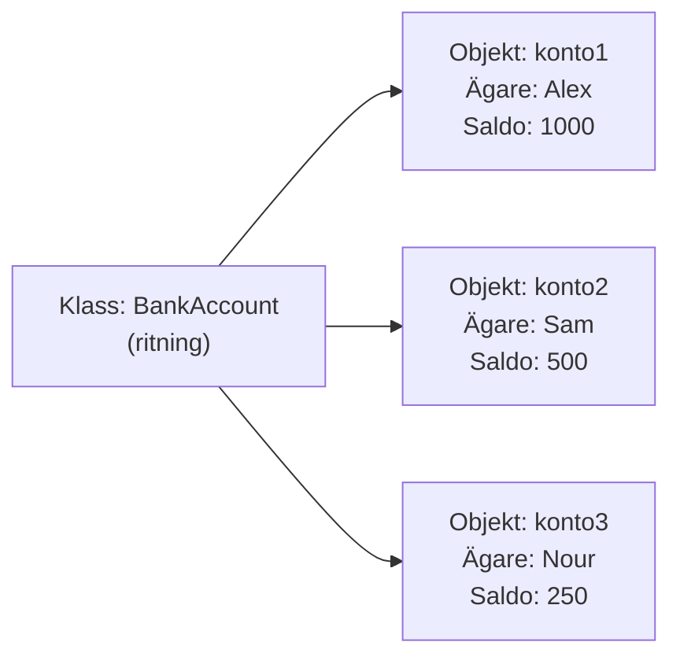
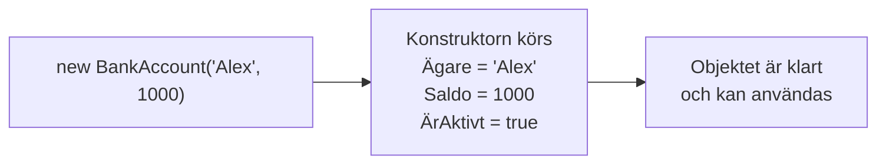
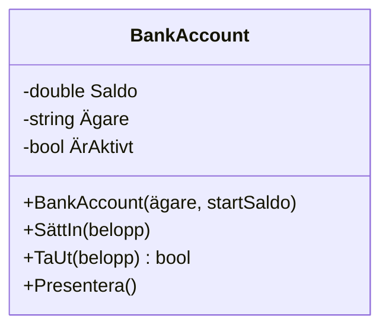

# Lästext — Klasser och objekt

## Vad är en klass?

Innan du kan förstå hur en klass fungerar i kod behöver du förstå varför den finns.

Tänk dig att du ska bygga ett program som hanterar bankkonton. Du behöver hålla reda på ett kontos ägare, saldo och om kontot är aktivt. Du behöver också kunna sätta in pengar, ta ut pengar och visa kontoinformation. Om du bara har tre variabler och tre lösa metoder fungerar det — men vad händer när du har hundra konton? Variablerna blandas ihop, metoderna vet inte vilket konto de arbetar med, och koden blir omöjlig att följa.

En klass löser det här. Den är en **ritning** — en mall som beskriver vad ett objekt ska innehålla och vad det ska kunna göra. Ur ritningen skapar du sedan verkliga objekt.



Klassen skapas en gång. Objekt kan du skapa hur många som helst ur samma klass — varje med sina egna värden, men samma struktur och beteende.

**Klass** = ritningen. **Objekt** = det verkliga exemplaret byggt från ritningen.

---

## Skapa en klass

En klass i C# har tre byggstenar: **fält** (eller properties) som lagrar data, en **konstruktor** som körs när objektet skapas, och **metoder** som beskriver vad objektet kan göra.

Här är ett komplett exempel på klassen `BankAccount`:

```csharp
class BankAccount
{
    // Properties — lagrar data, skrivbara bara inifrån klassen
    public double Balance { get; private set; }
    public string Owner { get; private set; }
    public bool IsActive { get; private set; }

    // Konstruktor — körs en gång när objektet skapas
    public BankAccount(string owner, double startBalance)
    {
        Owner = owner;
        Balance = startBalance;
        IsActive = true;
    }

    // Metod — sätter in pengar på kontot
    public void Deposit(double amount)
    {
        if (amount <= 0)
        {
            Console.WriteLine("Beloppet måste vara positivt.");
            return;
        }
        Balance += amount;
        Console.WriteLine($"{Owner} satte in {amount} kr. Nytt saldo: {Balance} kr.");
    }

    // Metod — tar ut pengar, returnerar true om det gick
    public bool Withdraw(double amount)
    {
        if (amount <= 0 || amount > Balance)
        {
            Console.WriteLine("Uttag nekat — otillräckligt saldo.");
            return false;
        }
        Balance -= amount;
        Console.WriteLine($"{Owner} tog ut {amount} kr. Nytt saldo: {Balance} kr.");
        return true;
    }

    // Metod — skriver ut en presentation av kontot
    public void Present()
    {
        string status = IsActive ? "Aktivt" : "Inaktivt";
        Console.WriteLine($"Konto: {Owner} | Saldo: {Balance} kr | Status: {status}");
    }
}
```

Lägg märke till att klassen bara beskriver strukturen. Inget händer förrän du skapar ett objekt ur den.

---

## Konstruktorn

Konstruktorn är en speciell metod som körs automatiskt när ett objekt skapas. Den har alltid samma namn som klassen och returnerar inget.

**Varför behövs den?** Utan en konstruktor skulle ett nyskapat objekt sakna värden — `Owner` skulle vara `null` och `Balance` skulle vara `0`. Konstruktorn är platsen där du garanterar att objektet startar i ett korrekt tillstånd.

```csharp
public BankAccount(string owner, double startBalance)
{
    Owner = owner;
    Balance = startBalance;
    IsActive = true;
}
```

Konstruktorn tar emot parametrar precis som en vanlig metod. När du skriver `new BankAccount("Alex", 1000)` skickas `"Alex"` och `1000` in i konstruktorn, som sedan tilldelar dem till objektets properties.



---

## Private och public

En klass kan hålla på hemligheter. Det är faktiskt meningen.

`public` betyder att något är tillgängligt för alla — kod utanför klassen kan läsa och ändra det. `private` betyder att något bara är tillgängligt inifrån klassen själv.

Varför vill vi dölja något? Tänk på `Balance`. Om det vore en vanlig `public` variabel skulle vem som helst kunna skriva `account.Balance = 999999` direkt — utan att gå via `Deposit` eller `Withdraw`. All logik om giltiga belopp och felmeddelanden skulle kringgås helt.

Det här principen kallas **inkapsling**: du döljer interndetaljer och erbjuder istället ett kontrollerat gränssnitt utåt.

```csharp
// Utanför klassen — detta fungerar INTE:
account.Balance = 999999;  // Fel! Saldo har private set

// Det här fungerar däremot:
account.Deposit(999999);  // Går via metoden som validerar beloppet
```

Tumregeln är enkel: **data är privat, beteende är publikt**. Metoder är klassens API mot omvärlden.

---

## Inkapsling

Det finns ett namn på det vi precis pratade om: **inkapsling** (encapsulation).

Inkapsling innebär att ett objekt äger sin data och bestämmer själv vem som får röra den — och hur. Ingenting utifrån kan komma åt interndetaljerna direkt. Istället exponerar klassen ett kontrollerat gränssnitt via properties och metoder.

En bra analogi: tänk på en bil. Du kan trycka på gaspedalen, vrida på ratten, växla. Men du kan inte sträcka in handen och justera bränsleinsprutningen direkt. Bilen döljer det komplexa innanverket och ger dig ett enkelt gränssnitt. Det är inkapsling i verkligheten.

I kod ser det ut så här:

```csharp
class BankAccount
{
    private double _balance;  // ingen utifrån kan röra detta

    public bool Withdraw(double amount)
    {
        if (amount <= 0 || amount > _balance) return false;
        _balance -= amount;
        return true;
    }
}
```

`_balance` är privat. Ingen kan skriva `account._balance = -999` utifrån. Den enda vägen in är via `Withdraw()` — som validerar beloppet innan den gör något.

> 📖 Se även: [Inkapsling — programmeringstermer](../termer/oop.md#inkapsling)

---

## Properties

I exemplet ovan används `{ get; private set; }` — det kallas en **property**. En property ser ut som en variabel utifrån men beter sig som en kontrollpunkt.

**Varför inte bara en vanlig variabel?** En `public double balance;` kan läsas och ändras av vem som helst. En property med `private set` låter omvärlden läsa värdet men inte ändra det direkt — bara metoderna inuti klassen kan sätta ett nytt värde.

```csharp
// Property — läsbar utifrån, skrivbar bara inifrån
public double Balance { get; private set; }

// Utanför klassen kan man göra:
Console.WriteLine(account.Balance);  // Fungerar — läsning är public

// Men inte:
account.Balance = 500;  // Kompileringsfel — set är private
```

Det ger dig en tydlig kontroll: vem får läsa? Vem får skriva?

En vanlig fälla: `{ get; set; }` med publik set ser ut som en property men beter sig som ett publikt fält — vem som helst kan skriva vilket värde som helst, ingen validering sker. Det är inte inkapsling, det är bara syntaxsocker.

---

## Privata fält (backing fields)

Auto-propertyn `{ get; private set; }` räcker i de flesta fall. Men ibland vill du ha ett **privat fält** som lagrar värdet — ett så kallat *backing field* — och en full property med logik i `get` eller `set`.

Konventionen för privata fält i C# är `_camelCase` — understreck som prefix:

```csharp
private string _name;
private int _number;
private double _balance;
```

När behöver du det? När du vill validera eller transformera värdet vid tilldelning. Auto-propertyn `{ get; private set; }` ger dig noll koll på vad som skickas in — en full property kan stoppa ogiltiga värden:

```csharp
private double _balance;

public double Balance
{
    get { return _balance; }
    private set
    {
        if (value < 0)
        {
            Console.WriteLine("Saldo kan inte bli negativt.");
            return;
        }
        _balance = value;
    }
}
```

Propertyn `Balance` är gränssnittet utåt. `_balance` är det privata lagret inuti. Ingen utifrån kan röra `_balance` direkt.

**Drömmatchen-struktur** — exakt det du ska skriva i inlämningen:

```csharp
public class Player
{
    private string _name;
    private int _number;
    private string _position;

    public string Name
    {
        get { return _name; }
        private set { _name = value; }
    }

    public int Number
    {
        get { return _number; }
        private set { _number = value; }
    }

    public string Position
    {
        get { return _position; }
        private set { _position = value; }
    }

    public Player(string name, int number, string position)
    {
        _name = name;
        _number = number;
        _position = position;
    }
}
```

Enkelt: konstruktorn sätter fälten direkt. Properties ger kontrollerad läsning utifrån.

---

## Skapa ett objekt

Nu när klassen är definierad kan du skapa objekt ur den. Det gör du med nyckelordet `new`.

```csharp
BankAccount account = new BankAccount("Alex", 1000);
BankAccount account = new BankAccount("Sam", 500);
```

Varje `new`-anrop skapar ett **eget objekt** med egna värden. `account` och `account` är oberoende av varandra — ändrar du `account.Balance` påverkar det inte `account`.

Variabeltypen till vänster (`BankAccount`) berättar vad för slags objekt variabeln pekar på. Det är viktigt: du kan bara använda det som klassen erbjuder via sitt publika gränssnitt.

---

## Metodanrop på objekt

När du har ett objekt kallar du dess metoder med punktnotation: `object.Method(argument)`.

```csharp
BankAccount account = new BankAccount("Alex", 1000);
BankAccount account = new BankAccount("Sam", 500);

account.Present();
account.Present();

account.Deposit(500);
account.Withdraw(200);
account.Withdraw(600);   // misslyckas — otillräckligt saldo

account.Present();
account.Present();
```

Utskrift:

```
Account: Alex | Balance: 1000 kr | Status: Active
Account: Sam | Balance: 500 kr | Status: Active
Alex set in 500 kr. New balance: 1500 kr.
Alex tog ut 200 kr. New balance: 1300 kr.
Withdrawal denied — insufficient balance.
Account: Alex | Balance: 1300 kr | Status: Active
Account: Sam | Balance: 500 kr | Status: Active
```

Punkten är inte bara syntax — den är en signal om ägande. `account.Deposit(500)` betyder: "be objektet `account` att utföra sin `Deposit`-metod med argumentet 500". Objektet vet vem det är och arbetar med sin egen data.

---

## UML-klassdiagram

När man pratar om klasser ritar man ofta ett **UML-klassdiagram** — ett standardiserat sätt att visa en klass struktur utan att skriva kod. Det är ett gemensamt språk mellan utvecklare.



Tecknen framför namnen har en betydelse:

| Tecken | Betyder |
|--------|---------|
| `-` | private |
| `+` | public |

Det du ser i diagrammet är precis samma klass som vi har kodat — bara ritad istället för skriven. UML hjälper dig planera och kommunicera design innan du börjar koda.

<details markdown="block">
<summary>Djupare: vad händer i minnet när new anropas?</summary>

När du skriver `new BankAccount("Alex", 1000)` händer det här bakom kulisserna:

1. **Minne allokeras på heapen.** .NET reserverar ett utrymme i minnet tillräckligt stort för att hålla alla objektets data — `Balance`, `Owner` och `IsActive`.

2. **Konstruktorn körs.** Värdena `"Alex"` och `1000` skickas in och tilldelas till objektets properties.

3. **En referens returneras.** Variabeln `account` innehåller inte objektet direkt — den innehåller en **referens**, ungefär som en adress, som pekar till var i minnet objektet finns.

Det har en praktisk konsekvens:

```csharp
BankAccount account = new BankAccount("Alex", 1000);
BankAccount copy = account;  // kopia pekar på SAMMA objekt

copy.Deposit(500);
account.Present();  // visar 1500 — inte 1000!
```

`account` och `copy` är två variabler men ett och samma objekt. Det är ett vanligt misstag att tro att man kopierat ett objekt när man egentligen bara kopierat referensen till det. Om du vill ha ett äkta nytt objekt med samma värden måste du skapa det med `new`.

</details>

---

## static i klasser

I en klass är metoder **icke-statiska som standard** — de tillhör objektet och har tillgång till dess data. Det är det normala läget när du skriver objektmetoder som `Present`, `Deposit` och `Withdraw`.

`static` i en klass används för saker som inte beror på ett specifikt objekt — till exempel en räknare som håller koll på hur många instanser som skapats:

```csharp
class BankAccount
{
    private static int _count_accounts = 0;

    public static int CountAccounts => _count_accounts;

    public BankAccount(string owner, double startBalance)
    {
        // ... sätt ägare och saldo ...
        _count_accounts++;   // räknas upp för varje nytt konto
    }
}

// Anropas på klassen, inte ett objekt:
Console.WriteLine(BankAccount.CountAccounts);   // 0
BankAccount k1 = new BankAccount("Alex", 1000);
BankAccount k2 = new BankAccount("Sam", 500);
Console.WriteLine(BankAccount.CountAccounts);   // 2
```

För era klasser i den här kursen — inga `static`-metoder i klasserna om ni inte har en specifik anledning. Håll er till objektmetoder.

---

**Se även:** [programmeringstermer/klasser.md](../programmeringstermer/klasser.md), [programmeringstermer/oop.md](../programmeringstermer/oop.md)
