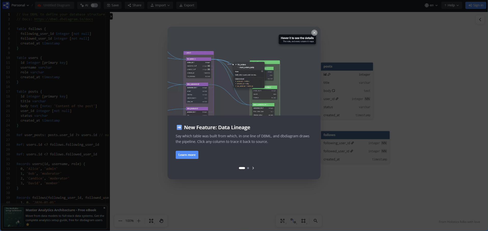
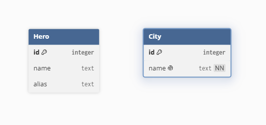
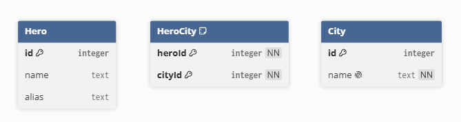
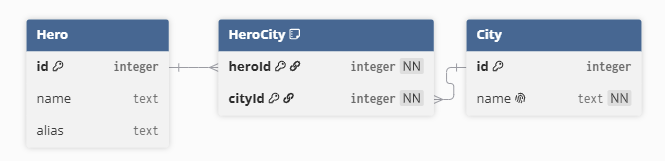
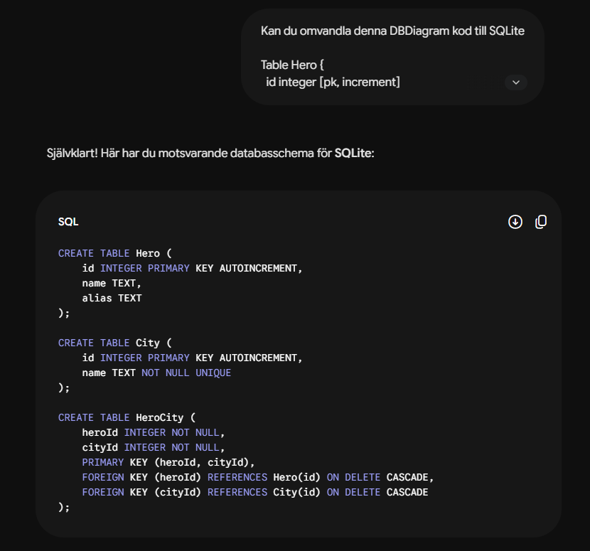
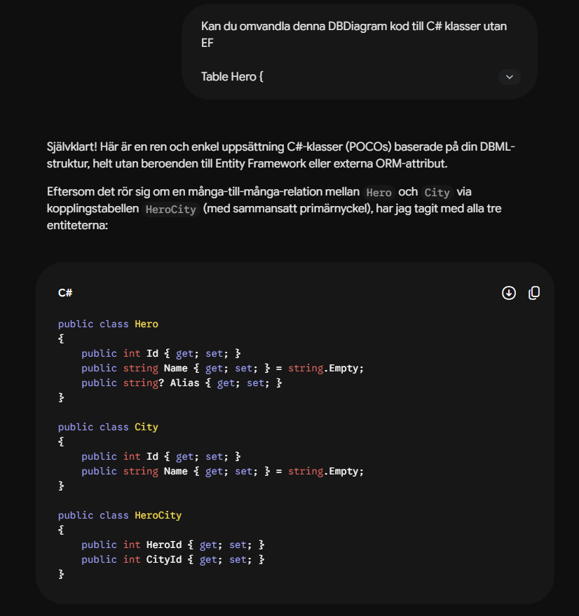

# Rita databasen med dbdiagram.io

När tabellerna blir fler blir det svårt att hålla dem i huvudet. Vilken tabell pekar på vilken? Då hjälper det att *rita* databasen.

[dbdiagram.io](https://dbdiagram.io/) är ett gratis verktyg i webbläsaren. Du skriver tabellerna som text till vänster, och diagrammet ritas upp av sig självt till höger.

Vi ritar hjältedatabasen från [Din första databas](forsta-databasen.md).

## 1. Kom igång

Gå till [dbdiagram.io](https://dbdiagram.io/) och öppna appen. Vill du spara ditt diagram behöver du logga in.



Rensa bort exemplet som ligger i textrutan till vänster, så börjar vi från noll.

## 2. Den första tabellen

Språket heter **DBML** (Database Markup Language). En tabell ser ut så här:

```
Table Hero {
  id integer [pk, increment]
  name text
  alias text
}
```

Varje rad är en kolumn: först namnet, sedan datatypen. Inom hakparenteser `[...]` skriver vi regler:

| DBML | Betyder | SQL |
|---|---|---|
| `pk` | Primärnyckel | `PRIMARY KEY` |
| `increment` | Räknas upp automatiskt | `AUTOINCREMENT` |
| `not null` | Måste ha ett värde | `NOT NULL` |
| `unique` | Får inte förekomma två gånger | `UNIQUE` |

## 3. Städerna

```
Table City {
  id integer [pk, increment]
  name text [not null, unique]
}
```



## 4. Kopplingstabellen

`HeroCity` har två kolumner, och *tillsammans* är de primärnyckel. Så kan samma hjälte inte kopplas till samma stad två gånger:

```
Table HeroCity {
  heroId integer [not null]
  cityId integer [not null]

  indexes {
    (heroId, cityId) [pk]
  }
}
```



## 5. Rita kopplingarna

Nu kommer det roliga. Med `Ref` drar vi streck mellan tabellerna:

```
Ref: HeroCity.heroId > Hero.id [delete: cascade]
Ref: HeroCity.cityId > City.id [delete: cascade]
```



`>` betyder *många-till-en*. Många rader i `HeroCity` kan peka på samma hjälte, och många kan peka på samma stad. `[delete: cascade]` är samma sak som `ON DELETE CASCADE` i SQL.

| Tecken | Betyder |
|---|---|
| `>` | många-till-en |
| `<` | en-till-många |
| `-` | en-till-en |
| `<>` | många-till-många |

> `<>` finns, men vi bygger hellre kopplingstabellen själva, som `HeroCity`. Då ser vi exakt hur databasen faktiskt lagrar kopplingen.

Lägg märke till att `Hero` och `City` inte har några streck till varandra. All koppling går via `HeroCity` i mitten.

## Hela koden

Kopiera in allt i dbdiagram så får du hela hjältedatabasen:

```
Table Hero {
  id integer [pk, increment]
  name text
  alias text
}

Table City {
  id integer [pk, increment]
  name text [not null, unique]
}

Table HeroCity {
  heroId integer [not null]
  cityId integer [not null]

  indexes {
    (heroId, cityId) [pk]
  }
}

Ref: HeroCity.heroId > Hero.id [delete: cascade]
Ref: HeroCity.cityId > City.id [delete: cascade]
```

## Bonus: exportera till SQL

Under **Export** kan dbdiagram skriva `CREATE TABLE`-satserna åt dig, för till exempel MySQL eller PostgreSQL. Men då måste man ha skapat ett konto på sidan. Jag rekommenderar att du hellre tar din DBML-kod och ber en AI omvandla den till vad du nu vill ha för språk, exempelvis SQLite eller varför inte C#.

> ⚠️ **SQLite är lite speciellt.** Den exporterade koden lägger till främmande nycklar i efterhand med `ALTER TABLE ... ADD FOREIGN KEY`, och det stöder inte SQLite. För SQLite skriver vi dem direkt i `CREATE TABLE`, som vi gjorde i [Din första databas](forsta-databasen.md).

Till SQLite:



Till C#:



## TL;DR

- **dbdiagram.io** ritar databasen åt dig utifrån text.
- `Table` = tabell, `[pk]` = primärnyckel, `Ref:` = koppling.
- `>` många-till-en, `<` en-till-många, `-` en-till-en.
- Rita först, koda sedan. Det är mycket lättare att flytta ett streck än att bygga om en databas.
