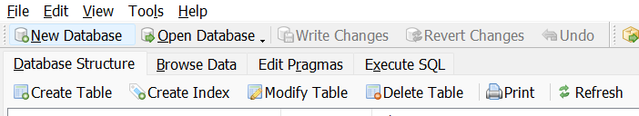
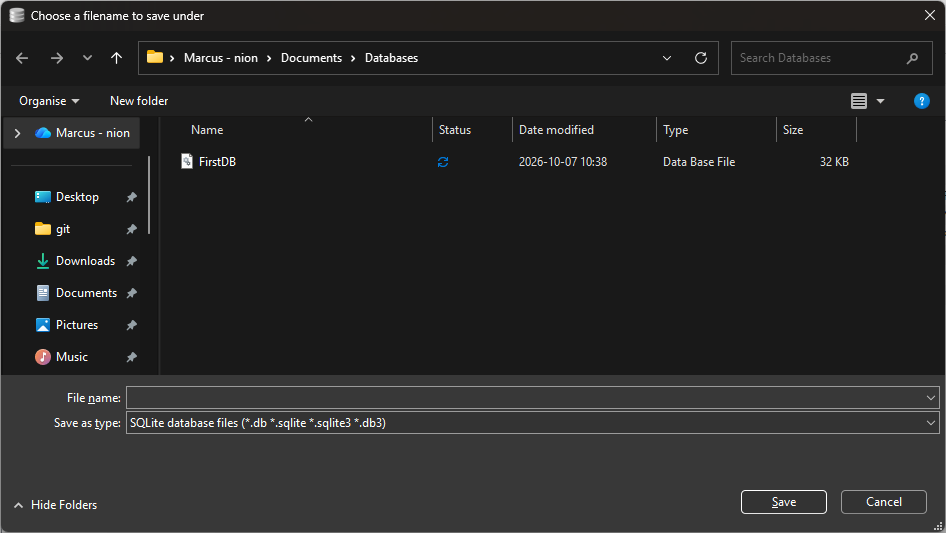
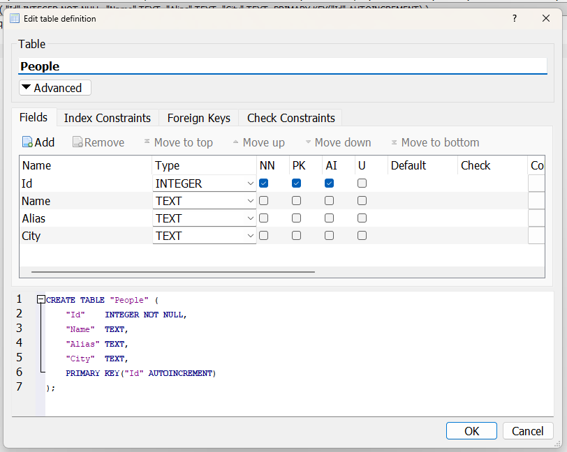

# Din första databas

**Verktyg:** DB Browser for SQLite

Vår allra första databas: en fil, en tabell, några rader och de första frågorna.

Vi ska skapa en databas för hjältar.

Vi börjar enkelt...
men först behöver du installera [DB Browser for SQLite](sqlite-browser.md).


## 1. Skapa databasen

Att skapa en databas är enkelt i DBBrowser, klicka på knappen "**New database**" så får du en ruta som frågar var du vill spara den. 



Jag rekommenderar att du skapar en databasmapp i din "**Mina dokument**"



## 2. Skapa tabellen

I SQLite kan vi använda oss av editorn...



... eller bara köra denna kod

```sql
CREATE TABLE "People" (
	"Id"	INTEGER NOT NULL,
	"Name"	TEXT,
	"Alias"	TEXT,
	"City"	TEXT,
	PRIMARY KEY("Id" AUTOINCREMENT)
);
```

## 3. Lägg in data

Vi börjar med att mata in lite hjältar från DC världen!

```sql
INSERT INTO People (Name, Alias, City) VALUES ('Clark Kent', 'Superman', 'Metropolis');
INSERT INTO People (Name, Alias, City) VALUES ('Bruce Wayne', 'Batman', 'Gotham City');
INSERT INTO People (Name, Alias, City) VALUES ('Kara Zor-El', 'Supergirl', 'National City');
INSERT INTO People (Name, Alias, City) VALUES ('Jonathan Kent', NULL, 'Smallville');
INSERT INTO People (Name, Alias, City) VALUES ('Martha Kent', NULL, 'Smallville');
INSERT INTO People (Name, Alias, City) VALUES ('Lois Lane', NULL, 'Metropolis');
INSERT INTO People (Name, Alias, City) VALUES ('Jimmy Olsen', NULL, 'Metropolis');
INSERT INTO People (Name, Alias, City) VALUES ('Lex Luthor', NULL, 'Metropolis');
INSERT INTO People (Name, Alias, City) VALUES ('Arthur Curry', 'Aquaman', 'Atlantis');
INSERT INTO People (Name, Alias, City) VALUES ('Diana Prince', 'Wonder Woman', 'Themyscira');
INSERT INTO People (Name, Alias, City) VALUES ('Barry Allen', 'The Flash', 'Central City');
INSERT INTO People (Name, Alias, City) VALUES ('Felicity Smoak', 'Overwatch', 'Star City');
INSERT INTO People (Name, Alias, City) VALUES ('Oliver Queen', 'Green Arrow', 'Star City');
```

**Tänk på:**

- **Text skrivs inom enkelfnuttar** `'...'`. Dubbelfnuttar `"..."` betyder i SQL ett *namn* på en tabell eller kolumn. SQLite förlåter det, men MySQL och PostgreSQL gör det inte.
- **Avsluta varje sats med semikolon** `;` så vet databasen var en fråga slutar och nästa börjar.
- **`NULL` betyder "inget värde"**: Lois, Jimmy och föräldrarna Kent har inget alias. `NULL` skrivs utan fnuttar. `'NULL'` vore texten "NULL".
- **`Id` fyller vi aldrig i själva**: `AUTOINCREMENT` ger varje rad nästa lediga nummer.

## 4. Hämta data

Nu kollar vi på vår lista
```sql
SELECT * FROM People;
```
och får fram namnlistan

| Id | Name | Alias | City |
|---|---|---|---|
| 1 | Clark Kent | Superman | Metropolis |
| 2 | Bruce Wayne | Batman | Gotham City |
| 3 | Kara Zor-El | Supergirl | National City |
| 4 | Jonathan Kent | NULL | Smallville |
| 5 | Martha Kent | NULL | Smallville |
| 6 | Lois Lane | NULL | Metropolis |
| 7 | Jimmy Olsen | NULL | Metropolis |
| 8 | Lex Luthor | NULL | Metropolis |
| 9 | Arthur Curry | Aquaman | Atlantis |
| 10 | Diana Prince | Wonder Woman | Themyscira |
| 11 | Barry Allen | The Flash | Central City |
| 12 | Felicity Smoak | Overwatch | Star City |
| 13 | Oliver Queen | Green Arrow | Star City |


## 5. Filtrera med WHERE

OK Nu vill jag bara kolla på Star City folket

```sql
SELECT * FROM People WHERE City = 'Star City';
```

| Id | Name | Alias | City |
|---|---|---|---|
| 12 | Felicity Smoak | Overwatch | Star City |
| 13 | Oliver Queen | Green Arrow | Star City |

## 6. Problemet med en växande tabell

Nu har vi en snygg tabell som vi kan söka i, filtrera och hitta namn i... Hur najs som helst, men vad är egentligen skillnaden mellan det här och ett Excelblad? I Excel ser man allt på en gång, så varför krångla med en databas när vi kan stoppa in datan direkt i Excel?

Ett verkligt exempel: hösten 2020 samlade Public Health England in alla positiva covidtester i England. Labbens resultat fördes in i Excel, i det gamla `.xls`-formatet, som bara klarar 65 536 rader per blad. När bladet var fullt försvann resten av raderna, helt utan felmeddelande. Nästan **16 000 smittade** försvann ur statistiken under en vecka, och deras kontakter fick aldrig veta att de borde stanna hemma. En databas hade inte tappat en enda rad.

Excel är ett bra verktyg för att *räkna och visa*, men det är inte byggt för att *lagra* stora mängder data säkert.

Vi kan redan nu se att vi har data som upprepas. Namnen på städerna är en nagel i ögat för alla databasingenjörer! De upprepas, och de är inte "personliga" för personerna.

Ju mer data vi lägger in, desto fler rader blir det, och ju mer upprepad data vi skriver in, desto större blir risken för felstavningar och annat.

### En sann historia: makrot som rörde ihop allt

Ett annat hemskt exempel är från när jag i 20-årsåldern tog jobb på en dansklubb för att få lära mig dansa bugg helt gratis. De hade hela medlemsregistret i en hemsk Excelaktig sak. Jag fick "junior"-jobbet att mata in all data: namn, personnummer, KlubbId, kurser och vilken period man betalat för (månad/halvår/år). Ingen ville göra det jobbet, så de hade enorma högar med inbetalningsblanketter. Det de inte visste var att jag tycker att sortera data är som meditation, så jag körde på och hade hur roligt som helst.

Medan jag matade in började jag se mönster, exempelvis mellan adresser och postnummer (duh). Så jag skrev ett makro som letade upp postnumret när en viss adress matades in och klistrade in det i rätt ruta. Jag snyggade också till telefonnumren så att de stod i formatet `xxx-xxx xx xx` och postnumren i formatet `xxx xx`.

Det blev många rader, och det tog mig 1½ vecka att gå igenom över ett års data. Jag hade roligt och fick betalt för det, yay!

Några år senare, efter att jag hade slutat, träffade jag en av dansarna som berättade att det var något mystiskt med deras register: det stod telefonnummer i postnummerfältet... Oj. Mitt makro hade rört ihop fälten och klistrat in telefonnummer där postnumret skulle stå och postnummer där telefonnumret skulle stå. Ooops.

### Summan av kardemumman

1. **Lagra saker på ett ställe.** Postnumret hör ihop med adressen, inte med personen. Om det skrivs in på varje rad kan det bli fel på varje rad. Det är precis det normalisering handlar om, och det kommer vi till snart.
2. **En databas kan säga nej.** Om ett postnummerfält har rätt datatyp och en regel som `CHECK (length(Zip) = 5)` hade mitt makro stoppats redan på första raden. I Excel kan man klistra in vad som helst var som helst.
3. **Testa automatiseringen på några rader innan du kör den på allt.** Mitt fel syntes inte förrän flera år senare.
4. **För mycket data på samma skärm gör oss blinda.** Jag såg inte felen, för det var för mycket data på skärmen. Med en databas frågar vi efter det vi vill se, till exempel `WHERE City = 'Star City'`, i stället för att scrolla igenom allt.
5. **Hänvisa med ett id i stället för att skriva av.** Genom att lägga upprepad data i en egen tabell och hänvisa till den med en siffra minskar vi risken för felstavningar och felhänvisningar. "Metropolis" skrivs in en gång, inte på varannan rad.
6. **Data lever längre än du tror.** Jag hade slutat för länge sedan när felet upptäcktes, och ingen visste vad som hade hänt. Den som tar över datan efter dig ska kunna lita på den, eller åtminstone förstå hur den kom till.

## 7. Vi fortsätter med våra hjältar

Som vi såg i tabellen innan så blev det upprepningar i städer ju mer data vi matade in. Tänk om vi matar in...

```sql
INSERT INTO People (Name, Alias, City) VALUES
    ('Lana Lang', NULL, 'Smallville'),
    ('Pete Ross', NULL, 'Smallville'),
    ('Chloe Sullivan', NULL, 'Smallville'),
    ('Perry White', NULL, 'Metropolis'),
    ('Cat Grant', NULL, 'Metropolis'),
    ('Lucy Lane', NULL, 'Metropolis'),
    ('Maggie Sawyer', NULL, 'Metropolis'),
    ('Mercy Graves', NULL, 'Metropolis'),
    ('John Henry Irons', 'Steel', 'Metropolis'),
    ('Ron Troupe', NULL, 'Metroplis'),
    ('Bibbo Bibbowski', NULL, 'metropolis'),
    ('Lionel Luthor', NULL, 'Metropolis ');
```

> **Nytt knep:** Ett enda `INSERT` kan lägga in flera rader. Separera raderna med kommatecken, och sätt semikolon först efter den sista.

Tabellen har nu 25 rader, och redan nu är den jobbig att läsa. Vi letar upp alla i Metropolis:

```sql
SELECT * FROM People WHERE City = 'Metropolis';
```

| Id | Name | Alias | City |
|---|---|---|---|
| 1 | Clark Kent | Superman | Metropolis |
| 6 | Lois Lane | NULL | Metropolis |
| 7 | Jimmy Olsen | NULL | Metropolis |
| 8 | Lex Luthor | NULL | Metropolis |
| 17 | Perry White | NULL | Metropolis |
| 18 | Cat Grant | NULL | Metropolis |
| 19 | Lucy Lane | NULL | Metropolis |
| 20 | Maggie Sawyer | NULL | Metropolis |
| 21 | Mercy Graves | NULL | Metropolis |
| 22 | John Henry Irons | Steel | Metropolis |

Vänta nu... var är Ron Troupe, Bibbo och Lionel Luthor? Titta noga på `INSERT`-satsen ovan:

- `'Metroplis'`: ett o saknas
- `'metropolis'`: liten bokstav
- `'Metropolis '`: ett mellanslag på slutet, som inte ens syns

För databasen är det tre olika städer. Tre personer har försvunnit ur sökningen, utan något felmeddelande. Känns det igen från Public Health England?

I detta fall finns de kvar i databasen, men deras städer är felstavade. Lätt hänt.

## 8. Rätta till med UPDATE

`UPDATE` ändrar rader som redan finns. Grundformen är:

```
UPDATE Tabell SET Kolumn = 'nytt värde' WHERE villkor;
```

### Rätta en rad med hjälp av Id

Ron Troupe har `Id` 23. Ett `Id` är unikt, så vi vet att vi bara träffar honom:

```sql
UPDATE People SET City = 'Metropolis' WHERE Id = 23;
```

### Rätta alla rader med samma fel

Har flera personer fått `'metropolis'` med liten bokstav? Spelar ingen roll, vi tar alla på en gång:

```sql
UPDATE People SET City = 'Metropolis' WHERE City = 'metropolis';
```

### Ta bort osynliga mellanslag

`TRIM()` tar bort mellanslag i början och slutet av en text. Det här rättar Lionel Luthor, och alla andra som kan ha fått ett mellanslag för mycket:

```sql
UPDATE People SET City = TRIM(City);
```

> Den här saknar `WHERE` med flit. Den ändrar *alla* rader, men den gör ingen skada, för en text utan mellanslag i kanterna blir likadan.

### Folk flyttar

Lana Lang lämnar Smallville och flyttar till storstaden:

```sql
UPDATE People SET City = 'Metropolis' WHERE Name = 'Lana Lang';
```

### Ändra flera kolumner på en gång

Jimmy Olsen får äntligen ett alias, och Lex Luthor blir president och flyttar till Washington. Separera kolumnerna med kommatecken:

```sql
UPDATE People SET Alias = 'Superman''s Pal' WHERE Name = 'Jimmy Olsen';
UPDATE People SET Alias = 'President Luthor', City = 'Washington' WHERE Name = 'Lex Luthor';
```

> **Fnuttfällan:** Hur skriver man `'` *inuti* en text som redan är omgiven av `'...'`? Man skriver två: `'Superman''s Pal'` blir *Superman's Pal* i databasen.

### Nu hittar vi alla

```sql
SELECT * FROM People WHERE City = 'Metropolis';
```

| Id | Name | Alias | City |
|---|---|---|---|
| 1 | Clark Kent | Superman | Metropolis |
| 6 | Lois Lane | NULL | Metropolis |
| 7 | Jimmy Olsen | Superman's Pal | Metropolis |
| 14 | Lana Lang | NULL | Metropolis |
| 17 | Perry White | NULL | Metropolis |
| 18 | Cat Grant | NULL | Metropolis |
| 19 | Lucy Lane | NULL | Metropolis |
| 20 | Maggie Sawyer | NULL | Metropolis |
| 21 | Mercy Graves | NULL | Metropolis |
| 22 | John Henry Irons | Steel | Metropolis |
| 23 | Ron Troupe | NULL | Metropolis |
| 24 | Bibbo Bibbowski | NULL | Metropolis |
| 25 | Lionel Luthor | NULL | Metropolis |

### ⚠️ Glöm aldrig WHERE

Kör **inte** den här:

```
UPDATE People SET City = 'Smallville';
```

Utan `WHERE` flyttar *alla* 25 personer till Smallville. Batman, Wonder Woman, Aquaman, alla. Det finns ingen ångra-knapp. Ett bra vanemönster: skriv `SELECT` med ditt `WHERE` först, kolla att du träffar rätt rader och byt sedan ut `SELECT *` mot `UPDATE ... SET`.

OMG! 😱

## Gör om, gör rätt

Vi börjar om med databasen. Delar upp den i tabeller och plockar ut vad vi behöver

Planen:
```plaintext
1. Id, Name, Alias kan vi behålla som det är
2. Vi kopierar över alla städer till en egen tabell
3. Vi ersätter textfältet för stad med ett numeriskt fält och byter ut alla namn mot siffror
```
Den här typen av koppling kallas många-till-en (\*-1). Det betyder att många personer kan kopplas till samma stad, men en person kan bara kopplas till en stad.
Det låter hur bra som helst... tills Lex Luthor köper ett hus i en annan stad. Då kan vi inte längre underhålla databasen, för vi kopplar tabellerna med ett heltal (`INTEGER`). Ett fält kan inte vara en array eller innehålla mer än ett värde. Så hur gör vi nu?

Vi behöver många-till-många (\*-\*), alltså att en person kan bo i flera städer och en stad kan ha många invånare.

Planerar igen:
```plaintext
1. Id, Name, Alias kan vi behålla som det är
2. Vi kopierar över alla städer till en egen tabell
3. Vi skapar en tabell som kopplar stad och person.
4. Kopplar dem i tabellen och raderar stad från personen.
```

Då har persontabellen ingen koppling till städer, och stadstabellen har ingen koppling till personer. Kopplingen bor i en egen tabell mittemellan.

OK, nya tabeller!

Först en tabell för våra hjältar
```sql
CREATE TABLE "Hero" (
	"id"	INTEGER NOT NULL,
	"name"	TEXT,
	"alias"	TEXT,
	PRIMARY KEY("id")
);
```

Se en tabell för städerna
```sql
CREATE TABLE "City" (
	"id"	INTEGER NOT NULL,
	"name"	TEXT NOT NULL UNIQUE,
	PRIMARY KEY("id")
);
```

Och slutligen kopplingstabell mellan Hero och City
```sql 
CREATE TABLE "HeroCity" (
    "heroId" INTEGER NOT NULL,
    "cityId" INTEGER NOT NULL,
    PRIMARY KEY("heroId", "cityId"),
    FOREIGN KEY("heroId") REFERENCES "Hero"("id") ON DELETE CASCADE,
    FOREIGN KEY("cityId") REFERENCES "City"("id") ON DELETE CASCADE
);
```
> **Tips:** `ON DELETE CASCADE` betyder att om en hjälte eller stad raderas, försvinner kopplingarna automatiskt. I SQLite måste främmande nycklar vara påslagna (`PRAGMA foreign_keys = ON;`). DB Browser slår på det åt dig.

Och nu ska vi kopiera datan från den gamla tabellen till de nya.

### Personerna

Vi behöver inte skriva 25 `INSERT` igen. Ett `INSERT` kan ta sina rader direkt från ett `SELECT`:

```sql
INSERT INTO Hero (id, name, alias)
    SELECT Id, Name, Alias FROM People;
```
Helt magiskt, Select hämtar alla personer och Hero sparar dem, ungefär som när vi anropar en metod som söker upp data och skickar resultatet till en metod som sparar eller skriver ut det.

Vi behåller samma `id` (viktigt så datan inte korrumperas), så att Clark Kent fortfarande är nummer 1.

### Städerna

`DISTINCT` plockar bort dubbletterna, så varje stad kommer med en gång:

```sql
INSERT INTO City (name)
    SELECT DISTINCT City FROM People ORDER BY City;
```
Samma sak här, vi samlar alla städer i bokstavsordning till och med och skickar in dem till den nya tabellen.

och vi kan se resultatet här:
```sql
SELECT * FROM City;
```

| id | name |
|---|---|
| 1 | Atlantis |
| 2 | Central City |
| 3 | Gotham City |
| 4 | Metropolis |
| 5 | National City |
| 6 | Smallville |
| 7 | Star City |
| 8 | Themyscira |
| 9 | Washington |

25 rader med upprepade städer har blivit 9 rader, en per stad. Och tack vare `UNIQUE` kan ingen lägga in Metropolis två gånger.

### Kopplingarna

Nu ska varje person kopplas till sin stad. Vi matchar stadens namn i `People` mot namnet i `City` och sparar bara siffrorna:

```sql
INSERT INTO HeroCity (heroId, cityId)
SELECT People.Id, City.id
FROM People
JOIN City ON City.name = People.City;
```

> `JOIN` lägger ihop två tabeller där villkoret efter `ON` stämmer. Det går vi igenom ordentligt i [JOIN](kommandon/join.md). Just nu räcker det att veta att den hittar rätt `id` för varje stadsnamn.

> ⚠️ Viktigt att städerna är rätt inmatade för att Join ska fungera!

### Lex köper ett hus till

Lex Luthor flyttade till Washington, men han behåller lyan i Metropolis. Förut var det omöjligt, nu är det bara en rad till. Vi kollar i `City`-tabellen att Metropolis har `id` 4, och Lex har `id` 8:

```sql
INSERT INTO HeroCity (heroId, cityId) VALUES (8, 4);
```

Vi kan mata in en person flera gånger i kopplingstabellen men bara en gång per stad.

### Bort med den gamla tabellen

All data finns nu i de nya tabellerna, så `People` behövs inte längre:

```sql
DROP TABLE People;
```

> ⚠️ `DROP TABLE` raderar hela tabellen *och* all data i den. Ingen ångra-knapp här heller. Kör den först när du har kollat att allt har kopierats.

### Vem bor var?

För att få tillbaka namnen på personerna och städerna lägger vi ihop alla tre tabellerna:

```sql
SELECT Hero.name, Hero.alias, City.name AS city
FROM Hero
JOIN HeroCity ON HeroCity.heroId = Hero.id
JOIN City ON City.id = HeroCity.cityId
WHERE Hero.name = 'Lex Luthor';
```

| name | alias | city |
|---|---|---|
| Lex Luthor | President Luthor | Washington |
| Lex Luthor | President Luthor | Metropolis |

En person, två städer, och varje stadsnamn står bara på ett ställe i hela databasen. Det är vad vi menar med att dela upp datan i småbitar.

## Sammanfattning

När du ska spara information i din databas, tänk först igenom vad du vill spara och se hur du kan dela upp det. Det sparar dig mycket arbete och tid att göra så.

## Referens

| Kommando | Gör |
|---|---|
| `CREATE TABLE` | Skapar en tabell |
| `INSERT INTO ... VALUES` | Lägger till rader |
| `INSERT INTO ... SELECT` | Lägger till rader från en annan tabell |
| `SELECT ... WHERE` | Hämtar rader som matchar ett villkor |
| `SELECT DISTINCT` | Hämtar utan dubbletter |
| `UPDATE ... SET ... WHERE` | Ändrar rader |
| `DROP TABLE` | Raderar en hel tabell |
| `JOIN` | Lägger ihop tabeller, se [JOIN](kommandon/join.md) |