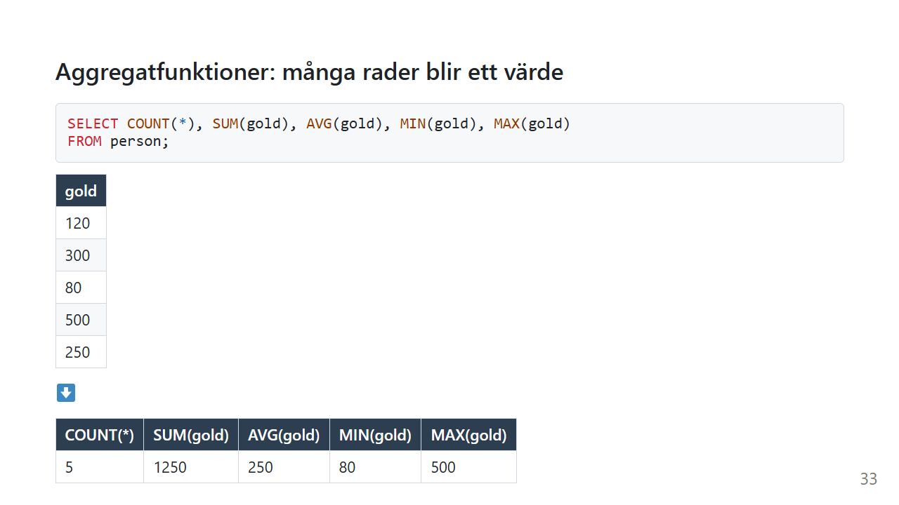
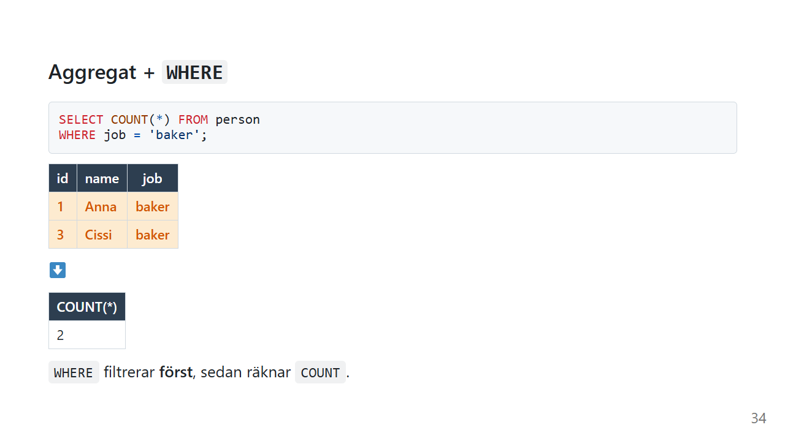

# Aggregatfunktioner: många rader blir ett värde

"Hur många kunder har vi?" "Vad är snittpriset?" "Vilken order var störst?"

Du vill inte se raderna. Du vill ha **ett tal** som sammanfattar dem. Det är vad aggregatfunktionerna gör.

*Exemplen använder [övningsdatan](ovningsdata.md).*

## De fem vanligaste

| Funktion | Gör | Exempel |
|---|---|---|
| `COUNT(*)` | räknar rader | hur många personer? |
| `SUM(kolumn)` | summerar | hur mycket guld totalt? |
| `AVG(kolumn)` | räknar ut medelvärdet | snittguld? |
| `MIN(kolumn)` | minsta värdet | minst guld? |
| `MAX(kolumn)` | största värdet | mest guld? |

```sql
SELECT COUNT(*), SUM(gold), AVG(gold), MIN(gold), MAX(gold)
FROM person;
```



| COUNT(\*) | SUM(gold) | AVG(gold) | MIN(gold) | MAX(gold) |
|---|---|---|---|---|
| 5 | 1250 | 250 | 80 | 500 |

Fem rader blev **en**. Det är det som gör aggregatfunktioner speciella: de slår ihop många rader till ett resultat.

Ge gärna kolumnerna namn med `AS`, så blir resultatet lättare att läsa:

```sql
SELECT COUNT(*) AS antal, SUM(gold) AS totalt
FROM person;
```

## Aggregat + WHERE



```sql
SELECT COUNT(*) FROM person
WHERE job = 'baker';
```

Resultatet är 2.

Ordningen är viktig: [WHERE](where.md) filtrerar raderna **först**, och sedan räknar `COUNT` de rader som är kvar. Det är därför du kan svara på frågor som "hur många bagare finns det?" eller "hur mycket guld har de som bor i by 2?".

```sql
SELECT SUM(gold) FROM person
WHERE village_id = 2;   -- 550
```

## `COUNT(*)` eller `COUNT(kolumn)`?

Det här är en fin liten fälla.

```sql
SELECT COUNT(*), COUNT(village_id)
FROM person;
```

| COUNT(\*) | COUNT(village_id) |
|---|---|
| 5 | 4 |

- `COUNT(*)` räknar **rader**, alla fem
- `COUNT(village_id)` räknar **värden som inte är `NULL`**. David har inget `village_id`, så han räknas inte.

Samma sak gäller de andra funktionerna: `SUM`, `AVG`, `MIN` och `MAX` hoppar över `NULL`.

Det här blir viktigt i [JOIN](join.md), där `NULL` dyker upp ofta.

## `COUNT(DISTINCT kolumn)`

Hur många **olika** yrken finns det?

```sql
SELECT COUNT(DISTINCT job)
FROM person;
```

Resultatet är 4. `baker` finns två gånger, men räknas en gång.

## Du kan inte blanda hur som helst

```sql
-- ❌ Vem är "name" här?
SELECT name, MAX(gold)
FROM person;
```

`MAX(gold)` är **ett** värde för hela tabellen, men det finns fem namn. Vilket ska stå bredvid?

De flesta databaser ger ett felmeddelande. SQLite har en specialregel: tillsammans med `MIN` eller `MAX` hämtas `name` från raden som har det minsta eller största värdet. Det är en egenhet som bara finns i SQLite, så bygg inte på den. Vill du veta *vem* som har mest guld finns det två sätt:

```sql
-- Sortera och ta den första
SELECT name, gold FROM person
ORDER BY gold DESC
LIMIT 1;

-- Eller med en subquery
SELECT name, gold FROM person
WHERE gold = (SELECT MAX(gold) FROM person);
```

Mer om det på sidorna [ORDER BY](order-by.md) och [Subquery](subquery.md).

Vill du ha ett aggregat **per** yrke eller **per** by i stället för ett för hela tabellen behöver du [GROUP BY](group-by.md). Det är nästa sida.

### Clean Code: aggregat

> Så här gör du siffrorna begripliga.

```sql
-- ❌ Resultatet får kolumnnamnen "COUNT(*)" och "AVG(gold)"
SELECT COUNT(*), AVG(gold) FROM person WHERE job='baker'
```

```sql
-- ✅ Resultatet förklarar sig själv
SELECT COUNT(*)  AS antal_bagare,
       AVG(gold) AS snittguld
FROM person
WHERE job = 'baker';
```

- **Namnge aggregaten med `AS`.** Det är det enda sättet att få ett vettigt kolumnnamn, och koden som läser resultatet blir tydligare.
- **Tänk på `NULL`.** Välj `COUNT(*)` eller `COUNT(kolumn)` med flit, inte av vana.

## Vanliga misstag

| Misstag | Vad händer? | Gör så här i stället |
|---|---|---|
| `COUNT(kolumn)` när du menar alla rader | Rader med `NULL` räknas inte | `COUNT(*)` |
| `SELECT name, MAX(gold)` | Felmeddelande i de flesta databaser, och fungerar bara i SQLite | `ORDER BY ... LIMIT 1`, eller en subquery |
| `WHERE COUNT(*) > 1` | Felmeddelande. `WHERE` körs innan något har räknats. | `HAVING`, se [GROUP BY](group-by.md) |
| `AVG` på heltal i vissa databaser | SQL Server kan avrunda snittet till ett heltal | `AVG(gold * 1.0)` om du vill ha decimaler |

## Sammanfattning

- `COUNT`, `SUM`, `AVG`, `MIN` och `MAX` gör **många rader till ett värde**.
- `WHERE` filtrerar först, och sedan räknar aggregatet.
- `COUNT(*)` räknar rader. `COUNT(kolumn)` hoppar över `NULL`.
- `COUNT(DISTINCT kolumn)` räknar olika värden.
- Vanliga kolumner och aggregat kan inte blandas fritt. För det behövs `GROUP BY`.

## Övningar

Använd [övningsdatan](ovningsdata.md).

### 🟢 Övning 1: Antal bagare

Hur många bagare finns det?

<details>
<summary>💡 Klicka här för ett lösningsförslag</summary>

Din lösning kan se annorlunda ut och ändå vara helt korrekt!

```sql
SELECT COUNT(*) AS antal_bagare
FROM person
WHERE job = 'baker';
```

Resultatet är 2.

</details>

### 🟢 Övning 2: Allt guld

Hur mycket guld finns det totalt, och vad är snittet?

<details>
<summary>💡 Klicka här för ett lösningsförslag</summary>

Din lösning kan se annorlunda ut och ändå vara helt korrekt!

```sql
SELECT SUM(gold) AS totalt, AVG(gold) AS snitt
FROM person;
```

Resultatet är 1250 totalt och 250 i snitt.

</details>

### 🟡 Övning 3: Fem eller fyra?

Kör de här två frågorna. Varför ger de olika svar?

```sql
SELECT COUNT(*) FROM person;
SELECT COUNT(village_id) FROM person;
```

<details>
<summary>💡 Klicka här för ett lösningsförslag</summary>

Din lösning kan se annorlunda ut och ändå vara helt korrekt!

Den första ger 5 och den andra ger 4.

`COUNT(*)` räknar rader, och det finns fem. `COUNT(village_id)` räknar bara värden som inte är `NULL`, och Davids `village_id` är `NULL`.

</details>

### 🔴 Övning 4: Skillnaden

Hur stor är skillnaden i guld mellan den rikaste och den fattigaste? Svaret ska vara ett enda tal, och det ska heta `skillnad`.

<details>
<summary>💡 Klicka här för ett lösningsförslag</summary>

Din lösning kan se annorlunda ut och ändå vara helt korrekt!

```sql
SELECT MAX(gold) - MIN(gold) AS skillnad
FROM person;
```

Resultatet är 420 (500 − 80). Du kan räkna med aggregat precis som med vanliga kolumner.

</details>

---

Föregående: [ORDER BY](order-by.md) · [Tillbaka till översikten](index.md) · Nästa: [GROUP BY](group-by.md)

*Av Marcus Ackre Medina · Nion Education · marcus.medina@nionit.com*
