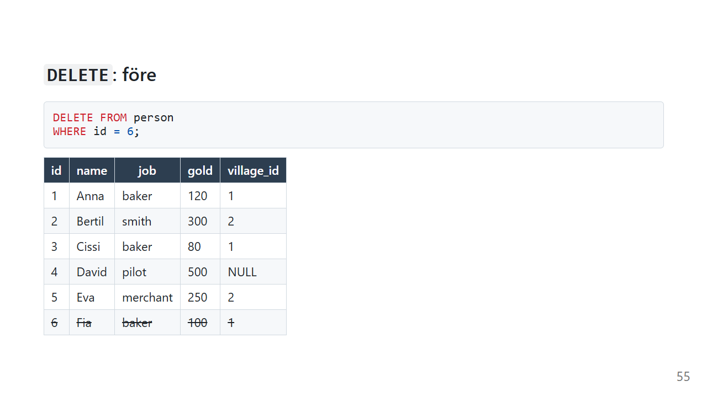
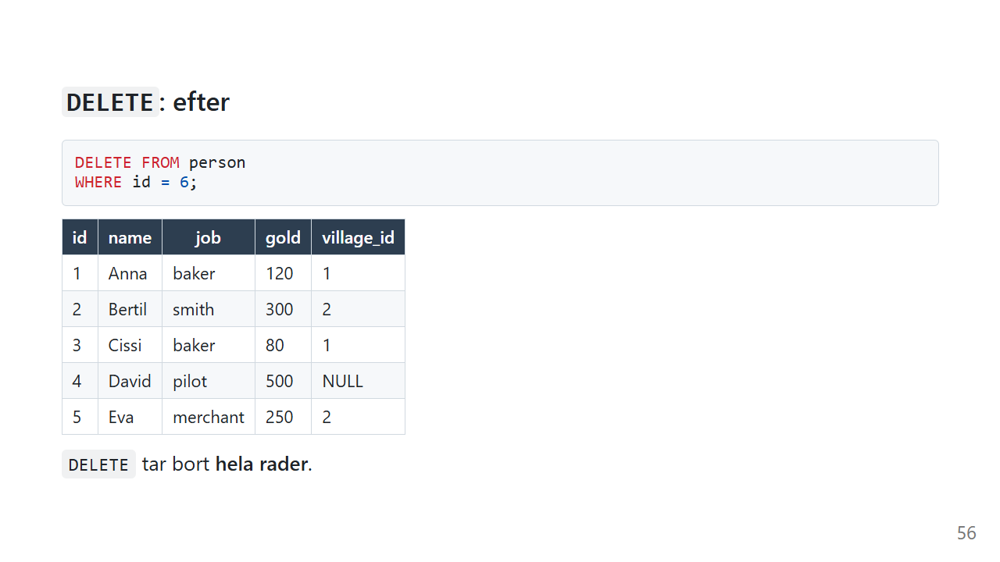
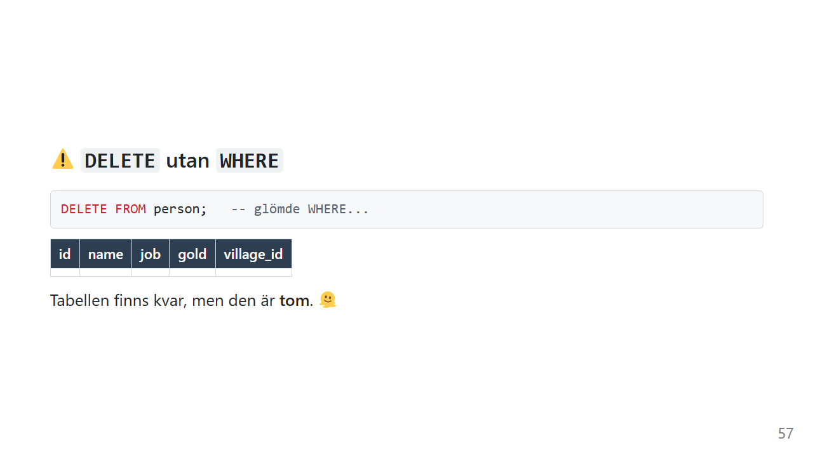

# DELETE: ta bort rader

`DELETE` är det enklaste kommandot att skriva och det farligaste att köra fel. Det finns ingen papperskorg. En rad som är borttagen är borta.

Den här sidan visar hur `DELETE` fungerar, och hur du ser till att du bara tar bort det du menar.

*Exemplen använder [övningsdatan](ovningsdata.md), plus Främlingen från [INSERT](insert.md)-sidan, som på [UPDATE](update.md)-sidan bytte namn till Fia. Har du inte henne kan du lägga till henne så här:*

```sql
INSERT INTO person (name, job, gold, village_id)
VALUES ('Fia', 'baker', 100, 1);
```

## Vad gör DELETE?



```sql
DELETE FROM person
WHERE id = 6;
```

På svenska:

> *Ta bort raden med id 6 från tabellen person.*



`DELETE` tar bort **hela rader**. Det finns ingen kolumnlista, för det går inte att ta bort "bara guldet" från en rad.

Vill du tömma en kolumn är det [UPDATE](update.md) du är ute efter:

```sql
UPDATE person SET job = NULL WHERE id = 6;
```

## ⚠️ Utan WHERE



```sql
DELETE FROM person;   -- glömde WHERE...
```

Tabellen finns kvar, med alla sina kolumner och regler, men den är **tom**.

| Kommando | Familj | Tar bort |
|---|---|---|
| `DELETE FROM person WHERE ...` | DML | de rader som matchar |
| `DELETE FROM person` | DML | alla rader, men tabellen finns kvar |
| `DROP TABLE person` | DDL | hela tabellen: rader, kolumner och regler |

## Den gyllene regeln


1. **Skriv `SELECT` med ditt `WHERE` först**

   ```sql
   SELECT * FROM person WHERE id = 6;
   ```

2. **Ser raderna rätt ut? Byt då bara början**

   ```sql
   DELETE FROM person WHERE id = 6;
   ```

Det är bara `SELECT *` som byts mot `DELETE`. Allt efter `FROM` är exakt detsamma, och därför vet du exakt vilka rader som försvinner.

### Skyddsnät: transaktion

```sql
BEGIN TRANSACTION;

DELETE FROM person WHERE gold < 100;

SELECT * FROM person;   -- försvann rätt rader?

ROLLBACK;               -- ångra allt sedan BEGIN
-- COMMIT;              -- eller spara
```

Det här är det närmaste en ångra-knapp du kommer i SQL. Mer om det i [Transaktioner](../transaktioner.md).

## När databasen säger nej

Tänk dig att du tar bort Lökby, trots att Anna och Cissi bor där:

```sql
DELETE FROM village WHERE id = 1;
```

Nu pekar Annas och Cissis `village_id` på en by som inte finns. Det kallas **föräldralösa rader**, och det är precis den sortens fel som främmande nycklar ska förhindra.

Kolumnen `village_id` är skapad med `REFERENCES village(id)`. I de flesta databaser räcker det, och då stoppas din `DELETE`. Men SQLite kontrollerar främmande nycklar **bara om du ber om det**:

```sql
PRAGMA foreign_keys = ON;

DELETE FROM village WHERE id = 1;
-- Fel: FOREIGN KEY constraint failed
```

`PRAGMA foreign_keys = ON` gäller den anslutning du har öppen just nu, så den behöver köras varje gång du ansluter. Många program gör det automatiskt när de öppnar databasen.

Felmeddelandet är din vän. Det säger: "Om du tar bort den här raden blir andra rader fel." Vill du verkligen ta bort byn måste du först bestämma vad som ska hända med invånarna. Ska de flytta, eller ska de också tas bort?

### Clean Code: DELETE

> Så här tar du bort rader utan att få ont i magen.

```sql
-- ❌ På en rad, och lätt att råka köra bara "delete from person"
delete from person where name='Fia'
```

```sql
-- ✅ WHERE på egen rad, och filtrerat på id
DELETE FROM person
WHERE id = 6;
```

- **`WHERE` på egen rad.** Då syns det direkt om det saknas.
- **Filtrera på id** när du menar en rad
- **`SELECT` först. Alltid.**
- **En transaktion** när du tar bort mer än en rad
- **Slå på kontrollen av främmande nycklar** så att databasen kan hjälpa dig

## Vanliga misstag

| Misstag | Vad händer? | Gör så här i stället |
|---|---|---|
| Glömt `WHERE` | Tabellen töms | `SELECT` med samma `WHERE` först |
| `DELETE name FROM person` | Syntaxfel. `DELETE` tar alltid hela rader. | `UPDATE person SET name = ...` |
| `WHERE name = 'Fia'` när du menar en person | Alla som heter Fia tas bort | `WHERE id = 6` |
| Ta bort en rad som andra rader pekar på | Föräldralösa rader, eller ett felmeddelande | Flytta eller ta bort de beroende raderna först |
| Förlita sig på främmande nycklar i SQLite | Kontrollen är avstängd från början | `PRAGMA foreign_keys = ON;` |

## Sammanfattning

- `DELETE FROM tabell WHERE villkor` tar bort **hela rader**.
- Utan `WHERE` töms hela tabellen, men tabellen finns kvar. `DROP TABLE` tar bort tabellen.
- `SELECT` med samma `WHERE` först.
- En transaktion låter dig ångra med `ROLLBACK`.
- Främmande nycklar kan stoppa en `DELETE` som skulle lämna föräldralösa rader. I SQLite måste kontrollen slås på.

## Övningar

Kör [övningsdatan](ovningsdata.md) innan du börjar.

### 🟢 Övning 1: Spökbyn försvinner

Ta bort Morotsby, som ingen bor i.

<details>
<summary>💡 Klicka här för ett lösningsförslag</summary>

Din lösning kan se annorlunda ut och ändå vara helt korrekt!

```sql
SELECT * FROM village WHERE id = 3;    -- kontrollera först

DELETE FROM village
WHERE id = 3;
```

Det går bra, eftersom ingen `person` pekar på by 3.

</details>

### 🟡 Övning 2: Testa utan att ta bort

Ta bort alla som har mindre än 100 guld, men gör det i en transaktion. Kontrollera resultatet och **ångra** sedan ändringen.

<details>
<summary>💡 Klicka här för ett lösningsförslag</summary>

Din lösning kan se annorlunda ut och ändå vara helt korrekt!

```sql
BEGIN TRANSACTION;

DELETE FROM person
WHERE gold < 100;

SELECT * FROM person;   -- Cissi är borta

ROLLBACK;

SELECT * FROM person;   -- Cissi är tillbaka
```

Efter `ROLLBACK` är tabellen exakt som innan `BEGIN`.

</details>

### 🟡 Övning 3: Två på en gång

Ta bort alla piloter och köpmän med **en** `DELETE`. Kontrollera först vilka det gäller.

<details>
<summary>💡 Klicka här för ett lösningsförslag</summary>

Din lösning kan se annorlunda ut och ändå vara helt korrekt!

```sql
SELECT * FROM person
WHERE job IN ('pilot', 'merchant');    -- David och Eva

DELETE FROM person
WHERE job IN ('pilot', 'merchant');
```

Tre personer är kvar: Anna, Bertil och Cissi.

</details>

### 🔴 Övning 4: Byn som inte går att ta bort

Slå på kontrollen av främmande nycklar och försök ta bort Lökby. Vad händer? Vad måste du göra först för att det ska gå?

<details>
<summary>💡 Klicka här för ett lösningsförslag</summary>

Din lösning kan se annorlunda ut och ändå vara helt korrekt!

```sql
PRAGMA foreign_keys = ON;

DELETE FROM village WHERE id = 1;
-- Fel: FOREIGN KEY constraint failed
```

Anna och Cissi pekar på Lökby, så databasen vägrar.

Det finns två vägar framåt, och vilken som är rätt är ett beslut om verksamheten, inte om SQL:

```sql
-- Väg 1: invånarna flyttar till Gurkby
UPDATE person SET village_id = 2 WHERE village_id = 1;
DELETE FROM village WHERE id = 1;
```

```sql
-- Väg 2: invånarna blir bostadslösa
UPDATE person SET village_id = NULL WHERE village_id = 1;
DELETE FROM village WHERE id = 1;
```

Lägg gärna båda stegen i en transaktion. Då blir det aldrig ett läge där invånarna har flyttat men byn finns kvar.

</details>

---

Föregående: [UPDATE](update.md) · [Tillbaka till översikten](index.md)

Vill du öva mer? Testa [SQL Island](https://sql-island.informatik.uni-kl.de/) och [SQL Murder Mystery](https://mystery.knightlab.com/), två spel som löses helt med SQL.

Snyggt jobbat! Nu kan du läsa, filtrera, sortera, räkna, koppla ihop och ändra data. Det är grunden i nästan allt du kommer att göra med en databas. 💪
