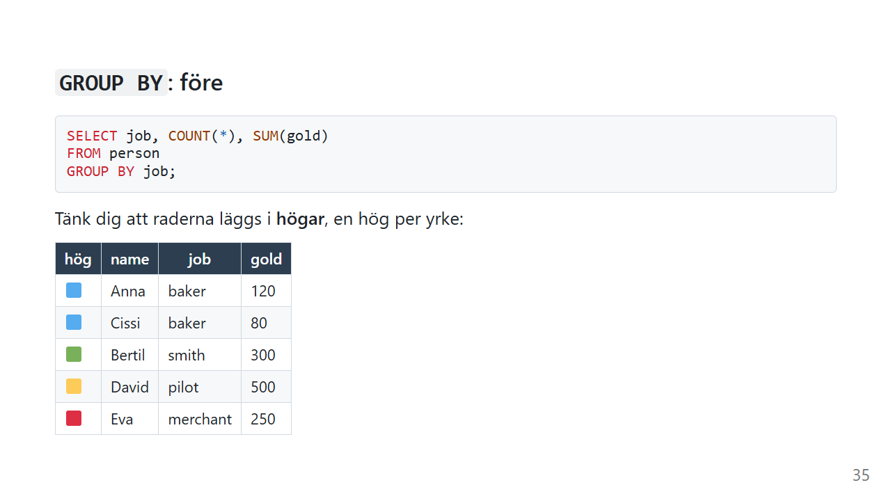
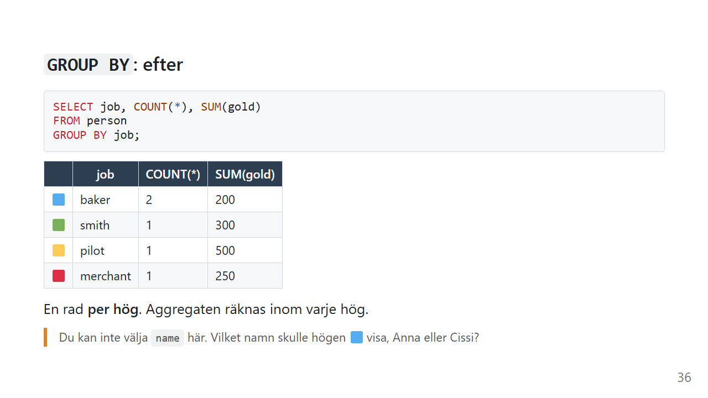
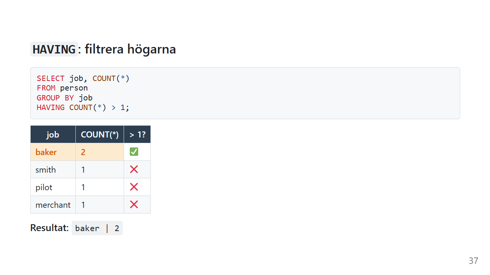
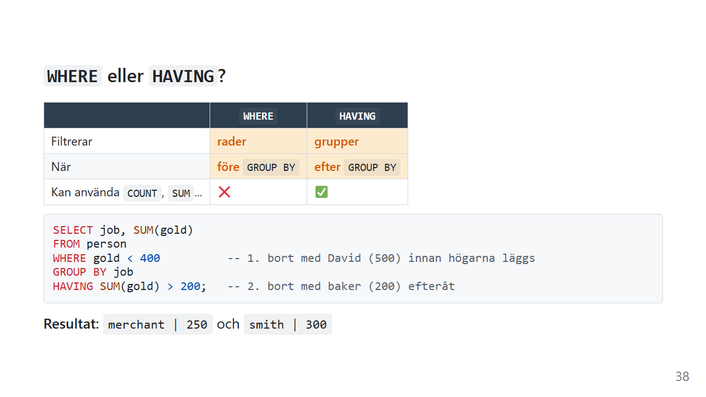
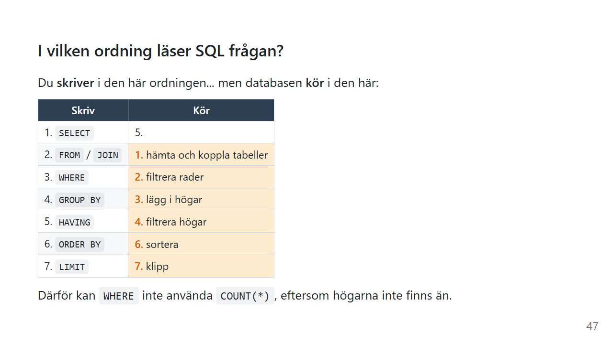

# GROUP BY: räkna per grupp

[Aggregatfunktionerna](aggregat.md) ger dig **ett** värde för hela tabellen. Men oftast vill du ha svaret *per* något: försäljning per månad, antal kunder per stad eller snittbetyg per kurs.

Det är det `GROUP BY` gör. Det är också där SQL börjar bli riktigt kraftfullt.

*Exemplen använder [övningsdatan](ovningsdata.md).*

## Lägg raderna i högar

Tänk dig att du sorterar tvätt. Alla vita plagg i en hög, alla svarta i en annan, alla färgade i en tredje. Sedan räknar du hur många plagg som ligger i varje hög.

Det är precis vad `GROUP BY` gör.

```sql
SELECT job, COUNT(*), SUM(gold)
FROM person
GROUP BY job;
```

Först läggs raderna i högar, en per yrke:



| hög | name | job | gold |
|---|---|---|---|
| 🟦 | Anna | baker | 120 |
| 🟦 | Cissi | baker | 80 |
| 🟩 | Bertil | smith | 300 |
| 🟨 | David | pilot | 500 |
| 🟥 | Eva | merchant | 250 |

Sedan blir varje hög **en rad** i resultatet, och aggregaten räknas inom varje hög för sig:



| job | COUNT(\*) | SUM(gold) |
|---|---|---|
| baker | 2 | 200 |
| merchant | 1 | 250 |
| pilot | 1 | 500 |
| smith | 1 | 300 |

På svenska:

> *Lägg personerna i högar efter yrke. Visa sedan yrket, antalet och summan av guldet för varje hög.*

## Regeln om SELECT

Varför kan du inte lägga till `name` här?

```sql
-- ❌ Vilket namn ska högen "baker" visa?
SELECT job, name, COUNT(*)
FROM person
GROUP BY job;
```

Tänk på tvätthögen. Om du frågar "vilket plagg är den vita högen?" finns inget svar. Högen är många plagg. På samma sätt vet databasen inte om högen `baker` ska visa Anna eller Cissi.

**Regeln:** i en grupperad fråga får `SELECT` bara innehålla

- kolumner som står i `GROUP BY`, eller
- aggregat som `COUNT`, `SUM` och `AVG`

De flesta databaser ger ett felmeddelande om du bryter mot regeln. SQLite gör det inte, utan väljer ett av namnen i högen. Det ser ut att fungera, men svaret är inte att lita på.

## NULL blir en egen hög

```sql
SELECT village_id, COUNT(*), AVG(gold)
FROM person
GROUP BY village_id;
```

| village_id | COUNT(\*) | AVG(gold) |
|---|---|---|
| NULL | 1 | 500 |
| 1 | 2 | 100 |
| 2 | 2 | 275 |

David har inget `village_id`, men han försvinner inte. Alla `NULL` hamnar i en gemensam hög.

## Gruppera på flera kolumner

```sql
SELECT village_id, job, COUNT(*)
FROM person
GROUP BY village_id, job;
```

Nu blir det en hög för varje **kombination** av by och yrke. Bagarna i by 1 hamnar i samma hög, men en bagare i by 2 hade fått en egen.

## `HAVING`: filtrera högarna

Vilka yrken har mer än en person?



```sql
SELECT job, COUNT(*)
FROM person
GROUP BY job
HAVING COUNT(*) > 1;
```

Resultatet är `baker | 2`.

`HAVING` är dörrvakten för **högar**, på samma sätt som [WHERE](where.md) är dörrvakten för **rader**.

## `WHERE` eller `HAVING`?



| | `WHERE` | `HAVING` |
|---|---|---|
| Filtrerar | **rader** | **högar** |
| När | **före** `GROUP BY` | **efter** `GROUP BY` |
| Kan använda `COUNT`, `SUM`... | ❌ | ✅ |

Här är ett exempel där båda behövs:

```sql
SELECT job, SUM(gold)
FROM person
WHERE gold < 400          -- 1. David (500) kommer aldrig in i någon hög
GROUP BY job
HAVING SUM(gold) > 200;   -- 2. Bagarnas hög (200) plockas bort efteråt
```

Resultatet är `merchant | 250` och `smith | 300`.

### Varför kan WHERE inte använda COUNT?

Titta på körordningen:



`WHERE` körs i steg 2. Högarna skapas i steg 3. När `WHERE` körs finns det alltså inga högar att räkna. `HAVING` körs i steg 4, när högarna redan finns.

Det är inte en godtycklig regel. Det är bara ordningen databasen gör sakerna i.

### Clean Code: GROUP BY

> Så här gör du grupperade frågor lätta att följa.

```sql
-- ❌ Rätt svar, men svårt att se vad som filtrerar vad
select job,sum(gold) from person where gold<400 group by job having sum(gold)>200
```

```sql
-- ✅ Varje steg på egen rad, i samma ordning som de körs
SELECT job,
       SUM(gold) AS totalt
FROM person
WHERE gold < 400
GROUP BY job
HAVING SUM(gold) > 200
ORDER BY totalt DESC;
```

- **Filtrera i `WHERE` när du kan.** Allt som kan sorteras bort innan grupperingen bör sorteras bort där. Det gör frågan tydligare, och ofta snabbare.
- **`HAVING` bara för villkor på aggregat**
- **Namnge aggregaten med `AS`**
- **Samma kolumner i `SELECT` och `GROUP BY`**, så att det syns vad en hög är

## Vanliga misstag

| Misstag | Vad händer? | Gör så här i stället |
|---|---|---|
| En kolumn i `SELECT` som inte finns i `GROUP BY` | Felmeddelande, eller ett slumpvis värde i SQLite | Gruppera på kolumnen, eller använd ett aggregat |
| `WHERE COUNT(*) > 1` | Felmeddelande | `HAVING COUNT(*) > 1` |
| `HAVING job = 'baker'` | Fungerar, men filtrerar sent | `WHERE job = 'baker'` före grupperingen |
| Glömma att `NULL` blir en egen hög | En oväntad rad i resultatet | Filtrera bort med `WHERE kolumn IS NOT NULL` om du inte vill ha den |
| Förvänta sig sorterat resultat | Ordningen är inte garanterad | Lägg till `ORDER BY` |

## Sammanfattning

- `GROUP BY` lägger rader i **högar**, och varje hög blir en rad i resultatet.
- Aggregaten räknas **per hög**.
- `SELECT` får bara innehålla grupperingskolumner och aggregat.
- `NULL` blir en egen hög.
- `WHERE` filtrerar rader **före** grupperingen och `HAVING` filtrerar högar **efter**.

## Övningar

Använd [övningsdatan](ovningsdata.md).

### 🟢 Övning 1: Antal per yrke

Hur många personer har varje yrke?

<details>
<summary>💡 Klicka här för ett lösningsförslag</summary>

Din lösning kan se annorlunda ut och ändå vara helt korrekt!

```sql
SELECT job, COUNT(*) AS antal
FROM person
GROUP BY job;
```

| job | antal |
|---|---|
| baker | 2 |
| merchant | 1 |
| pilot | 1 |
| smith | 1 |

</details>

### 🟡 Övning 2: Rika yrken

Vilka yrken har tillsammans **mer än** 250 guld? Visa yrket och summan.

<details>
<summary>💡 Klicka här för ett lösningsförslag</summary>

Din lösning kan se annorlunda ut och ändå vara helt korrekt!

```sql
SELECT job, SUM(gold) AS totalt
FROM person
GROUP BY job
HAVING SUM(gold) > 250;
```

Resultatet är `pilot | 500` och `smith | 300`. Bagarna har 200 och köpmannen exakt 250, och 250 är inte *mer än* 250.

Villkoret handlar om högar, inte enskilda rader, och därför är det `HAVING` och inte `WHERE`.

</details>

### 🟡 Övning 3: Snitt per by

Visa snittguldet per `village_id`, med det högsta snittet först.

<details>
<summary>💡 Klicka här för ett lösningsförslag</summary>

Din lösning kan se annorlunda ut och ändå vara helt korrekt!

```sql
SELECT village_id, AVG(gold) AS snittguld
FROM person
GROUP BY village_id
ORDER BY snittguld DESC;
```

| village_id | snittguld |
|---|---|
| NULL | 500 |
| 2 | 275 |
| 1 | 100 |

David hamnar i en egen hög med `NULL`. Vill du ha bynamnen i stället för id behöver du [JOIN](join.md).

</details>

### 🔴 Övning 4: Bara de bofasta

Gör om övning 2, men räkna bara med personer som bor i en by. Vilka yrken har då tillsammans mer än 250 guld? Försök förutsäga svaret innan du kör frågan.

<details>
<summary>💡 Klicka här för ett lösningsförslag</summary>

Din lösning kan se annorlunda ut och ändå vara helt korrekt!

```sql
SELECT job, SUM(gold) AS totalt
FROM person
WHERE village_id IS NOT NULL
GROUP BY job
HAVING SUM(gold) > 250;
```

Resultatet är bara `smith | 300`.

Här jobbar båda dörrvakterna, i tur och ordning:

1. `WHERE village_id IS NOT NULL` stoppar David **innan** högarna läggs. Det blir aldrig någon hög för `pilot`.
2. `HAVING SUM(gold) > 250` stoppar sedan bagarna (200) och köpmannen (250).

Jämför med övning 2. Där var piloten med, eftersom hans hög hade 500. Nu försvann han redan i `WHERE`, långt innan `HAVING` fick säga något.

</details>

---

Föregående: [Aggregatfunktioner](aggregat.md) · [Tillbaka till översikten](index.md) · Nästa: [JOIN](join.md)
