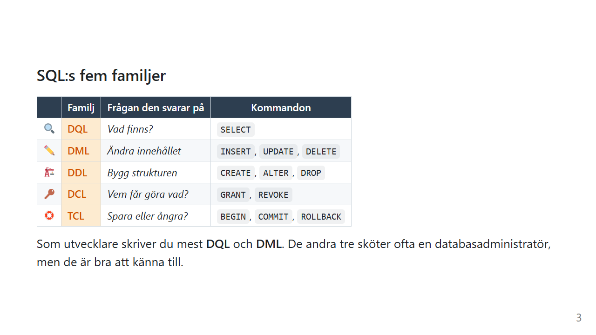

# SQL, ett kommando i taget

Det mesta du gör med en databas klarar du med ett fåtal SQL-kommandon. Det svåra är inte att lära sig dem, utan att se hur de fungerar tillsammans.

Här får varje kommando en egen sida, med samma lilla tabell genom hela vägen. Du kan läsa sidorna i ordning, eller hoppa direkt till det kommando du vill förstå bättre.

## Börja här

[Övningsdata](ovningsdata.md) har skriptet som skapar tabellerna som alla sidor använder. Kör det en gång, så kan du testa varje exempel själv.

## Sidorna

| Sida | Innehåll | Familj |
|---|---|---|
| [SELECT](select.md) | `SELECT`, `*`, kolumner, `AS`, `DISTINCT` | 🔍 DQL |
| [WHERE](where.md) | jämförelser, `AND`/`OR`/`IN`, `LIKE`, `BETWEEN`, `IS NULL` | 🔍 DQL |
| [ORDER BY](order-by.md) | `ORDER BY`, `LIMIT`/`TOP`, `OFFSET` | 🔍 DQL |
| [Aggregatfunktioner](aggregat.md) | `COUNT`, `SUM`, `AVG`, `MIN`, `MAX` | 🔍 DQL |
| [GROUP BY](group-by.md) | `GROUP BY`, `HAVING` | 🔍 DQL |
| [JOIN](join.md) | `JOIN`, `LEFT JOIN`, alias, gammal och ny stil | 🔍 DQL |
| [Subquery](subquery.md) | subquery och korrelerad subquery | 🔍 DQL |
| [COALESCE](coalesce.md) | reservvärden för `NULL`, `COALESCE(SUM(...), 0)` och `NULLIF` | 🔍 DQL |
| [INSERT](insert.md) | lägga till rader | ✏️ DML |
| [UPDATE](update.md) | ändra rader | ✏️ DML |
| [DELETE](delete.md) | ta bort rader | ✏️ DML |

Och när du vill knyta ihop SQL med C#:

| Sida | Innehåll |
|---|---|
| [Från tabell till klass](tabeller-och-klasser.md) | hur en tabell är uppbyggd, vad varje del motsvarar i C#, SQL jämfört med LINQ och var liknelsen tar slut |

## SQL:s fem familjer

| | Familj | Frågan den svarar på | Kommandon |
|---|---|---|---|
| 🔍 | **DQL**, Data Query Language | *Vad finns?* | `SELECT` |
| ✏️ | **DML**, Data Manipulation Language | *Ändra innehållet* | `INSERT`, `UPDATE`, `DELETE` |
| 🏗️ | **DDL**, Data Definition Language | *Bygg strukturen* | `CREATE`, `ALTER`, `DROP` |
| 🔑 | **DCL**, Data Control Language | *Vem får göra vad?* | `GRANT`, `REVOKE` |
| 🛟 | **TCL**, Transaction Control Language | *Spara eller ångra?* | `BEGIN`, `COMMIT`, `ROLLBACK` |

Sidorna här handlar om **DQL** och **DML**, alltså det du som utvecklare skriver mest. Om TCL kan du läsa mer i [Transaktioner](../transaktioner.md).

## I vilken ordning kör databasen frågan?

Det här är bra att ha i bakhuvudet när du läser sidorna. Du **skriver** en fråga i en ordning, men databasen **kör** den i en annan:

| Du skriver | Databasen kör |
|---|---|
| 1. `SELECT` | 5. välj kolumner |
| 2. `FROM` / `JOIN` | **1.** hämta och koppla tabeller |
| 3. `WHERE` | **2.** filtrera rader |
| 4. `GROUP BY` | **3.** lägg i högar |
| 5. `HAVING` | **4.** filtrera högar |
| 6. `ORDER BY` | **6.** sortera |
| 7. `LIMIT` | **7.** klipp |

Många saker som annars känns godtyckliga får sin förklaring här. Du kommer att se tabellen igen på flera av sidorna.

## Öva mer

När du har läst sidorna kan du testa dina kunskaper i två spel som löses helt med SQL:

| Spel | Vad du gör | Passar för |
|---|---|---|
| [SQL Island](https://sql-island.informatik.uni-kl.de/) | Du kraschar på en ö och tar dig därifrån med SQL | Nybörjare: `SELECT`, `WHERE`, `UPDATE`, `INSERT`, `DELETE`, `JOIN` |
| [SQL Murder Mystery](https://mystery.knightlab.com/) | Du löser ett mord genom att söka i polisens databas | Lite mer: flera `JOIN` i kedja, `GROUP BY`, `HAVING` |

---

*Av Marcus Ackre Medina · Nion Education · marcus.medina@nionit.com*
