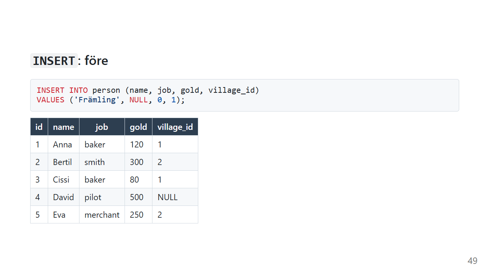
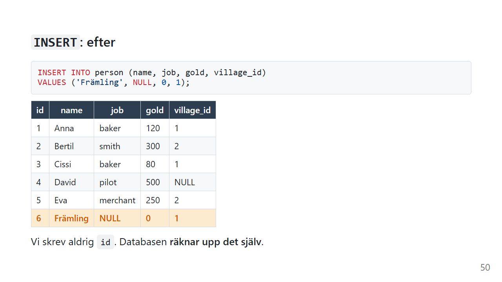

# INSERT: lägg till rader

Hittills har vi bara **läst** data. Nu börjar vi ändra den.

`INSERT` lägger till nya rader. Varje gång någon registrerar ett konto, lägger en order eller skriver en kommentar körs en `INSERT` någonstans.

*Exemplen använder [övningsdatan](ovningsdata.md). Kör skriptet igen när du vill ha tillbaka originaldatan.*

## Vad gör INSERT?



```sql
INSERT INTO person (name, job, gold, village_id)
VALUES ('Främling', NULL, 0, 1);
```

På svenska:

> *Lägg in en ny rad i person. Kolumnerna name, job, gold och village_id får värdena Främling, inget, 0 och 1.*



| id | name | job | gold | village_id |
|---|---|---|---|---|
| ... | | | | |
| **6** | **Främling** | **NULL** | **0** | **1** |

Tre saker att lägga märke till:

- **Vi skrev aldrig `id`.** Kolumnen är `INTEGER PRIMARY KEY`, så databasen räknar upp den själv.
- **Kolumnerna och värdena paras ihop i ordning.** Det första värdet hamnar i den första kolumnen du räknade upp, och så vidare.
- **`NULL` skrivs utan citattecken.** `'NULL'` med citattecken hade varit texten NULL, och det är inte samma sak som inget värde.

Främlingen följer med till sidorna [UPDATE](update.md) och [DELETE](delete.md).

## Kolumner du inte nämner

```sql
INSERT INTO person (name)
VALUES ('Gustav');
```

| id | name | job | gold | village_id |
|---|---|---|---|---|
| 7 | Gustav | NULL | 0 | NULL |

En kolumn du inte nämner får sitt **standardvärde**:

- `gold` är `INTEGER NOT NULL DEFAULT 0` och blir **0**
- `job` och `village_id` har inget standardvärde och blir **`NULL`**

Men `name` är `NOT NULL` utan standardvärde. Försöker du lägga in en person utan namn säger databasen ifrån:

```sql
INSERT INTO person (job) VALUES ('baker');
-- Fel: NOT NULL constraint failed: person.name
```

Det är bra. Reglerna i tabellen skyddar datan, även när koden som skriver till den har en bugg.

## Flera rader på en gång

```sql
INSERT INTO person (name, job, gold, village_id) VALUES
    ('Hugo', 'smith',  150, 2),
    ('Ida',  'farmer',  40, 3);
```

En `INSERT` med flera rader är snabbare än många `INSERT` med en rad var, och de läggs in som **en** enhet. Antingen läggs alla in, eller ingen.

## Utan kolumnlista

```sql
-- Fungerar, men skört
INSERT INTO person
VALUES (10, 'Jonna', 'pilot', 200, 1);
```

Utan kolumnlista måste du ange **alla** kolumner, i **exakt** den ordning de har i tabellen, inklusive `id`.

Det fungerar idag. Men om någon lägger till en kolumn i tabellen, eller ändrar ordningen, går frågan sönder. I värsta fall går den inte sönder, utan lägger värdena i fel kolumner.

**Skriv alltid ut kolumnerna.**

## Kopiera från en annan fråga: `INSERT ... SELECT`

Du kan lägga in resultatet av en `SELECT`:

```sql
INSERT INTO person (name, job, gold, village_id)
SELECT name || ' Junior', job, 0, village_id
FROM person
WHERE job = 'smith';
```

Varje smed får en junior med samma yrke och by, men utan guld. `||` sätter ihop text i SQLite och PostgreSQL. I SQL Server skriver du `+` i stället.

Det här används ofta för att flytta eller kopiera data mellan tabeller.

### Clean Code: INSERT

> Så här skriver du INSERT som tål förändringar.

```sql
-- ❌ Vilket värde hamnar var? Och vad händer när tabellen ändras?
insert into person values (null,'Fia','baker',0,1)
```

```sql
-- ✅ Varje värde har ett namn
INSERT INTO person (name, job, gold, village_id)
VALUES ('Fia', 'baker', 0, 1);
```

- **Skriv alltid ut kolumnlistan**
- **Låt databasen sätta `id`.** Skriv inte in id för hand.
- **En rad per värdegrupp** när du lägger in flera rader, med värdena under varandra
- **Låt `NOT NULL` och `DEFAULT` jobba åt dig.** Regler i tabellen är säkrare än regler som bara finns i koden.

## Vanliga misstag

| Misstag | Vad händer? | Gör så här i stället |
|---|---|---|
| Fler kolumner än värden, eller tvärtom | Felmeddelande | Lika många av båda, i samma ordning |
| Ingen kolumnlista | Går sönder, eller hamnar fel, när tabellen ändras | Skriv ut kolumnerna |
| Ett `id` som redan finns | `UNIQUE constraint failed` | Låt databasen sätta `id` |
| Glömma en `NOT NULL`-kolumn | `NOT NULL constraint failed` | Ange ett värde, eller ge kolumnen ett `DEFAULT` |
| `VALUES ("Fia", ...)` | Dubbla citattecken betyder kolumnnamn i SQL | `'Fia'` med enkla citattecken |
| Bygga SQL genom att klistra ihop text från användaren | SQL injection | Parametrar, se [SQL injection](../sql-injection.md) |

## Sammanfattning

- `INSERT INTO tabell (kolumner) VALUES (värden)` lägger till en rad.
- Kolumner och värden paras ihop **i ordning**.
- Kolumner du inte nämner får sitt `DEFAULT`, eller `NULL`.
- `NOT NULL` och `PRIMARY KEY` stoppar felaktiga rader.
- Flera rader går att lägga in med en enda `INSERT`.
- Skriv **alltid** ut kolumnlistan.

## Övningar

Kör [övningsdatan](ovningsdata.md) innan du börjar, så att id-numren stämmer med facit.

### 🟢 Övning 1: Lägg till dig själv

Lägg till dig själv i tabellen `person`, med valfritt yrke, 100 guld och boende i Morotsby. Kontrollera sedan att raden finns.

<details>
<summary>💡 Klicka här för ett lösningsförslag</summary>

Din lösning kan se annorlunda ut och ändå vara helt korrekt!

```sql
INSERT INTO person (name, job, gold, village_id)
VALUES ('Kim', 'developer', 100, 3);

SELECT * FROM person WHERE village_id = 3;
```

Du får `id` 6. Morotsby har nu sin första invånare!

</details>

### 🟡 Övning 2: Två på en gång

Lägg till två personer med **en** `INSERT`: Leo, en bagare med 60 guld i Lökby, och Maja, en köpman med 90 guld i Gurkby.

<details>
<summary>💡 Klicka här för ett lösningsförslag</summary>

Din lösning kan se annorlunda ut och ändå vara helt korrekt!

```sql
INSERT INTO person (name, job, gold, village_id) VALUES
    ('Leo',  'baker',    60, 1),
    ('Maja', 'merchant', 90, 2);
```

</details>

### 🟡 Övning 3: Så lite som möjligt

Lägg till en person som bara heter Nils. Vilka värden får de andra kolumnerna, och varför?

<details>
<summary>💡 Klicka här för ett lösningsförslag</summary>

Din lösning kan se annorlunda ut och ändå vara helt korrekt!

```sql
INSERT INTO person (name)
VALUES ('Nils');

SELECT * FROM person WHERE name = 'Nils';
```

| id | name | job | gold | village_id |
|---|---|---|---|---|
| 6 | Nils | NULL | 0 | NULL |

`id` räknas upp automatiskt. `gold` har `DEFAULT 0`. `job` och `village_id` har inget standardvärde och blir `NULL`.

(Har du redan gjort övning 1 och 2 utan att köra om övningsdatan blir `id` högre.)

</details>

### 🔴 Övning 4: En by till

Lägg till en by som heter Rädisby. Försök sedan lägga till en till by, Selleriby, med `id` 1. Vad händer, och varför?

<details>
<summary>💡 Klicka här för ett lösningsförslag</summary>

Din lösning kan se annorlunda ut och ändå vara helt korrekt!

```sql
INSERT INTO village (name)
VALUES ('Rädisby');                -- får id 4

INSERT INTO village (id, name)
VALUES (1, 'Selleriby');
-- Fel: UNIQUE constraint failed: village.id
```

`id` är primärnyckeln, och en primärnyckel måste vara unik. Lökby har redan `id` 1, så databasen vägrar.

Det är därför du ska låta databasen sätta `id` själv. Då kan det här aldrig hända.

</details>

---

Föregående: [COALESCE](coalesce.md) · [Tillbaka till översikten](index.md) · Nästa: [UPDATE](update.md)
