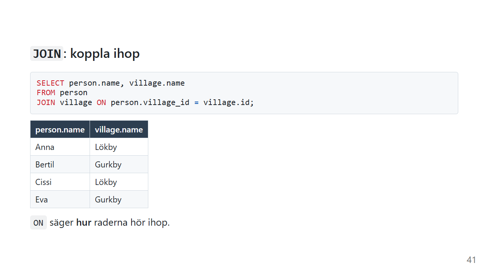
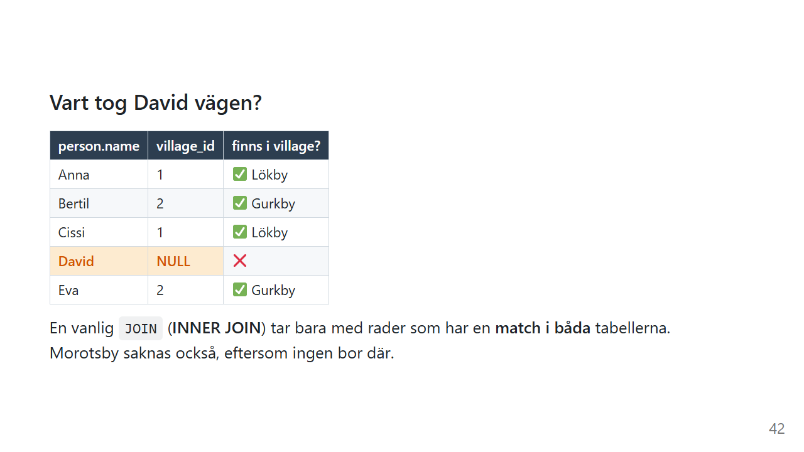
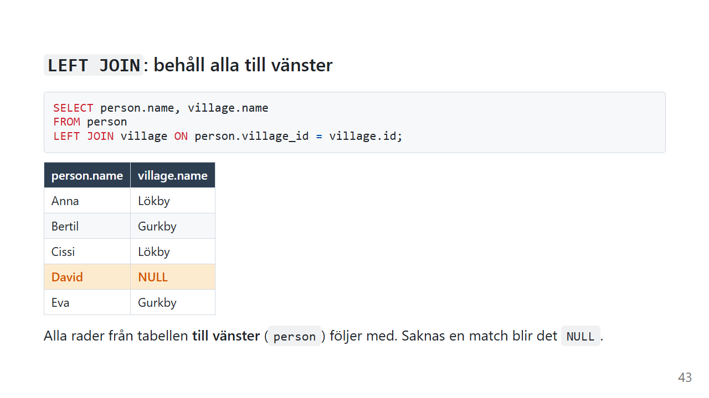
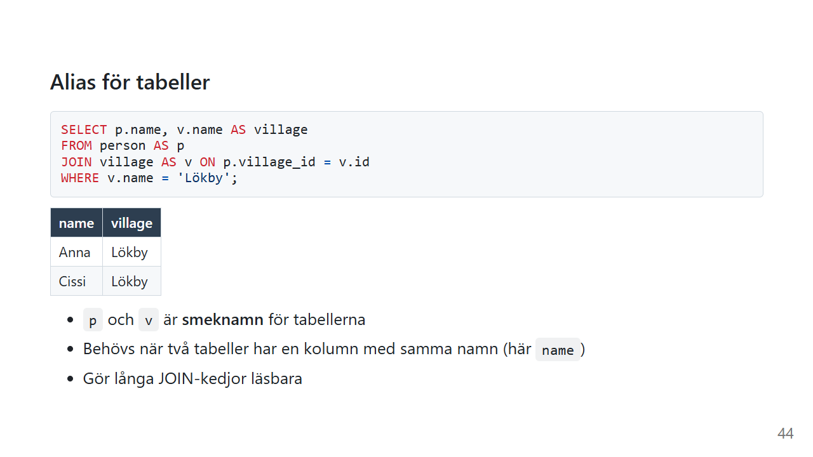
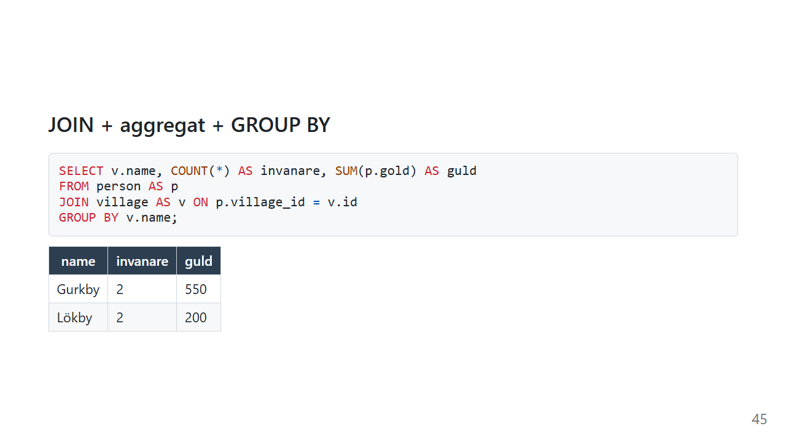

# JOIN: koppla ihop tabeller

En bra databas sparar varje sak på **ett** ställe. Byns namn står i tabellen `village`, inte i varje persons rad. Det gör att du kan byta namn på en by på ett enda ställe.

Men det betyder också att svaret på en enkel fråga, som "vilken by bor Anna i?", ligger utspritt över två tabeller. `JOIN` sätter ihop bitarna igen.

*Exemplen använder [övningsdatan](ovningsdata.md).*

## Två tabeller, en nyckel


`person.village_id` **pekar på** `village.id`. Det kallas en **främmande nyckel** (foreign key), och det är den som gör att tabellerna kan kopplas ihop.

Lägg märke till två saker, för de blir viktiga strax:

- **David** har `NULL` och bor ingenstans
- **Morotsby** har inga invånare

## `JOIN ... ON`



```sql
SELECT person.name, village.name
FROM person
JOIN village ON person.village_id = village.id;
```

| person.name | village.name |
|---|---|
| Anna | Lökby |
| Bertil | Gurkby |
| Cissi | Lökby |
| Eva | Gurkby |

På svenska:

> *Ta varje person, leta upp den by vars id är samma som personens village_id, och sätt ihop dem till en rad.*

`ON` säger **hur** raderna hör ihop. Eftersom båda tabellerna har en kolumn som heter `name` skriver du ut tabellnamnet framför: `person.name` och `village.name`.

## 💡 Vart tog David vägen?



Titta på resultatet igen. David är borta, och Morotsby också.

En vanlig `JOIN` (egentligen `INNER JOIN`, men `INNER` kan utelämnas) tar bara med rader som har en **match i båda** tabellerna. David har `NULL` och matchar ingen by. Morotsby har ingen som pekar på den.

**En JOIN är alltså också ett filter.**

Det här är en av de viktigaste sakerna att förstå om SQL. Tänk dig att du letar efter misstänkta och kopplar ihop tre tabeller: personer, körkort och bilar. Den som saknar körkort i registret försvinner tyst ur resultatet. Det är inte ditt `WHERE` som tog bort personen, det var din `JOIN`. Och det kan vara precis det du ville, eller precis det du *inte* ville.

## `LEFT JOIN`: behåll alla till vänster



```sql
SELECT person.name, village.name
FROM person
LEFT JOIN village ON person.village_id = village.id;
```

| person.name | village.name |
|---|---|
| Anna | Lökby |
| Bertil | Gurkby |
| Cissi | Lökby |
| David | NULL |
| Eva | Gurkby |

Alla rader från tabellen **till vänster** (den som står i `FROM`) följer med. Saknas en match fylls kolumnerna från den högra tabellen i med `NULL`. Vill du visa något annat än `NULL`, t.ex. texten "ingen by", använder du [COALESCE](coalesce.md).

Vill du i stället behålla alla **byar**, även de utan invånare, ställer du `village` till vänster:

```sql
SELECT village.name, person.name
FROM village
LEFT JOIN person ON person.village_id = village.id;
```

Nu är Morotsby med, med `NULL` som invånare. David är däremot borta, eftersom han inte matchar någon by.

| JOIN | Tar med |
|---|---|
| `JOIN` / `INNER JOIN` | bara rader som matchar i **båda** |
| `LEFT JOIN` | **alla** från vänster, och matchande från höger |
| `RIGHT JOIN` | **alla** från höger, och matchande från vänster |
| `FULL OUTER JOIN` | **alla** från båda |

`LEFT JOIN` är den du använder mest av de tre sista. En `RIGHT JOIN` kan alltid skrivas om till en `LEFT JOIN` genom att byta plats på tabellerna.

## Alias



```sql
SELECT p.name, v.name AS village
FROM person AS p
JOIN village AS v ON p.village_id = v.id
WHERE v.name = 'Lökby';
```

| name | village |
|---|---|
| Anna | Lökby |
| Cissi | Lökby |

`p` och `v` är smeknamn för tabellerna. Med två tabeller sparar det lite skrivande. Med fyra eller fem tabeller i samma fråga är det skillnaden mellan läsbart och oläsbart.

Ordet `AS` är frivilligt för tabellalias, så `FROM person p` fungerar också.

## JOIN tillsammans med GROUP BY



```sql
SELECT v.name, COUNT(*) AS invanare, SUM(p.gold) AS guld
FROM person AS p
JOIN village AS v ON p.village_id = v.id
GROUP BY v.name;
```

| name | invanare | guld |
|---|---|---|
| Gurkby | 2 | 550 |
| Lökby | 2 | 200 |

Först kopplas tabellerna ihop, sedan läggs raderna i högar per by. Mer om högar på sidan [GROUP BY](group-by.md).

## Gammal stil och ny stil

Du kommer att stöta på två sätt att skriva samma JOIN.

**Gammal stil:**

```sql
-- Kommatecken i FROM, kopplingen i WHERE
SELECT person.name, village.name
FROM person, village
WHERE person.village_id = village.id;
```

**Modern stil:**

```sql
-- Kopplingen i ON, filtren i WHERE
SELECT person.name, village.name
FROM person
JOIN village ON person.village_id = village.id;
```

Båda ger exakt samma resultat. Den gamla stilen finns kvar i mycket äldre kod, så det är bra att kunna läsa den.

Den moderna stilen håller isär *hur tabellerna hör ihop* och *vilka rader du vill ha*. Glömmer du kopplingsvillkoret i den gamla stilen får du **alla kombinationer** av rader, en så kallad *kartesisk produkt*:

```sql
SELECT COUNT(*) FROM person, village;   -- 15
```

Fem personer gånger tre byar blir femton rader nonsens. Och det kommer inget felmeddelande.

Med den moderna stilen syns det direkt om `ON` saknas. SQL Server och PostgreSQL vägrar dessutom att köra en `JOIN` utan `ON`. SQLite och MySQL kör den, och ger samma femton rader.

### Clean Code: JOIN

> Så här skriver du JOIN som går att följa.

```sql
-- ❌ Kommatecken, inga alias och allt på en rad
select person.name, village.name from person, village where person.village_id = village.id and village.name = 'Lökby'
```

```sql
-- ✅ Varje JOIN på egen rad, och kopplingen skild från filtret
SELECT p.name,
       v.name AS village
FROM person AS p
JOIN village AS v ON p.village_id = v.id
WHERE v.name = 'Lökby';
```

- **`JOIN ... ON`** i stället för kommatecken
- **En `JOIN` per rad**, med kopplingen direkt efter
- **Korta men begripliga alias:** `p` för `person` är bra, `t1` och `t2` är det inte
- **Prefixa alla kolumner** när det finns mer än en tabell, även när namnet är unikt. Då ser läsaren direkt var varje kolumn kommer ifrån.
- **Skriv `LEFT JOIN` med flit.** Fråga dig: ska rader utan match vara med eller inte?

> 💬 *Det här är hur jag brukar skriva JOIN. Har ditt team en annan stil som är lika läsbar? Kör på den.*

## Vanliga misstag

| Misstag | Vad händer? | Gör så här i stället |
|---|---|---|
| Rader "försvinner" efter en `JOIN` | Inner join tar bara rader med match | `LEFT JOIN` om du vill behålla dem |
| `SELECT name FROM person JOIN village ...` | Felmeddelande: `name` finns i båda tabellerna | `p.name` eller `v.name` |
| Glömt kopplingsvillkoret i gammal stil | Kartesisk produkt: alla kombinationer | Använd `JOIN ... ON` |
| `COUNT(*)` efter en `LEFT JOIN` | Rader utan match räknas som 1 | `COUNT(kolumn)` från den högra tabellen |
| Fel tabell till vänster i `LEFT JOIN` | Fel rader behålls | Den tabell vars rader du vill behålla står i `FROM` |

## Sammanfattning

- `JOIN ... ON` kopplar ihop rader från två tabeller via en nyckel.
- En vanlig `JOIN` tar bara rader som matchar i **båda**, så den är också ett **filter**.
- `LEFT JOIN` behåller alla rader från tabellen till vänster och fyller i `NULL` där det saknas match.
- Alias gör långa frågor läsbara.
- Använd `JOIN ... ON` i stället för kommatecken i `FROM`.

## Övningar

Använd [övningsdatan](ovningsdata.md).

### 🟢 Övning 1: Vem bor var?

Visa varje persons namn tillsammans med namnet på byn personen bor i.

<details>
<summary>💡 Klicka här för ett lösningsförslag</summary>

Din lösning kan se annorlunda ut och ändå vara helt korrekt!

```sql
SELECT p.name, v.name AS village
FROM person AS p
JOIN village AS v ON p.village_id = v.id;
```

Fyra rader. David saknas, eftersom han inte bor i någon by.

</details>

### 🟢 Övning 2: Gurkby

Hur många personer bor i Gurkby? Använd byns **namn**, inte dess id.

<details>
<summary>💡 Klicka här för ett lösningsförslag</summary>

Din lösning kan se annorlunda ut och ändå vara helt korrekt!

```sql
SELECT COUNT(*)
FROM person AS p
JOIN village AS v ON p.village_id = v.id
WHERE v.name = 'Gurkby';
```

Resultatet är 2. Namnet finns bara i `village`, så du behöver en `JOIN` för att kunna filtrera på det.

</details>

### 🟡 Övning 3: Spökbyn

Vilken by har ingen invånare alls?

*Tips: vilken sorts JOIN behåller rader som saknar match?*

<details>
<summary>💡 Klicka här för ett lösningsförslag</summary>

Din lösning kan se annorlunda ut och ändå vara helt korrekt!

```sql
SELECT v.name
FROM village AS v
LEFT JOIN person AS p ON p.village_id = v.id
WHERE p.id IS NULL;
```

Resultatet är Morotsby.

`LEFT JOIN` behåller alla byar, och en by utan invånare får `NULL` i alla kolumner från `person`. Sedan plockar `WHERE p.id IS NULL` fram just de raderna.

Lägg märke till att `village` står till vänster här. Det är byarna du vill behålla.

</details>

### 🟡 Övning 4: Invånare per by

Visa varje by och hur många som bor där. **Alla** tre byar ska vara med, även den som saknar invånare.

<details>
<summary>💡 Klicka här för ett lösningsförslag</summary>

Din lösning kan se annorlunda ut och ändå vara helt korrekt!

```sql
SELECT v.name, COUNT(p.id) AS invanare
FROM village AS v
LEFT JOIN person AS p ON p.village_id = v.id
GROUP BY v.name;
```

| name | invanare |
|---|---|
| Gurkby | 2 |
| Lökby | 2 |
| Morotsby | 0 |

Prova att byta `COUNT(p.id)` mot `COUNT(*)`. Då får Morotsby **1**, trots att ingen bor där!

`COUNT(*)` räknar rader, och `LEFT JOIN` skapade faktiskt en rad för Morotsby, fylld med `NULL`. `COUNT(p.id)` räknar bara värden som inte är `NULL`, och det är därför den ger rätt svar. Mer om skillnaden på sidan [Aggregatfunktioner](aggregat.md). Gör du samma sak med `SUM` blir det `NULL` för Morotsby, och då behövs [COALESCE](coalesce.md).

</details>

### 🔴 Övning 5: Femton rader

Kör den här frågan:

```sql
SELECT p.name, v.name
FROM person AS p, village AS v;
```

Hur många rader blir det? Varför just så många? Skriv sedan om frågan i modern stil så att den bara visar personer tillsammans med byn de faktiskt bor i.

<details>
<summary>💡 Klicka här för ett lösningsförslag</summary>

Din lösning kan se annorlunda ut och ändå vara helt korrekt!

Det blir 15 rader: varje person ihopparad med varje by, 5 × 3. Det kallas en **kartesisk produkt**. Anna "bor" i Lökby, Gurkby och Morotsby på samma gång.

Det som saknas är kopplingsvillkoret:

```sql
SELECT p.name, v.name
FROM person AS p
JOIN village AS v ON p.village_id = v.id;
```

Nu blir det fyra rader, och var och en är sann.

Någon gång kommer du att se en rapport där summorna är tre gånger för stora. Då är en bortglömd koppling en bra första misstanke.

</details>

---

Föregående: [GROUP BY](group-by.md) · [Tillbaka till översikten](index.md) · Nästa: [Subquery](subquery.md)
