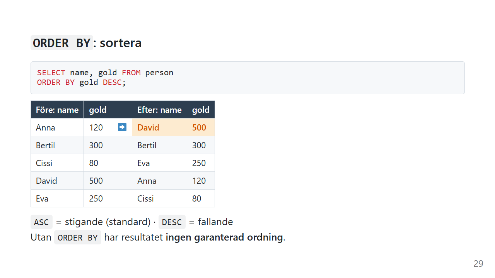
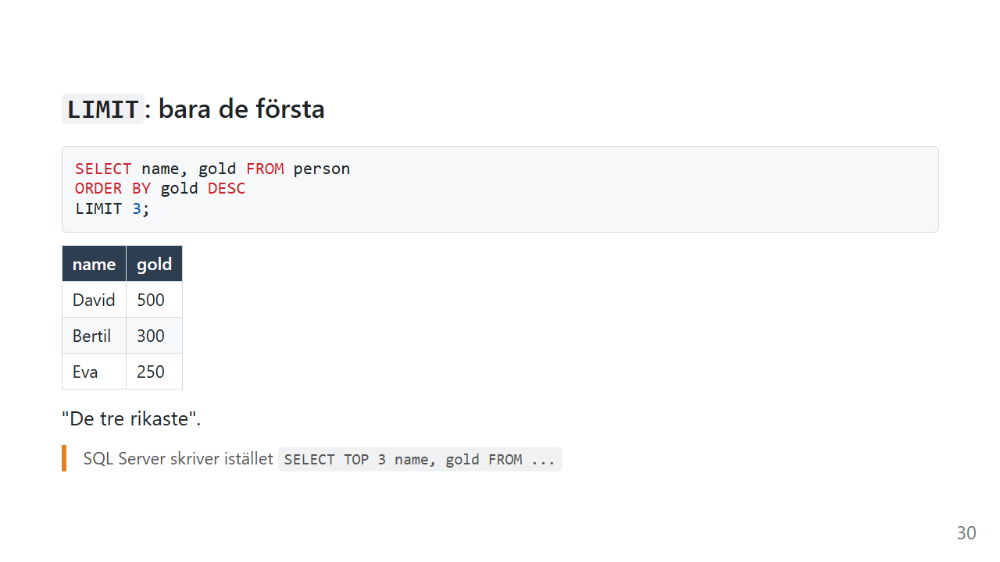

# ORDER BY: sortera och begränsa

"Visa de tio senaste ordrarna." "Vem är rikast?" "Vilken produkt säljer sämst?"

Alla de frågorna handlar om **ordning**. Och här finns en överraskning: utan `ORDER BY` har ett resultat ingen garanterad ordning alls.

*Exemplen använder [övningsdatan](ovningsdata.md).*

## Vad gör ORDER BY?

`ORDER BY` sorterar resultatet efter en eller flera kolumner.

> *Visa namn och guld från person, sorterat på guld med mest först.*

```sql
SELECT name, gold FROM person
ORDER BY gold DESC;
```



| name | gold |
|---|---|
| David | 500 |
| Bertil | 300 |
| Eva | 250 |
| Anna | 120 |
| Cissi | 80 |

| Nyckelord | Betyder |
|---|---|
| `ASC` | stigande: minst först, A till Ö. Det är standard om du inte skriver något. |
| `DESC` | fallande: störst först, Ö till A |

## Utan ORDER BY finns ingen ordning

När du kör `SELECT * FROM person;` kommer raderna ofta i den ordning de lades in. Det ser ut som en regel, men det är det inte.

Databasen får lämna tillbaka raderna i vilken ordning den vill. Med fler rader, ett index eller en ny version av databasen kan ordningen ändras utan förvarning.

**Om ordningen spelar roll, skriv `ORDER BY`.**

## Sortera på flera kolumner

```sql
SELECT name, job, gold FROM person
ORDER BY job ASC, gold DESC;
```

| name | job | gold |
|---|---|---|
| Anna | baker | 120 |
| Cissi | baker | 80 |
| Eva | merchant | 250 |
| David | pilot | 500 |
| Bertil | smith | 300 |

Först sorteras allt på `job`. Bara när två rader har **samma** yrke används nästa kolumn, `gold`, för att avgöra ordningen mellan dem. Det är som i en telefonkatalog: först efternamn, och bara vid samma efternamn tittar du på förnamnet.

## Var hamnar NULL?

```sql
SELECT name, village_id FROM person
ORDER BY village_id;
```

I SQLite hamnar `NULL` **först** vid stigande sortering, så David kommer överst. Andra databaser gör olika: PostgreSQL lägger `NULL` sist. Vill du bestämma själv kan du i SQLite och PostgreSQL skriva `ORDER BY village_id NULLS LAST`.

## `LIMIT`: bara de första



```sql
SELECT name, gold FROM person
ORDER BY gold DESC
LIMIT 3;
```

| name | gold |
|---|---|
| David | 500 |
| Bertil | 300 |
| Eva | 250 |

`LIMIT` klipper resultatet efter ett visst antal rader. Tillsammans med `ORDER BY` blir det "de tre rikaste", "de tio senaste" eller "den dyraste".

`LIMIT` utan `ORDER BY` ger dig *några* rader, men inte nödvändigtvis de du tror.

### `OFFSET`: hoppa över

```sql
SELECT name, gold FROM person
ORDER BY gold DESC
LIMIT 2 OFFSET 2;
```

`OFFSET 2` hoppar över de två första raderna, och sedan tar `LIMIT 2` de två nästa. Resultatet är Eva och Anna.

Det är så sidindelning fungerar på webben: sida 1 är `LIMIT 10 OFFSET 0`, sida 2 är `LIMIT 10 OFFSET 10`, och så vidare.

### Olika databaser, olika syntax

| Databas | De tre första |
|---|---|
| SQLite, MySQL, PostgreSQL | `SELECT ... ORDER BY gold DESC LIMIT 3` |
| SQL Server | `SELECT TOP 3 ... ORDER BY gold DESC` |
| SQL Server (med offset) | `... ORDER BY gold DESC OFFSET 0 ROWS FETCH NEXT 3 ROWS ONLY` |

Idén är densamma. Det är bara orden som skiljer.

### Clean Code: ORDER BY

> Så här gör du ordningen tydlig.

```sql
-- ❌ Vilken ordning? Och vilka tre?
SELECT name, gold FROM person LIMIT 3
```

```sql
-- ✅ Ordningen är uttalad, och det syns vad "de tre" betyder
SELECT name, gold
FROM person
ORDER BY gold DESC
LIMIT 3;
```

- **Alltid `ORDER BY` tillsammans med `LIMIT`**
- **Skriv `ASC` uttryckligen** när frågan har flera sorteringskolumner, så att ingen behöver gissa
- **Sortera på kolumnnamn, inte på nummer.** `ORDER BY 2` (den andra kolumnen) fungerar, men går sönder i det tysta när någon ändrar i `SELECT`.

## Vanliga misstag

| Misstag | Vad händer? | Gör så här i stället |
|---|---|---|
| Förlita sig på ordningen utan `ORDER BY` | Ordningen kan ändras när som helst | Skriv `ORDER BY` |
| `LIMIT` utan `ORDER BY` | Du får *några* rader, inte de första | Kombinera alltid med `ORDER BY` |
| `ORDER BY gold, DESC` | Syntaxfel | `ORDER BY gold DESC`, utan kommatecken |
| `ORDER BY job, gold DESC` och tro att båda blir fallande | `DESC` gäller bara `gold`, och `job` blir stigande | Skriv riktning för varje kolumn |
| `LIMIT 3` i SQL Server | Syntaxfel | `SELECT TOP 3 ...` |

## Sammanfattning

- `ORDER BY` sorterar. `ASC` (standard) är stigande och `DESC` är fallande.
- Utan `ORDER BY` finns **ingen** garanterad ordning.
- Flera kolumner: nästa kolumn används bara när de föregående är lika.
- `LIMIT n` tar de n första och `OFFSET m` hoppar över m rader.
- SQL Server skriver `TOP n` i stället för `LIMIT n`.

## Övningar

Använd [övningsdatan](ovningsdata.md).

### 🟢 Övning 1: Fattigast först

Visa namn och guld för alla, med den som har minst guld först.

<details>
<summary>💡 Klicka här för ett lösningsförslag</summary>

Din lösning kan se annorlunda ut och ändå vara helt korrekt!

```sql
SELECT name, gold
FROM person
ORDER BY gold ASC;
```

Resultatet är Cissi, Anna, Eva, Bertil och David. `ASC` är standard, så det fungerar lika bra utan.

</details>

### 🟢 Övning 2: De två rikaste

Visa namnen på de två som har mest guld.

<details>
<summary>💡 Klicka här för ett lösningsförslag</summary>

Din lösning kan se annorlunda ut och ändå vara helt korrekt!

```sql
SELECT name
FROM person
ORDER BY gold DESC
LIMIT 2;
```

Resultatet är David och Bertil. Du kan sortera på en kolumn som inte finns i `SELECT`.

</details>

### 🟡 Övning 3: Alfabetiskt per yrke

Visa namn och yrke, sorterat på yrke och sedan namn, båda i bokstavsordning.

<details>
<summary>💡 Klicka här för ett lösningsförslag</summary>

Din lösning kan se annorlunda ut och ändå vara helt korrekt!

```sql
SELECT name, job
FROM person
ORDER BY job ASC, name ASC;
```

| name | job |
|---|---|
| Anna | baker |
| Cissi | baker |
| Eva | merchant |
| David | pilot |
| Bertil | smith |

</details>

### 🔴 Övning 4: Tredje rikast

Vem är **tredje** rikast? Svaret ska vara exakt en rad.

<details>
<summary>💡 Klicka här för ett lösningsförslag</summary>

Din lösning kan se annorlunda ut och ändå vara helt korrekt!

```sql
SELECT name, gold
FROM person
ORDER BY gold DESC
LIMIT 1 OFFSET 2;
```

Resultatet är Eva med 250. `OFFSET 2` hoppar över David och Bertil, och `LIMIT 1` tar nästa.

Tänk på vad som hade hänt om två personer hade haft lika mycket guld. Då är "tredje rikast" inte längre entydigt, och vem som hamnar där beror på slumpen. Lägg till en andra sorteringskolumn, t.ex. `ORDER BY gold DESC, name ASC`, så blir svaret alltid detsamma.

</details>

---

Föregående: [WHERE](where.md) · [Tillbaka till översikten](index.md) · Nästa: [Aggregatfunktioner](aggregat.md)
