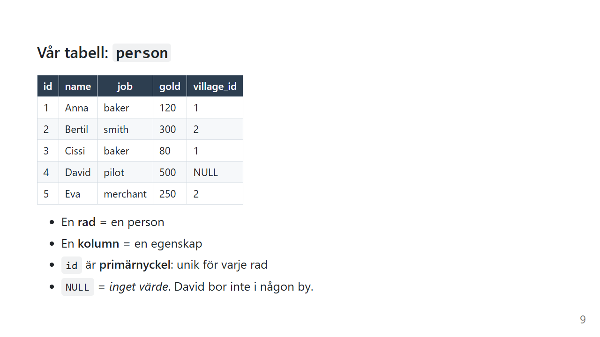
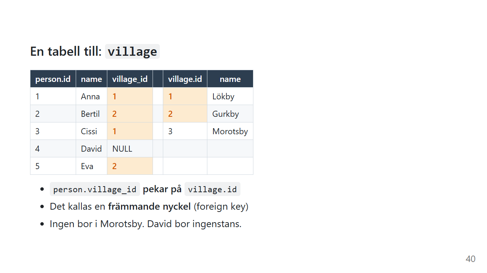

# Övningsdata

Alla sidor i den här delen använder samma två små tabeller: `person` och `village`. De är små med flit. Med fem personer kan du hålla hela tabellen i huvudet och se exakt vilka rader en fråga plockar fram.

## Kör skriptet

Öppna DB Browser for SQLite, skapa en ny databas och klistra in skriptet under fliken *Execute SQL*. Det går lika bra på [sqliteonline.com](https://sqliteonline.com/) om du inte vill installera något.

```sql
DROP TABLE IF EXISTS person;
DROP TABLE IF EXISTS village;

CREATE TABLE village (
    id   INTEGER PRIMARY KEY,
    name TEXT NOT NULL
);

CREATE TABLE person (
    id         INTEGER PRIMARY KEY,
    name       TEXT NOT NULL,
    job        TEXT,
    gold       INTEGER NOT NULL DEFAULT 0,
    village_id INTEGER REFERENCES village(id)
);

INSERT INTO village (id, name) VALUES
    (1, 'Lökby'),
    (2, 'Gurkby'),
    (3, 'Morotsby');

INSERT INTO person (name, job, gold, village_id) VALUES
    ('Anna',   'baker',    120, 1),
    ('Bertil', 'smith',    300, 2),
    ('Cissi',  'baker',     80, 1),
    ('David',  'pilot',    500, NULL),
    ('Eva',    'merchant', 250, 2);
```

De två `DROP TABLE IF EXISTS` i början gör att du kan köra skriptet igen när du vill. Har du ändrat i tabellerna med `UPDATE` eller `DELETE` får du tillbaka originaldatan.

## Tabellen `person`



| id | name | job | gold | village_id |
|---|---|---|---|---|
| 1 | Anna | baker | 120 | 1 |
| 2 | Bertil | smith | 300 | 2 |
| 3 | Cissi | baker | 80 | 1 |
| 4 | David | pilot | 500 | NULL |
| 5 | Eva | merchant | 250 | 2 |

- En **rad** är en person och en **kolumn** är en egenskap
- `id` är **primärnyckeln**: unik för varje rad, och databasen räknar upp den själv
- `NULL` betyder *inget värde*. David bor inte i någon by.

## Tabellen `village`



| id | name |
|---|---|
| 1 | Lökby |
| 2 | Gurkby |
| 3 | Morotsby |

`person.village_id` **pekar på** `village.id`. Det kallas en **främmande nyckel** (foreign key).

Två saker är där med flit, och du kommer att få nytta av dem på [JOIN](join.md)-sidan:

- **David bor ingenstans** (`village_id` är `NULL`)
- **Ingen bor i Morotsby**

## Datatyper

| Kolumn | Typ | Betyder |
|---|---|---|
| `id` | `INTEGER PRIMARY KEY` | heltal, unikt, räknas upp automatiskt |
| `name` | `TEXT NOT NULL` | text som måste finnas |
| `job` | `TEXT` | text som får vara `NULL` |
| `gold` | `INTEGER NOT NULL DEFAULT 0` | heltal, blir 0 om du inte anger något |
| `village_id` | `INTEGER REFERENCES village(id)` | heltal som pekar på en by, får vara `NULL` |

Skriptet är skrivet för SQLite. I SQL Server skriver du `INT IDENTITY(1,1) PRIMARY KEY` i stället för `INTEGER PRIMARY KEY` och `NVARCHAR(100)` i stället för `TEXT`. Själva frågorna på sidorna fungerar i nästan alla databaser. Där det skiljer sig står det.

---

[Tillbaka till översikten](index.md)

*Av Marcus Ackre Medina · Nion Education · marcus.medina@nionit.com*
