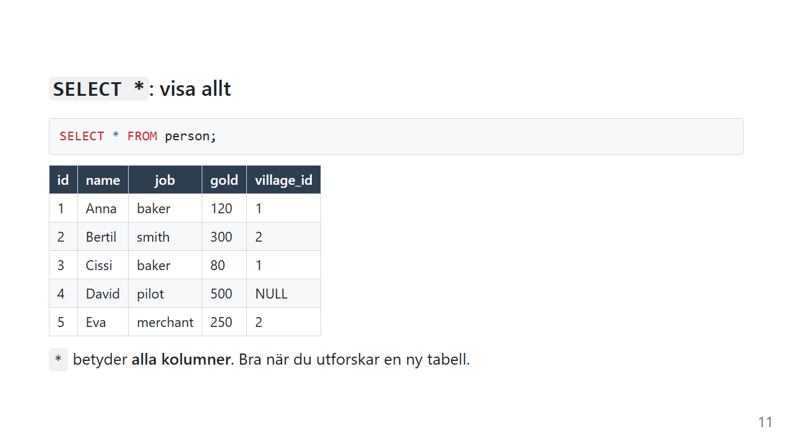
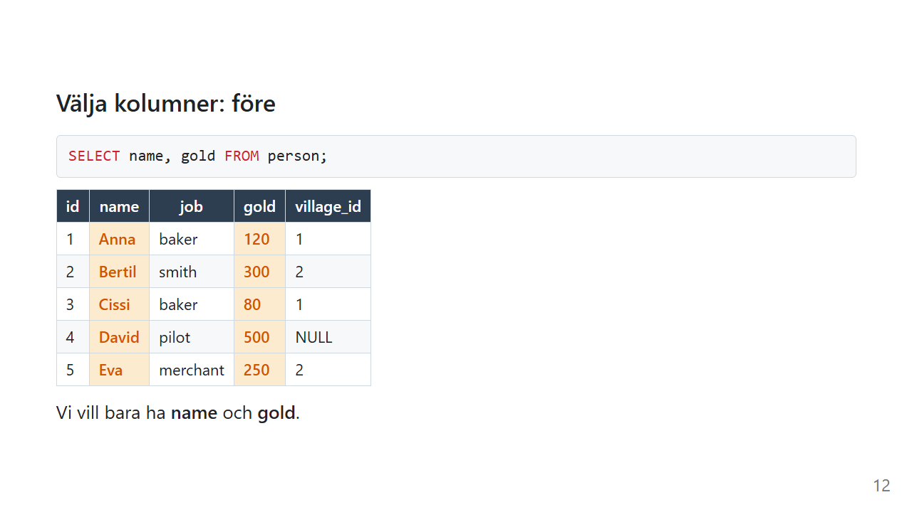
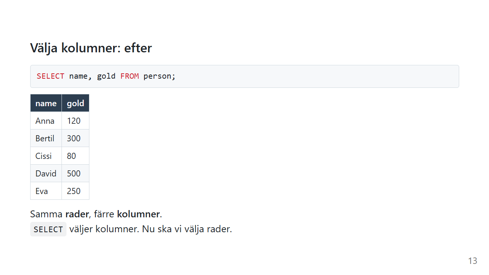
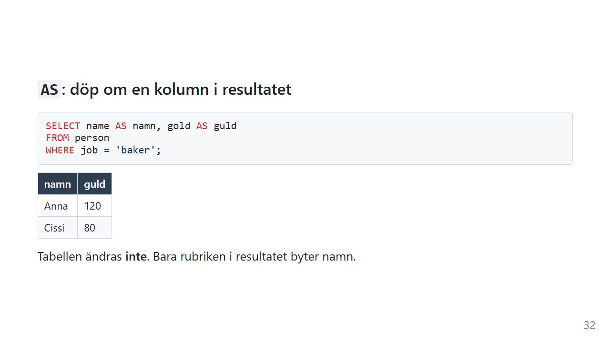
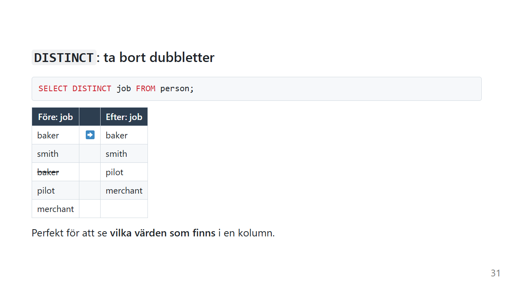

# SELECT: välj kolumner

Varje fråga du ställer till en databas börjar med samma ord. `SELECT` betyder "visa mig", och det är det kommando du kommer att skriva oftast av alla.

`SELECT` ändrar ingenting. Du kan köra det tusen gånger utan att en enda rad påverkas. Det gör det till det perfekta stället att börja.

*Exemplen använder [övningsdatan](ovningsdata.md).*

## Vad gör SELECT?

En tabell har **rader** och **kolumner**. `SELECT` bestämmer vilka **kolumner** som ska visas. Vilka **rader** som ska visas bestämmer du med [WHERE](where.md), och det tar vi på nästa sida.

På svenska läser du en `SELECT` så här:

> *Visa kolumnerna name och gold från tabellen person.*

```sql
SELECT name, gold FROM person;
```

## Allt: `SELECT *`



```sql
SELECT * FROM person;
```

`*` betyder **alla kolumner**. Det är rätt första steg när du möter en tabell du inte känner. Du ser direkt vilka kolumner som finns och hur datan ser ut.

## Bara vissa kolumner

Räkna upp kolumnerna du vill ha, med kommatecken mellan:



```sql
SELECT name, gold FROM person;
```



| name | gold |
|---|---|
| Anna | 120 |
| Bertil | 300 |
| Cissi | 80 |
| David | 500 |
| Eva | 250 |

Samma **rader**, färre **kolumner**. Kolumnerna visas i den ordning du skriver dem, inte i den ordning de har i tabellen.

## Döp om med `AS`



```sql
SELECT name AS namn, gold AS guld
FROM person;
```

`AS` ger kolumnen ett nytt namn **i resultatet**. Själva tabellen ändras inte.

Det här blir viktigt när du räknar, eftersom en uträkning annars får ett namn som `gold * 2`:

```sql
SELECT name, gold * 2 AS dubbelt
FROM person;
```

| name | dubbelt |
|---|---|
| Anna | 240 |
| Bertil | 600 |
| Cissi | 160 |
| David | 1000 |
| Eva | 500 |

Du kan räkna med `+`, `-`, `*` och `/` direkt i `SELECT`. Datan i tabellen är fortfarande densamma. Det är bara resultatet som räknas fram.

## Unika värden med `DISTINCT`

Vilka yrken finns i tabellen?

```sql
SELECT job FROM person;
```

Det ger fem rader, och `baker` står två gånger. Med `DISTINCT` tas dubbletterna bort:



```sql
SELECT DISTINCT job FROM person;
```

| job |
|---|
| baker |
| smith |
| pilot |
| merchant |

Det här är ett av de mest användbara knepen när du utforskar en ny databas. Innan du skriver `WHERE job = '...'` kan du se exakt vilka värden som finns och hur de är stavade.

### `DISTINCT` gäller hela raden

Står det flera kolumner efter `DISTINCT` är det **kombinationen** som ska vara unik, inte varje kolumn för sig:

```sql
SELECT DISTINCT job, village_id FROM person;
```

| job | village_id |
|---|---|
| baker | 1 |
| smith | 2 |
| pilot | NULL |
| merchant | 2 |

`baker` och `1` förekommer två gånger (Anna och Cissi), så den kombinationen visas en gång. `2` förekommer också två gånger, men tillsammans med olika yrken, så båda raderna är kvar.

### Clean Code: SELECT

> Så här skriver du SELECT som går att läsa om ett halvår.

```sql
-- ❌ Fungerar, men vad hämtas egentligen?
select * from person
```

```sql
-- ✅ Tydligt vad som hämtas
SELECT name, gold
FROM person;
```

- **Välj kolumnerna du behöver** i riktig kod. `*` är bra för att utforska, men i ett program hämtar det mer data än du behöver, och koden går sönder i det tysta om någon lägger till eller tar bort en kolumn.
- **Nyckelord med versaler** (`SELECT`, `FROM`), och namn på tabeller och kolumner med gemener
- **`FROM` på egen rad** när frågan växer
- **`AS` för uträkningar**, så att resultatet får ett namn som betyder något

> 💬 *Det här är hur jag brukar formatera SQL. Har ditt team en annan stil som är lika läsbar? Kör på den. Det viktiga är att alla i projektet skriver likadant.*

## Vanliga misstag

| Misstag | Vad händer? | Gör så här i stället |
|---|---|---|
| `SELECT name, gold, FROM person` | Syntaxfel, kommatecknet efter sista kolumnen | Inget kommatecken före `FROM` |
| `SELECT "name" FROM person` | Fungerar i SQLite, men dubbla citattecken betyder *kolumnnamn* i SQL | Skriv kolumnnamnet utan citattecken, och text inom `'enkla'` |
| `SELECT Name FROM person` | Fungerar i SQLite, men kan fela i andra databaser | Skriv namnet exakt som i tabellen |
| `SELECT DISTINCT job, name` och förvänta sig unika yrken | Varje person blir unik, så inga rader försvinner | `DISTINCT` gäller hela raden. Välj bara `job`. |

## Sammanfattning

- `SELECT` väljer **kolumner**. Det ändrar aldrig någon data.
- `*` betyder alla kolumner. Det är bra för att utforska, men skriv ut kolumnerna i riktig kod.
- `AS` döper om en kolumn i resultatet.
- Du kan räkna direkt i `SELECT`, t.ex. `gold * 2`.
- `DISTINCT` tar bort dubbletter, och det gäller **hela raden**.

## Övningar

Använd [övningsdatan](ovningsdata.md).

### 🟢 Övning 1: Namn och yrke

Visa namn och yrke för alla personer.

<details>
<summary>💡 Klicka här för ett lösningsförslag</summary>

Din lösning kan se annorlunda ut och ändå vara helt korrekt!

```sql
SELECT name, job
FROM person;
```

Fem rader, två kolumner.

</details>

### 🟢 Övning 2: Vilka byar används?

Vilka olika värden finns i kolumnen `village_id` i tabellen `person`?

<details>
<summary>💡 Klicka här för ett lösningsförslag</summary>

Din lösning kan se annorlunda ut och ändå vara helt korrekt!

```sql
SELECT DISTINCT village_id
FROM person;
```

| village_id |
|---|
| 1 |
| 2 |
| NULL |

Lägg märke till att `NULL` räknas som ett eget värde av `DISTINCT`. Och `3` finns inte med, eftersom ingen bor i Morotsby.

</details>

### 🟡 Övning 3: Löneförhöjning på papperet

Visa varje persons namn, nuvarande guld och vad de skulle ha om de fick 50 guld till. Ge den nya kolumnen namnet `nytt_guld`. Tabellen ska inte ändras.

<details>
<summary>💡 Klicka här för ett lösningsförslag</summary>

Din lösning kan se annorlunda ut och ändå vara helt korrekt!

```sql
SELECT name, gold, gold + 50 AS nytt_guld
FROM person;
```

| name | gold | nytt_guld |
|---|---|---|
| Anna | 120 | 170 |
| Bertil | 300 | 350 |
| Cissi | 80 | 130 |
| David | 500 | 550 |
| Eva | 250 | 300 |

Kör `SELECT * FROM person;` efteråt. Guldet är oförändrat, eftersom `SELECT` aldrig ändrar något. Vill du ändra på riktigt behöver du [UPDATE](update.md).

</details>

### 🔴 Övning 4: Hur många kombinationer?

Hur många rader ger `SELECT DISTINCT job, village_id FROM person;`? Försök svara **innan** du kör frågan, och förklara varför det inte blir fem.

<details>
<summary>💡 Klicka här för ett lösningsförslag</summary>

Din lösning kan se annorlunda ut och ändå vara helt korrekt!

Fyra rader:

| job | village_id |
|---|---|
| baker | 1 |
| smith | 2 |
| pilot | NULL |
| merchant | 2 |

Anna och Cissi är båda `baker` i by `1`, så deras kombination blir en enda rad. Bertil och Eva bor båda i by `2`, men har olika yrken, så deras rader är olika och båda finns kvar.

</details>

---

[Tillbaka till översikten](index.md) · Nästa: [WHERE](where.md)
