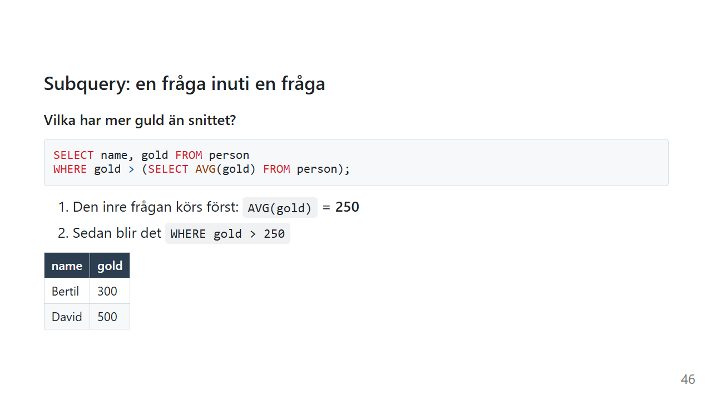

# Subquery: en fråga inuti en fråga

"Vilka tjänar mer än snittet?"

Det låter enkelt, men det är egentligen två frågor. Först: vad *är* snittet? Sedan: vilka ligger över det?

En subquery låter dig ställa båda frågorna på en gång.

*Exemplen använder [övningsdatan](ovningsdata.md).*

## En fråga som svarar med ett värde



```sql
SELECT name, gold FROM person
WHERE gold > (SELECT AVG(gold) FROM person);
```

| name | gold |
|---|---|
| Bertil | 300 |
| David | 500 |

1. Den inre frågan, inom parentes, körs först: `SELECT AVG(gold) FROM person` ger **250**
2. Sedan blir det i praktiken `WHERE gold > 250`

Tänk på den inre frågan som en **lapp** som räcks till den yttre. Den yttre frågan läser bara vad som står på lappen. Hur siffran räknades fram behöver den inte veta.

En subquery som ger exakt **ett** värde, alltså en rad och en kolumn, kan stå överallt där du annars hade skrivit ett vanligt värde.

## Varför inte bara skriva 250?

```sql
SELECT name, gold FROM person
WHERE gold > 250;
```

Det ger samma svar idag. Men i morgon får någon mer guld, och då är snittet inte 250 längre. Subqueryn räknar ut snittet **varje gång** frågan körs, så svaret är alltid aktuellt.

## En fråga som svarar med en lista: `IN`

En subquery kan också ge en **lista**, och då passar den med `IN`:

```sql
SELECT name FROM person
WHERE village_id IN (SELECT id FROM village WHERE name LIKE 'L%');
```

Resultatet är Anna och Cissi.

1. Den inre frågan ger alla id för byar som börjar på L, alltså `1`
2. Den yttre frågan blir `WHERE village_id IN (1)`

Samma fråga kan skrivas med en [JOIN](join.md):

```sql
SELECT p.name
FROM person AS p
JOIN village AS v ON p.village_id = v.id
WHERE v.name LIKE 'L%';
```

Båda fungerar. Subqueryn läses ofta mer som en mening ("personer vars by finns i listan"). En `JOIN` behövs om du också vill **visa** något från den andra tabellen, t.ex. byns namn.

## Hitta raden med det största värdet

På sidan [Aggregatfunktioner](aggregat.md) såg du att `SELECT name, MAX(gold)` inte fungerar i de flesta databaser. Med en subquery går det utmärkt:

```sql
SELECT name, gold FROM person
WHERE gold = (SELECT MAX(gold) FROM person);
```

Resultatet är David med 500.

En fördel jämfört med `ORDER BY gold DESC LIMIT 1` är att om **två** personer delar på förstaplatsen kommer båda med.

## Korrelerad subquery

Hittills har den inre frågan kunnat köras helt för sig själv. Men den kan också **referera till raden** som den yttre frågan just tittar på.

Vem är rikast i sin egen by?

```sql
SELECT p.name, p.gold, p.village_id
FROM person AS p
WHERE p.gold = (
    SELECT MAX(p2.gold)
    FROM person AS p2
    WHERE p2.village_id = p.village_id
);
```

| name | gold | village_id |
|---|---|---|
| Anna | 120 | 1 |
| Bertil | 300 | 2 |

Den inre frågan pratar om `p.village_id`, alltså byn för den person som den yttre frågan tittar på just nu. Den körs därför en gång **per rad**:

| Yttre raden | Inre frågan blir | Svar | Lika med personens guld? |
|---|---|---|---|
| Anna, by 1 | `MAX(gold)` i by 1 | 120 | ✅ |
| Bertil, by 2 | `MAX(gold)` i by 2 | 300 | ✅ |
| Cissi, by 1 | `MAX(gold)` i by 1 | 120 | ❌ |
| David, by `NULL` | `MAX(gold)` där `village_id = NULL` | `NULL` | ❌ |
| Eva, by 2 | `MAX(gold)` i by 2 | 300 | ❌ |

Lägg märke till David. `p2.village_id = NULL` är aldrig sant, så hans inre fråga hittar ingenting och ger `NULL`. Samma fälla som på [WHERE](where.md)-sidan.

Det krävs två alias för samma tabell, `p` och `p2`, för att hålla isär "personen vi tittar på" och "personerna vi jämför med".

Korrelerade subqueries är kraftfulla, men eftersom den inre frågan körs en gång per rad kan de bli långsamma på stora tabeller.

### Clean Code: subquery

> Så här håller du subqueries läsbara.

```sql
-- ❌ Allt på en rad, och vilken person pratar vi om?
select name from person where gold=(select max(gold) from person where village_id=person.village_id)
```

```sql
-- ✅ Indrag och tydliga alias
SELECT p.name
FROM person AS p
WHERE p.gold = (
    SELECT MAX(p2.gold)
    FROM person AS p2
    WHERE p2.village_id = p.village_id
);
```

- **Indrag för den inre frågan**, så att den syns som ett eget block
- **Olika alias** för yttre och inre när det är samma tabell
- **Välj `JOIN` om du behöver visa kolumner** från den andra tabellen
- **Nästla inte för djupt.** Tre nivåer subqueries är ett tecken på att frågan borde delas upp.

## Vanliga misstag

| Misstag | Vad händer? | Gör så här i stället |
|---|---|---|
| `WHERE gold = (SELECT gold FROM person)` | Den inre frågan ger fem värden, men `=` behöver ett. De flesta databaser ger ett felmeddelande, men SQLite tar tyst det första värdet. | `IN`, eller ett aggregat som `MAX` |
| Glömma parenteserna | Syntaxfel | Subqueryn står alltid inom `( )` |
| Samma alias inne och ute | Den inre frågan jämför raden med sig själv | Olika alias, t.ex. `p` och `p2` |
| `NOT IN (SELECT ...)` när listan innehåller `NULL` | Ger 0 rader | Filtrera bort `NULL` i den inre frågan, eller använd `NOT EXISTS` |

## Sammanfattning

- En subquery är en fråga inom parentes, inuti en annan fråga.
- Ger den **ett värde** kan den stå där ett vanligt värde står, t.ex. `WHERE gold > (SELECT AVG(gold) ...)`.
- Ger den en **lista** passar den med `IN`.
- En **korrelerad** subquery refererar till den yttre raden och körs en gång per rad.
- Behöver du visa kolumner från den andra tabellen är en `JOIN` oftast bättre.

## Övningar

Använd [övningsdatan](ovningsdata.md).

### 🟢 Övning 1: Under snittet

Visa namn och guld för alla som har **mindre** guld än snittet.

<details>
<summary>💡 Klicka här för ett lösningsförslag</summary>

Din lösning kan se annorlunda ut och ändå vara helt korrekt!

```sql
SELECT name, gold
FROM person
WHERE gold < (SELECT AVG(gold) FROM person);
```

Resultatet är Anna (120) och Cissi (80). Eva har exakt 250, alltså inte *mindre* än snittet.

</details>

### 🟡 Övning 2: Den fattigaste

Vem har minst guld? Använd en subquery, inte `ORDER BY`.

<details>
<summary>💡 Klicka här för ett lösningsförslag</summary>

Din lösning kan se annorlunda ut och ändå vara helt korrekt!

```sql
SELECT name, gold
FROM person
WHERE gold = (SELECT MIN(gold) FROM person);
```

Resultatet är Cissi med 80.

</details>

### 🟡 Övning 3: Gurkbys invånare

Visa namnen på alla som bor i Gurkby. Använd `IN` och en subquery. Byns id får inte stå i frågan.

<details>
<summary>💡 Klicka här för ett lösningsförslag</summary>

Din lösning kan se annorlunda ut och ändå vara helt korrekt!

```sql
SELECT name
FROM person
WHERE village_id IN (SELECT id FROM village WHERE name = 'Gurkby');
```

Resultatet är Bertil och Eva.

</details>

### 🔴 Övning 4: Över snittet i sin by

Vilka har mer guld än snittet **i sin egen by**? Personer utan by ska inte vara med.

<details>
<summary>💡 Klicka här för ett lösningsförslag</summary>

Din lösning kan se annorlunda ut och ändå vara helt korrekt!

```sql
SELECT p.name, p.gold, p.village_id
FROM person AS p
WHERE p.gold > (
    SELECT AVG(p2.gold)
    FROM person AS p2
    WHERE p2.village_id = p.village_id
);
```

| name | gold | village_id |
|---|---|---|
| Anna | 120 | 1 |
| Bertil | 300 | 2 |

Snittet i Lökby är 100, så Anna (120) är över det. Snittet i Gurkby är 275, så Bertil (300) är över det.

David kommer inte med, och du behövde inte ens skriva något särskilt för det. Hans inre fråga letar efter `village_id = NULL`, hittar ingenting och ger `NULL`. `500 > NULL` är inte sant.

Det är bra att veta, men skriv gärna `AND p.village_id IS NOT NULL` ändå. Då syns det att det är med flit, och inte av en slump.

</details>

---

Föregående: [JOIN](join.md) · [Tillbaka till översikten](index.md) · Nästa: [COALESCE](coalesce.md)

*Av Marcus Ackre Medina · Nion Education · marcus.medina@nionit.com*
