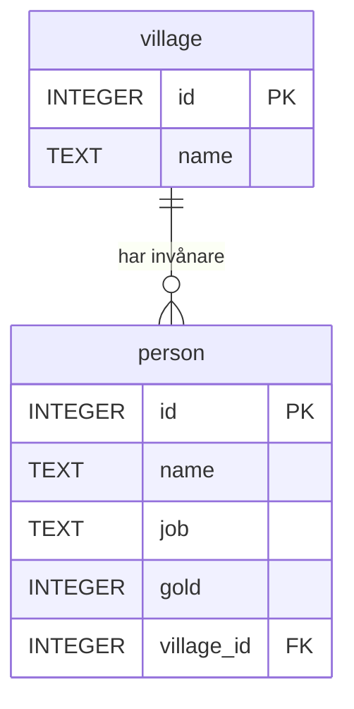
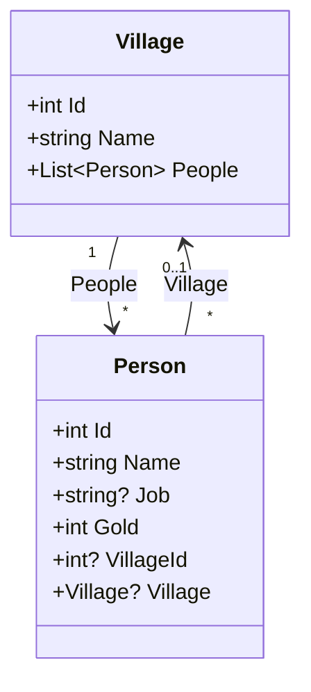

# Från tabell till klass

Du har skrivit klasser. Du har skapat objekt och lagt dem i listor.

Då kan du redan mer om databaser än du tror. En tabell och en klass beskriver nämligen nästan samma sak: *hur en sak ser ut*. Den här sidan går igenom hur en tabell är uppbyggd, del för del, och visar sedan vad varje del motsvarar i C#.

*Exemplen använder [övningsdatan](ovningsdata.md).*

## Hur en tabell är uppbyggd

Så här skapas tabellen `person`:

```sql
CREATE TABLE person (
    id         INTEGER PRIMARY KEY,
    name       TEXT NOT NULL,
    job        TEXT,
    gold       INTEGER NOT NULL DEFAULT 0,
    village_id INTEGER REFERENCES village(id)
);
```

Vi tar den bit för bit.

### Tabellen

`person` är tabellens namn. En tabell beskriver **en sorts sak**: personer, ordrar eller produkter. Allt i tabellen handlar om just den saken.

### Kolumner

`id`, `name`, `job`, `gold` och `village_id` är tabellens **kolumner**. En kolumn är en egenskap som varje rad har.

Varje kolumn har tre delar:

| Del | Exempel | Betyder |
|---|---|---|
| Namn | `gold` | vad egenskapen heter |
| Datatyp | `INTEGER` | vilken sorts värde den får innehålla |
| Regler | `NOT NULL DEFAULT 0` | vilka värden som är tillåtna, och vad som gäller om inget anges |

### Datatyper

| SQLite | SQL Server | Innehåller |
|---|---|---|
| `INTEGER` | `INT` | heltal |
| `REAL` | `FLOAT`, `DECIMAL(10,2)` | decimaltal |
| `TEXT` | `NVARCHAR(100)` | text |
| `INTEGER` (0/1) | `BIT` | sant eller falskt |
| `TEXT` | `DATE`, `DATETIME2` | datum och tid |

SQLite har få och generösa typer. Andra databaser har fler och är strängare, och där bestämmer du ofta också en maxlängd, t.ex. `NVARCHAR(100)`.

### Regler (constraints)

| Regel | Betyder |
|---|---|
| `PRIMARY KEY` | unik för varje rad, och identifierar raden |
| `NOT NULL` | måste ha ett värde |
| `DEFAULT 0` | blir 0 om du inte anger något |
| `REFERENCES village(id)` | måste peka på ett `id` som finns i `village` |
| `UNIQUE` | inga två rader får ha samma värde |

Reglerna är tabellens skydd. Även om koden som skriver till databasen har en bugg kan den inte lägga in en person utan namn. Mer om reglerna finns i [Constraints](../Constraints.md).

### Rader

| id | name | job | gold | village_id |
|---|---|---|---|---|
| 1 | Anna | baker | 120 | 1 |
| 2 | Bertil | smith | 300 | 2 |
| 3 | Cissi | baker | 80 | 1 |
| 4 | David | pilot | 500 | NULL |
| 5 | Eva | merchant | 250 | 2 |

Varje **rad** är en person. `CREATE TABLE` bestämmer *hur* en rad ska se ut, och `INSERT` lägger till rader. Tabellen ovan har fem.

### Nycklar och relationer

`id` är **primärnyckeln** och identifierar varje rad. `village_id` är en **främmande nyckel** som pekar på primärnyckeln i en annan tabell:



Symbolerna på linjen betyder att **en** by kan ha **noll eller flera** personer, och att varje person hör till **högst en** by. Det kallas en **en-till-många-relation**. Läs mer om diagrammet i [ERD](../erd.md).

---

## Samma sak i C#

Nu kommer bron. Så här ser `person` ut som en klass:

```csharp
public class Person
{
    public int Id { get; set; }
    public required string Name { get; set; }
    public string? Job { get; set; }
    public int Gold { get; set; } = 0;
    public int? VillageId { get; set; }
}
```

Lägg dem bredvid varandra:

| SQL | C# | Kommentar |
|---|---|---|
| `CREATE TABLE person` | `public class Person` | ritningen |
| `id INTEGER PRIMARY KEY` | `public int Id { get; set; }` | identiteten |
| `name TEXT NOT NULL` | `public required string Name { get; set; }` | måste anges |
| `job TEXT` | `public string? Job { get; set; }` | får vara tomt |
| `gold INTEGER NOT NULL DEFAULT 0` | `public int Gold { get; set; } = 0;` | standardvärde |
| `village_id INTEGER REFERENCES ...` | `public int? VillageId { get; set; }` | pekar på en by, eller ingen |

### Hela kartan

| I databasen | I C# |
|---|---|
| tabell | klass |
| kolumn | property |
| datatyp | C#-typ |
| rad | objekt, alltså en instans av klassen |
| alla rader i tabellen | `List<Person>` |
| `CREATE TABLE` | att skriva klassen |
| `INSERT` | `new Person { ... }` och `people.Add(...)` |
| `NOT NULL` | en typ som inte är nullable, och gärna `required` |
| `NULL` tillåtet | `?` efter typen: `string?`, `int?` |
| `DEFAULT` | ett startvärde: `= 0` |
| primärnyckel | `Id` |
| främmande nyckel | `VillageId`, plus en referens till objektet |

### Datatyperna

| SQL | C# |
|---|---|
| `INTEGER` / `INT` | `int` (eller `long` för stora tal) |
| `REAL` / `FLOAT` | `double` |
| `DECIMAL(10,2)` | `decimal`, som du ska använda för pengar |
| `TEXT` / `NVARCHAR` | `string` |
| `BIT` | `bool` |
| `DATE` / `DATETIME2` | `DateOnly` / `DateTime` |

### En rad är ett objekt

Raden

| id | name | job | gold | village_id |
|---|---|---|---|---|
| 1 | Anna | baker | 120 | 1 |

är samma sak som objektet

```csharp
var anna = new Person { Id = 1, Name = "Anna", Job = "baker", Gold = 120, VillageId = 1 };
```

och hela tabellen är en lista:

```csharp
List<Person> people =
[
    new() { Id = 1, Name = "Anna",   Job = "baker",    Gold = 120, VillageId = 1 },
    new() { Id = 2, Name = "Bertil", Job = "smith",    Gold = 300, VillageId = 2 },
    new() { Id = 3, Name = "Cissi",  Job = "baker",    Gold = 80,  VillageId = 1 },
    new() { Id = 4, Name = "David",  Job = "pilot",    Gold = 500, VillageId = null },
    new() { Id = 5, Name = "Eva",    Job = "merchant", Gold = 250, VillageId = 2 },
];
```

### `NOT NULL` och `required`

```csharp
var nils = new Person { Name = "Nils" };
// Gold = 0, Job = null, VillageId = null

var ingen = new Person { Gold = 10 };
// Kompileringsfel: Name är required
```

Det är samma beteende som i databasen. En kolumn med `DEFAULT` får sitt standardvärde, en kolumn som tillåter `NULL` blir `null`, och en `NOT NULL`-kolumn utan standardvärde måste du fylla i. Skillnaden är att C# säger ifrån redan när du **kompilerar**, medan databasen säger ifrån när du **kör**.

Läs mer om [required](../../oop/required.md) och [properties](../../oop/properties.md).

**Gammal stil:**

```csharp
// Så skrevs properties förr, och så ser de fortfarande ut i äldre kodbaser
private int _gold = 0;

public int Gold
{
    get { return _gold; }
    set { _gold = value; }
}
```

**Modern stil:**

```csharp
// Auto-property med startvärde. Gör exakt samma sak.
public int Gold { get; set; } = 0;
```

### Främmande nyckel och navigation

I databasen pekar `village_id` på en by med ett **tal**. I C# kan ett objekt peka på ett annat objekt direkt:

```csharp
public class Village
{
    public int Id { get; set; }
    public required string Name { get; set; }
    public List<Person> People { get; set; } = [];
}

public class Person
{
    public int Id { get; set; }
    public required string Name { get; set; }
    public string? Job { get; set; }
    public int Gold { get; set; } = 0;
    public int? VillageId { get; set; }
    public Village? Village { get; set; }
}
```



- `VillageId` är den främmande nyckeln, precis som i tabellen
- `Village` är en **navigation property**: själva by-objektet, så att du kan skriva `anna.Village.Name`
- `People` i `Village` är andra hållet: alla personer i byn

I databasen finns bara `village_id`. Där behövs en [JOIN](join.md) för att gå från en person till byns namn. I C# följer du bara referensen.

Läs mer om relationer i [Entity Framework: relationer](../../entityframework/relationer.md).

## SQL och LINQ

När tabellen är en lista är frågorna nästan samma sak. Här är SQL-frågor från de andra sidorna, översatta till [LINQ](../../datastrukturer/linq.md):

| SQL | LINQ |
|---|---|
| `SELECT name FROM person` | `people.Select(p => p.Name)` |
| `WHERE gold >= 250` | `people.Where(p => p.Gold >= 250)` |
| `ORDER BY gold DESC LIMIT 3` | `people.OrderByDescending(p => p.Gold).Take(3)` |
| `SELECT COUNT(*) ... WHERE job = 'baker'` | `people.Count(p => p.Job == "baker")` |
| `GROUP BY job` | `people.GroupBy(p => p.Job)` |
| `JOIN village ON ...` | `people.Join(villages, p => p.VillageId, v => v.Id, ...)` |

```csharp
var rich = people
    .Where(p => p.Gold >= 250)
    .Select(p => p.Name);
// Bertil, David, Eva, exakt som i SQL
```

Ordningen skiljer sig lite. I SQL skriver du `SELECT` först, men i LINQ kommer `Select` sist. LINQ följer alltså samma ordning som databasen faktiskt **kör** frågan i (se [översikten](index.md#i-vilken-ordning-kör-databasen-frågan)).

## 💡 Där liknelsen tar slut

En tabell och en klass är lika, men inte identiska. Här är skillnaderna som brukar ställa till det.

### `NULL` är inte `null`

```csharp
people.Where(p => p.VillageId != 1).Select(p => p.Name);
// Bertil, David, Eva
```

```sql
SELECT name FROM person WHERE village_id <> 1;
-- Bertil, Eva
```

Samma fråga, olika svar. David saknas i SQL!

I C# är `null != 1` **sant**. I SQL är `NULL <> 1` **okänt**, eftersom `NULL` betyder "vi vet inte". Och `WHERE` släpper bara igenom det som är sant. Läs mer under `NULL` på sidan [WHERE](where.md).

Det här är värt att komma ihåg när du senare skriver LINQ mot en databas med Entity Framework. Där översätts din C# till SQL, och då är det SQL:s regler som gäller.

### En tabell har ingen ordning

En `List<Person>` har en ordning: Anna är på index 0. En tabell har det inte. Raderna kommer i den ordning databasen vill, om du inte skriver [ORDER BY](order-by.md).

### En klass kan göra saker

```csharp
public class Person
{
    // ...
    public bool CanAfford(int price) => Gold >= price;
}
```

En klass har **beteende**: metoder, validering och logik. En tabell har bara **data**. Tabellen säger hur en person *ser ut*, aldrig vad en person *gör*.

### Många-till-många kräver en extra tabell

Säg att en person kan ha många verktyg, och att ett verktyg kan delas av många personer. I C# är det enkelt:

```csharp
public List<Tool> Tools { get; set; } = [];   // i Person
public List<Person> Owners { get; set; } = []; // i Tool
```

En kolumn i en tabell kan bara innehålla **ett** värde. Därför behövs en tredje tabell som bara håller ihop paren:

```sql
CREATE TABLE person_tool (
    person_id INTEGER REFERENCES person(id),
    tool_id   INTEGER REFERENCES tool(id),
    PRIMARY KEY (person_id, tool_id)
);
```

Den kallas **kopplingstabell** (junction table). Den har ingen motsvarighet som egen klass i C#, men den behövs alltid i databasen.

### Arv finns inte

En klass kan ärva från en annan. En tabell kan det inte. Det finns sätt att lagra arv i databaser, men inget av dem är lika enkelt som `class Baker : Person`.

## Det här är vad en ORM gör

Allt på den här sidan, alltså att översätta mellan tabeller och klasser, rader och objekt, och SQL och LINQ, är precis vad en **ORM** (Object-Relational Mapper) gör åt dig. I .NET heter den vanligaste **Entity Framework Core**.

Du skriver klasserna, och EF Core skapar tabellerna. Du skriver LINQ, och EF Core skriver SQL. Men det är fortfarande tabeller och SQL under ytan, och därför är det värt att förstå båda sidorna. Läs mer i [Entity Framework: entiteter](../../entityframework/entiteter.md).

### Clean Code: tabell och klass

> Så här håller du de två världarna i takt.

```csharp
// ❌ Typerna stämmer inte med tabellen
public class Person
{
    public string Id { get; set; }          // id är ett heltal
    public string Name { get; set; }        // NOT NULL, men inget hindrar null
    public string Job { get; set; }         // får vara NULL, men typen säger nej
    public double Gold { get; set; }        // tabellen har heltal
    public int VillageId { get; set; }      // David har ingen by. Vad blir det?
}
```

```csharp
// ✅ Klassen säger samma sak som tabellen
public class Person
{
    public int Id { get; set; }
    public required string Name { get; set; }
    public string? Job { get; set; }
    public int Gold { get; set; } = 0;
    public int? VillageId { get; set; }
}
```

- **Samma regler på båda sidor.** `NOT NULL` blir en typ som inte är nullable, och tillåtet `NULL` blir `?`.
- **Samma datatyp.** Ett heltal i databasen ska inte bli `string` eller `double` i koden.
- **`decimal` för pengar**, i både databasen och koden
- **Namnkonventioner:** `snake_case` är vanligt i databaser (`village_id`), och `PascalCase` i C# (`VillageId`). En ORM översätter mellan dem.

> 💬 *Det här är hur jag brukar göra. Vissa team använder PascalCase även i databasen, och det fungerar lika bra. Det viktiga är att det är konsekvent.*

## Vanliga misstag

| Misstag | Vad händer? | Gör så här i stället |
|---|---|---|
| `int VillageId` när kolumnen tillåter `NULL` | `null` blir `0`, eller ger ett fel vid inläsning | `int? VillageId` |
| `string Name` utan `required` för en `NOT NULL`-kolumn | Objekt utan namn kan skapas, och felet syns först i databasen | `required string Name` |
| `double` för pengar | Avrundningsfel, t.ex. 0.1 + 0.2 = 0.30000000000000004 | `decimal` |
| Tro att `NULL` i SQL fungerar som `null` i C# | Rader med `NULL` försvinner i `WHERE` | `IS NULL` / `IS NOT NULL` i SQL |
| Lägga en lista i en kolumn | Går inte, eftersom en kolumn har ett värde per rad | En egen tabell, eller en kopplingstabell |

## Sammanfattning

- En **tabell** är en ritning, precis som en **klass**.
- En **kolumn** motsvarar en **property** och en **rad** motsvarar ett **objekt**.
- `NOT NULL` motsvarar en typ som inte är nullable, och tillåtet `NULL` motsvarar `?`. `DEFAULT` motsvarar ett startvärde.
- En **främmande nyckel** är ett tal i databasen, men kan bli en **referens** till ett objekt i C#.
- Liknelsen tar slut vid `NULL`, ordning, beteende, många-till-många och arv.
- En **ORM** som Entity Framework Core översätter mellan de två världarna åt dig.

## Övningar

### 🟢 Övning 1: Village som klass

Skriv en C#-klass som motsvarar tabellen `village`:

```sql
CREATE TABLE village (
    id   INTEGER PRIMARY KEY,
    name TEXT NOT NULL
);
```

<details>
<summary>💡 Klicka här för ett lösningsförslag</summary>

Din lösning kan se annorlunda ut och ändå vara helt korrekt!

```csharp
public class Village
{
    public int Id { get; set; }
    public required string Name { get; set; }
}
```

`name` är `NOT NULL`, så `Name` är en `string` som inte är nullable, och `required` gör att den måste anges.

</details>

### 🟡 Övning 2: Från tabell till klass

Skriv en C#-klass som motsvarar den här tabellen:

```sql
CREATE TABLE product (
    id          INTEGER PRIMARY KEY,
    name        TEXT NOT NULL,
    description TEXT,
    price       DECIMAL(10,2) NOT NULL,
    in_stock    INTEGER NOT NULL DEFAULT 0
);
```

<details>
<summary>💡 Klicka här för ett lösningsförslag</summary>

Din lösning kan se annorlunda ut och ändå vara helt korrekt!

```csharp
public class Product
{
    public int Id { get; set; }
    public required string Name { get; set; }
    public string? Description { get; set; }
    public decimal Price { get; set; }
    public int InStock { get; set; } = 0;
}
```

- `description` tillåter `NULL`, alltså blir den `string?`
- `price` är `DECIMAL`, alltså blir den `decimal`, eftersom det är pengar
- `in_stock` har `DEFAULT 0`, och det blir `= 0`
- `snake_case` blir `PascalCase`: `in_stock` blir `InStock`

</details>

### 🟡 Övning 3: Från klass till tabell

Skriv `CREATE TABLE` för den här klassen:

```csharp
public class Book
{
    public int Id { get; set; }
    public required string Title { get; set; }
    public string? Subtitle { get; set; }
    public int Pages { get; set; } = 0;
    public int? AuthorId { get; set; }
}
```

Tänk dig att det finns en tabell `author` med en `id`-kolumn.

<details>
<summary>💡 Klicka här för ett lösningsförslag</summary>

Din lösning kan se annorlunda ut och ändå vara helt korrekt!

```sql
CREATE TABLE book (
    id        INTEGER PRIMARY KEY,
    title     TEXT NOT NULL,
    subtitle  TEXT,
    pages     INTEGER NOT NULL DEFAULT 0,
    author_id INTEGER REFERENCES author(id)
);
```

- `required string` blir `NOT NULL`
- `string?` och `int?` tillåter `NULL`, så de får ingen regel
- `= 0` blir `DEFAULT 0`. `int` utan `?` kan aldrig vara `null`, så kolumnen blir också `NOT NULL`
- `AuthorId` blir en främmande nyckel

</details>

### 🔴 Övning 4: Samma fråga, olika svar

Kör den här C#-koden med listan `people` från sidan:

```csharp
var result = people.Where(p => p.VillageId != 2).Select(p => p.Name);
```

Skriv sedan motsvarande SQL-fråga. Får du samma svar? Förklara skillnaden, och skriv om SQL-frågan så att den ger samma svar som C#.

<details>
<summary>💡 Klicka här för ett lösningsförslag</summary>

Din lösning kan se annorlunda ut och ändå vara helt korrekt!

C# ger **Anna, Cissi, David**.

```sql
SELECT name FROM person WHERE village_id <> 2;
-- Anna, Cissi
```

SQL ger **Anna, Cissi**. David saknas.

I C# är `null != 2` sant, men i SQL är `NULL <> 2` okänt, och `WHERE` släpper bara igenom det som är sant. För att få samma svar som C# måste du fråga efter `NULL` uttryckligen:

```sql
SELECT name
FROM person
WHERE village_id <> 2
   OR village_id IS NULL;
-- Anna, Cissi, David
```

Kom ihåg det här när du börjar med Entity Framework. Där skrivs din LINQ om till SQL, och EF Core lägger till `IS NULL`-kontrollen åt dig i just det här fallet, så att C#-svaret behålls. Men den som skriver SQL för hand måste själv tänka på det.

</details>

---

[Tillbaka till översikten](index.md)

Du kunde redan klasser. Nu ser du att du har kunnat tänka i tabeller hela tiden. Snyggt jobbat! 💪

*Av Marcus Ackre Medina · Nion Education · marcus.medina@nionit.com*
