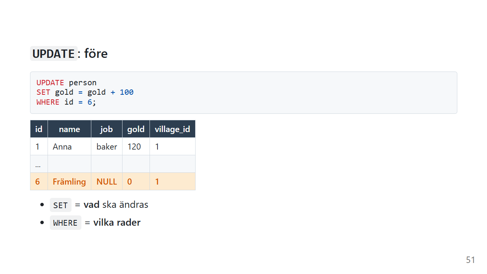
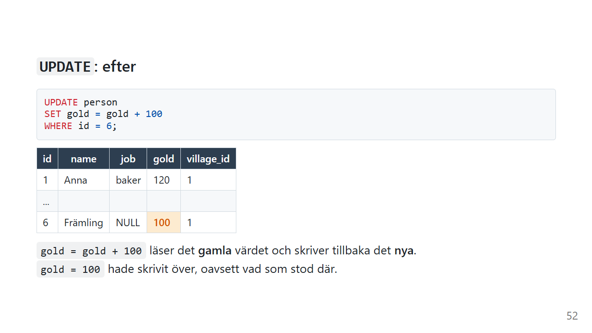
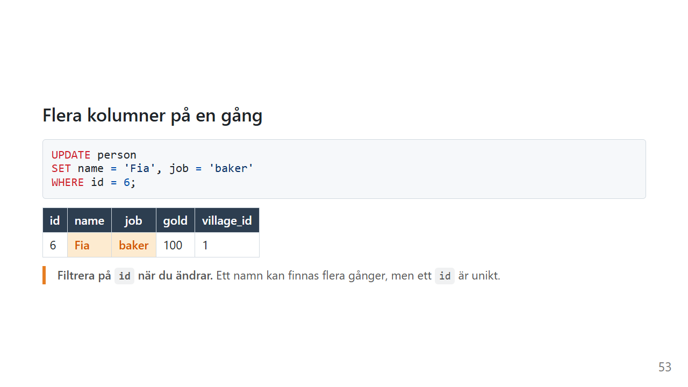
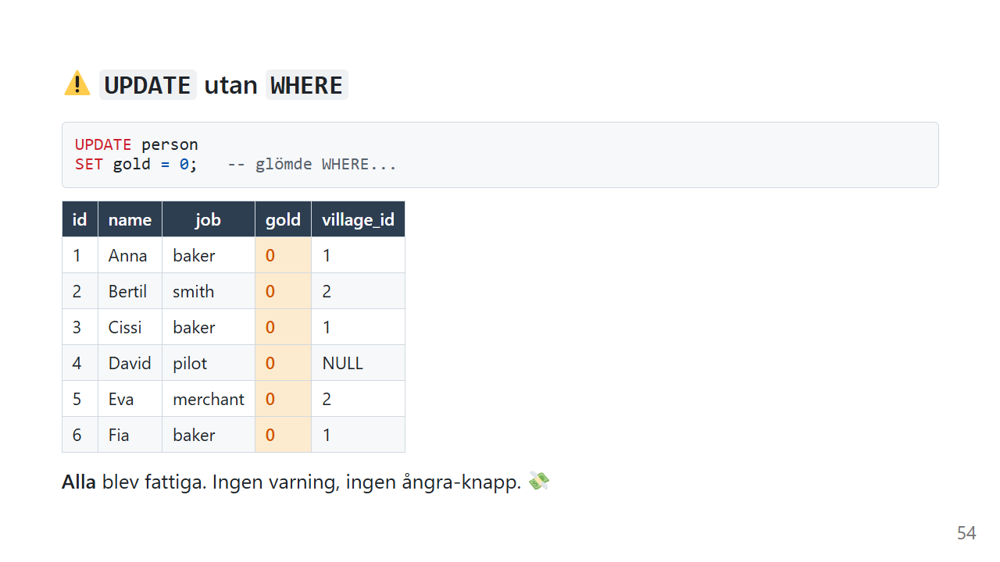
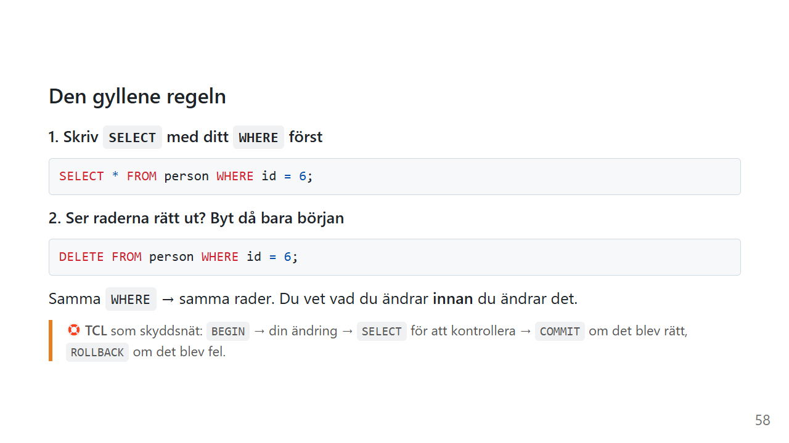

# UPDATE: ändra rader

Någon byter adress. En order skickas. Ett pris höjs. Data som redan finns behöver ändras hela tiden.

`UPDATE` är också det kommando som har förstört flest databaser. Inte för att det är svårt, utan för att det är så **lätt** att glömma en enda rad. Den här sidan handlar lika mycket om hur du använder `UPDATE` säkert som om hur det fungerar.

*Exemplen använder [övningsdatan](ovningsdata.md), plus Främlingen från [INSERT](insert.md)-sidan. Har du inte Främlingen kan du lägga till hen så här:*

```sql
INSERT INTO person (name, job, gold, village_id)
VALUES ('Främling', NULL, 0, 1);
```

## Vad gör UPDATE?



```sql
UPDATE person
SET gold = gold + 100
WHERE id = 6;
```

På svenska:

> *I tabellen person, sätt gold till det gamla värdet plus 100, men bara på raden med id 6.*



Ett `UPDATE` har tre delar:

| Del | Säger |
|---|---|
| `UPDATE person` | **vilken tabell** |
| `SET gold = gold + 100` | **vad** som ska ändras |
| `WHERE id = 6` | **vilka rader** |

## `gold = gold + 100` eller `gold = 100`?

`gold = gold + 100` läser det **gamla** värdet, lägger till 100 och skriver tillbaka resultatet. Om Främlingen hade 40 får hen 140.

`gold = 100` skriver över. Om Främlingen hade 40, eller 4000, får hen 100.

Båda är rätt, men de gör olika saker. Läs frågan högt och kontrollera att den säger det du menar.

## Flera kolumner på en gång



```sql
UPDATE person
SET name = 'Fia', job = 'baker'
WHERE id = 6;
```

Kolumnerna i `SET` separeras med kommatecken. Skriv **inte** `AND` mellan dem. `SET name = 'Fia' AND job = 'baker'` betyder något helt annat, och det blir fel.

## Filtrera på id

Det kan finnas två personer som heter Fia. Det kan aldrig finnas två med `id` 6.

```sql
-- ⚠️ Ändrar alla som heter Fia
UPDATE person SET gold = 0 WHERE name = 'Fia';

-- ✅ Ändrar exakt en rad
UPDATE person SET gold = 0 WHERE id = 6;
```

När du vill ändra **en** sak, filtrera på primärnyckeln.

Ibland vill du förstås ändra många rader på en gång, och då är ett bredare `WHERE` helt rätt:

```sql
UPDATE person
SET gold = gold + 10
WHERE job = 'baker';
```

## ⚠️ Utan WHERE



```sql
UPDATE person
SET gold = 0;   -- glömde WHERE...
```

**Alla** rader ändras. Ingen varning och ingen ångra-knapp.

Det här är inte en teoretisk risk. Det är en av de vanligaste orsakerna till att produktionsdata förstörs. Det räcker att markera bara den första raden av frågan i ett databasverktyg och trycka på *Kör*.

## Den gyllene regeln



1. **Skriv `SELECT` med ditt `WHERE` först**

   ```sql
   SELECT * FROM person WHERE job = 'baker';
   ```

2. **Ser raderna rätt ut? Byt då bara början**

   ```sql
   UPDATE person SET gold = gold + 10 WHERE job = 'baker';
   ```

Samma `WHERE` ger samma rader. Du vet vad du ändrar **innan** du ändrar det.

### Skyddsnät: transaktion

```sql
BEGIN TRANSACTION;

UPDATE person SET gold = gold + 10 WHERE job = 'baker';

SELECT * FROM person;   -- ser det rätt ut?

COMMIT;                 -- ja, spara
-- ROLLBACK;            -- nej, ångra allt sedan BEGIN
```

Inuti en transaktion kan du titta på resultatet innan något sparas på riktigt. Mer om det i [Transaktioner](../transaktioner.md).

## UPDATE med en subquery

Du vet byns namn, men inte dess id:

```sql
UPDATE person
SET village_id = (SELECT id FROM village WHERE name = 'Gurkby')
WHERE id = 6;
```

Subqueryn översätter namnet till ett id. Mer om subqueries på sidan [Subquery](subquery.md).

### Clean Code: UPDATE

> Så här skriver du UPDATE som går att lita på.

```sql
-- ❌ Allt på en rad, och lätt att råka köra bara halva
update person set gold=gold+10,job='baker' where name='Fia'
```

```sql
-- ✅ En del per rad, och filtrerat på id
UPDATE person
SET gold = gold + 10,
    job  = 'baker'
WHERE id = 6;
```

- **`WHERE` på egen rad.** Då syns det direkt om det saknas.
- **Filtrera på id** när du menar en rad
- **En kolumn per rad i `SET`** när du ändrar flera
- **`SELECT` först**, och gärna en transaktion

## Vanliga misstag

| Misstag | Vad händer? | Gör så här i stället |
|---|---|---|
| Glömt `WHERE` | Alla rader ändras | `SELECT` med samma `WHERE` först |
| `WHERE name = 'Fia'` när du menar en person | Alla som heter Fia ändras | `WHERE id = 6` |
| `SET gold = 100` när du menar "lägg till 100" | Det gamla värdet skrivs över | `SET gold = gold + 100` |
| `SET name = 'Fia' AND job = 'baker'` | Tolkas som `name = ('Fia' AND job = 'baker')`. I SQLite blir `name` då texten `'0'`, och `job` ändras inte. | Kommatecken mellan kolumnerna |
| `SET job = 'NULL'` | Kolumnen får texten NULL | `SET job = NULL`, utan citattecken |

## Sammanfattning

- `UPDATE tabell SET kolumn = värde WHERE villkor` ändrar befintliga rader.
- `SET` säger **vad** och `WHERE` säger **vilka**.
- `gold = gold + 100` räknar från det gamla värdet. `gold = 100` skriver över.
- Flera kolumner separeras med kommatecken.
- Utan `WHERE` ändras **alla** rader.
- `SELECT` med samma `WHERE` först, och gärna en transaktion.

## Övningar

Kör [övningsdatan](ovningsdata.md) innan du börjar.

### 🟢 Övning 1: Cissi får betalt

Cissi har sålt bröd och tjänat 20 guld. Uppdatera hennes guld.

<details>
<summary>💡 Klicka här för ett lösningsförslag</summary>

Din lösning kan se annorlunda ut och ändå vara helt korrekt!

```sql
SELECT * FROM person WHERE id = 3;    -- kontrollera först

UPDATE person
SET gold = gold + 20
WHERE id = 3;
```

Cissi går från 80 till 100. `gold + 20` räknar från det hon redan har.

</details>

### 🟡 Övning 2: Eva flyttar

Eva flyttar till Lökby. Uppdatera hennes rad.

<details>
<summary>💡 Klicka här för ett lösningsförslag</summary>

Din lösning kan se annorlunda ut och ändå vara helt korrekt!

```sql
UPDATE person
SET village_id = 1
WHERE id = 5;
```

Med en subquery slipper du veta Lökbys id:

```sql
UPDATE person
SET village_id = (SELECT id FROM village WHERE name = 'Lökby')
WHERE id = 5;
```

</details>

### 🟡 Övning 3: Byte av bana

David tröttnar på att flyga. Han blir bagare och flyttar till Morotsby. Gör det med **en** `UPDATE`.

<details>
<summary>💡 Klicka här för ett lösningsförslag</summary>

Din lösning kan se annorlunda ut och ändå vara helt korrekt!

```sql
UPDATE person
SET job        = 'baker',
    village_id = 3
WHERE id = 4;
```

</details>

### 🔴 Övning 4: Bonus till bagarna, säkert

Alla bagare i Lökby ska få 50 guld extra. Gör det så säkert som möjligt: kontrollera vilka rader som påverkas, gör ändringen så att den kan ångras och kontrollera resultatet innan du sparar. Använd byns **namn**, inte dess id.

<details>
<summary>💡 Klicka här för ett lösningsförslag</summary>

Din lösning kan se annorlunda ut och ändå vara helt korrekt!

```sql
-- 1. Vilka rader gäller det?
SELECT *
FROM person
WHERE job = 'baker'
  AND village_id = (SELECT id FROM village WHERE name = 'Lökby');

-- 2. Ändra inuti en transaktion
BEGIN TRANSACTION;

UPDATE person
SET gold = gold + 50
WHERE job = 'baker'
  AND village_id = (SELECT id FROM village WHERE name = 'Lökby');

-- 3. Kontrollera
SELECT name, gold FROM person;

-- 4. Spara (eller ROLLBACK om något blev fel)
COMMIT;
```

Anna går från 120 till 170 och Cissi från 80 till 130.

Här samlas allt: den gyllene regeln (`SELECT` först), en subquery som översätter bynamnet till ett id, `gold = gold + 50` i stället för att skriva över, och en transaktion som skyddsnät.

</details>

---

Föregående: [INSERT](insert.md) · [Tillbaka till översikten](index.md) · Nästa: [DELETE](delete.md)

*Av Marcus Ackre Medina · Nion Education · marcus.medina@nionit.com*
