# WHERE: välj rader

En riktig tabell kan ha miljontals rader. Du vill nästan aldrig se alla. Du vill se *de rader som spelar roll*: kunden med ett visst id, ordrarna från igår eller produkterna som är slut i lager.

Det är `WHERE` som gör det.

*Exemplen använder [övningsdatan](ovningsdata.md).*

## Vad gör WHERE?

[SELECT](select.md) väljer **kolumner**. `WHERE` väljer **rader**.

Tänk dig `WHERE` som en **dörrvakt**. Varje rad kommer fram till dörren en i taget. Dörrvakten tittar på villkoret och svarar ja eller nej, och bara de rader som får ett ja kommer in i resultatet.

På svenska:

> *Visa alla kolumner från person, men bara för de rader där gold är minst 250.*

```sql
SELECT * FROM person
WHERE gold >= 250;
```

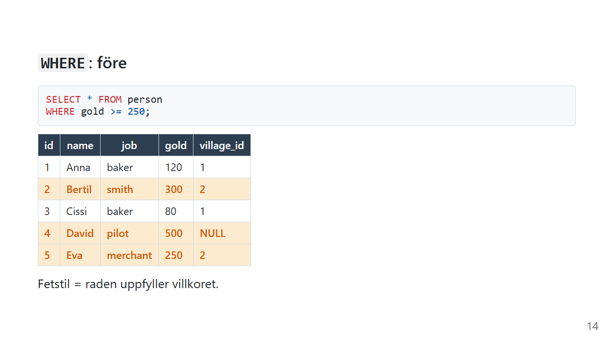

Dörrvakten frågar varje rad: "Har du minst 250 guld?"

| id | name | gold | Får komma in? |
|---|---|---|---|
| 1 | Anna | 120 | ❌ |
| 2 | Bertil | 300 | ✅ |
| 3 | Cissi | 80 | ❌ |
| 4 | David | 500 | ✅ |
| 5 | Eva | 250 | ✅ |

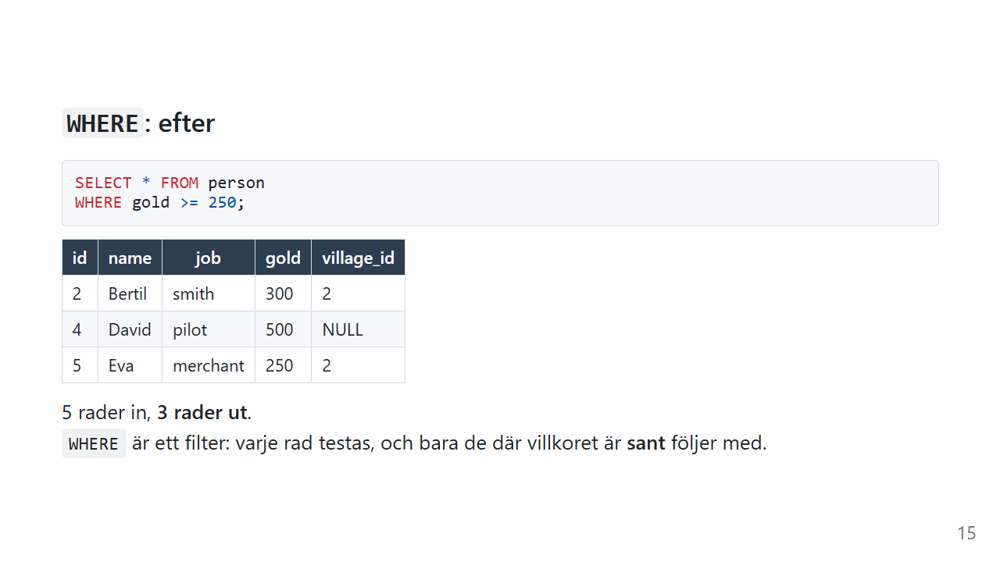

Fem rader in, **tre rader ut**.

## Jämförelser

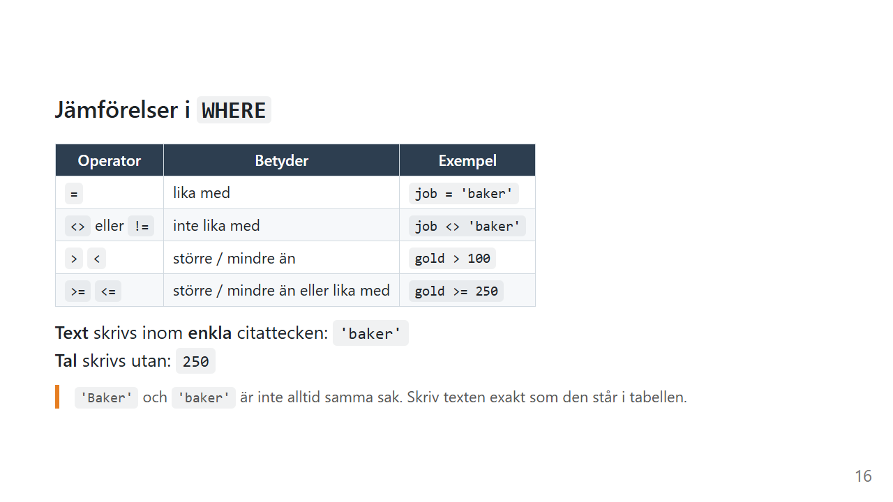

| Operator | Betyder | Exempel |
|---|---|---|
| `=` | lika med | `job = 'baker'` |
| `<>` eller `!=` | inte lika med | `job <> 'baker'` |
| `>` `<` | större / mindre än | `gold > 100` |
| `>=` `<=` | större / mindre än eller lika med | `gold >= 250` |

**Text** skrivs inom **enkla** citattecken (`'baker'`), och **tal** skrivs utan (`250`).

```sql
SELECT * FROM person
WHERE job = 'baker';
```

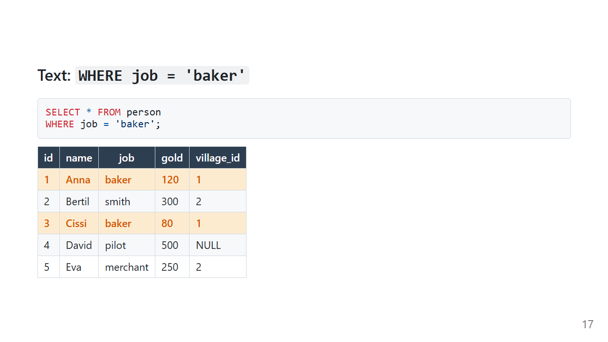

Värdet måste matcha **exakt** det som står i tabellen. Om `'Baker'` och `'baker'` räknas som samma sak beror på databasen och dess inställningar, så räkna inte med det. Osäker på stavningen? Kör `SELECT DISTINCT job FROM person;` först.

## Flera villkor: `AND` och `OR`

### `AND`: båda måste stämma

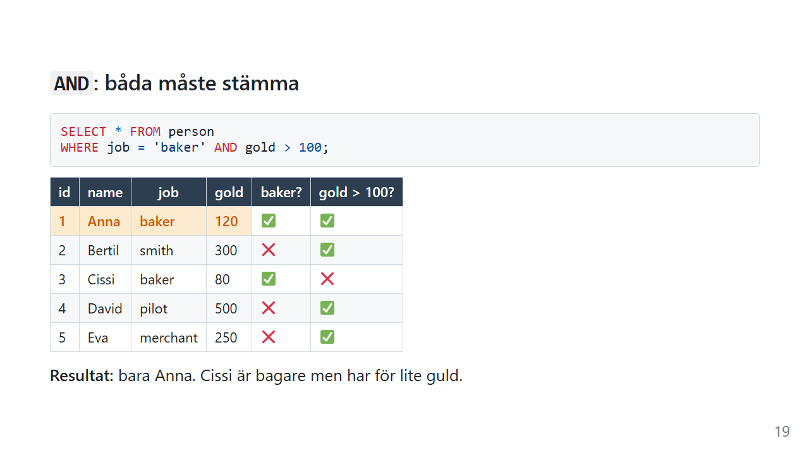

```sql
SELECT * FROM person
WHERE job = 'baker' AND gold > 100;
```

Resultatet är bara Anna. Cissi är bagare, men har för lite guld.

### `OR`: minst ett måste stämma

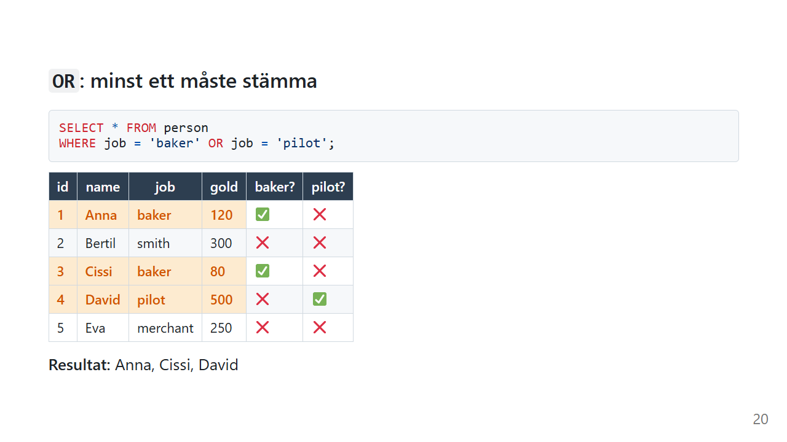

```sql
SELECT * FROM person
WHERE job = 'baker' OR job = 'pilot';
```

Resultatet är Anna, Cissi och David.

### `IN`: ett kortare `OR`

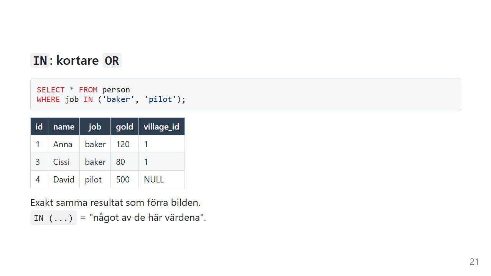

```sql
SELECT * FROM person
WHERE job IN ('baker', 'pilot');
```

Det är exakt samma resultat som med `OR`. `IN (...)` betyder "något av de här värdena", och det blir mycket lättare att läsa när listan växer.

### `NOT`: vänd på villkoret

```sql
SELECT * FROM person
WHERE job NOT IN ('baker', 'pilot');
```

Resultatet är Bertil och Eva. `NOT` fungerar framför de flesta villkor: `NOT IN`, `NOT LIKE` och `NOT BETWEEN`.

## ⚠️ Fällan: `AND` före `OR`

Säg att du vill ha bagare eller piloter som har **mer än 100 guld**:

```sql
-- ❌ Ser rätt ut, men är fel
WHERE job = 'baker' OR job = 'pilot' AND gold > 100
```

SQL läser `AND` före `OR`, precis som gånger kommer före plus i matte. Databasen läser alltså frågan så här:

```sql
WHERE job = 'baker' OR (job = 'pilot' AND gold > 100)
```

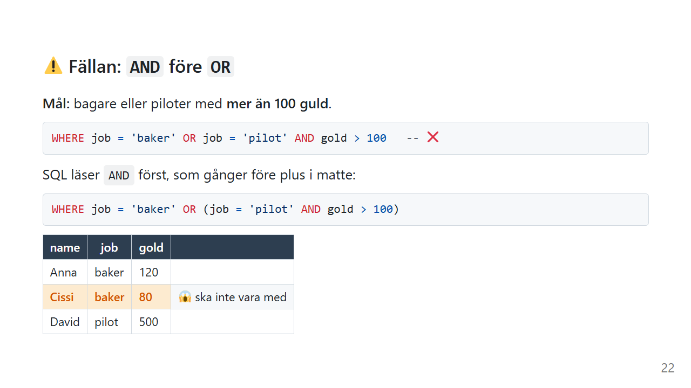

Alla bagare kommer med, oavsett guld, och därför smiter Cissi med sina 80 guld in. Lösningen är parenteser:

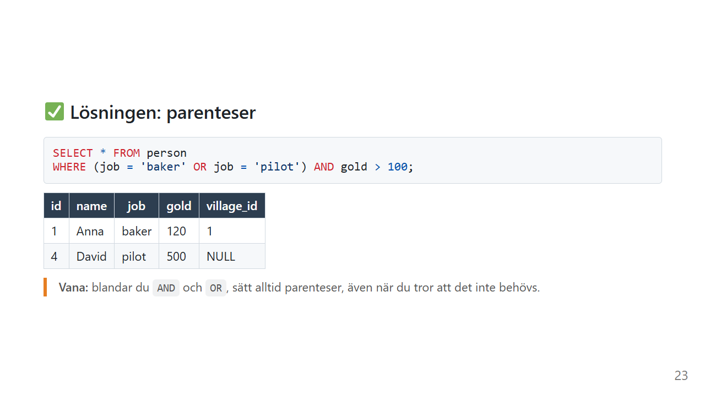

```sql
-- ✅ Säger exakt det du menar
SELECT * FROM person
WHERE (job = 'baker' OR job = 'pilot') AND gold > 100;
```

Nu blir resultatet Anna och David.

Det lömska med den här fällan är att den ofta ger rätt svar *av en slump*, t.ex. när det råkar finnas data som döljer felet. Sedan ändras datan, och frågan börjar ge fel resultat utan att någon har rört koden.

## `LIKE`: när du bara vet en del

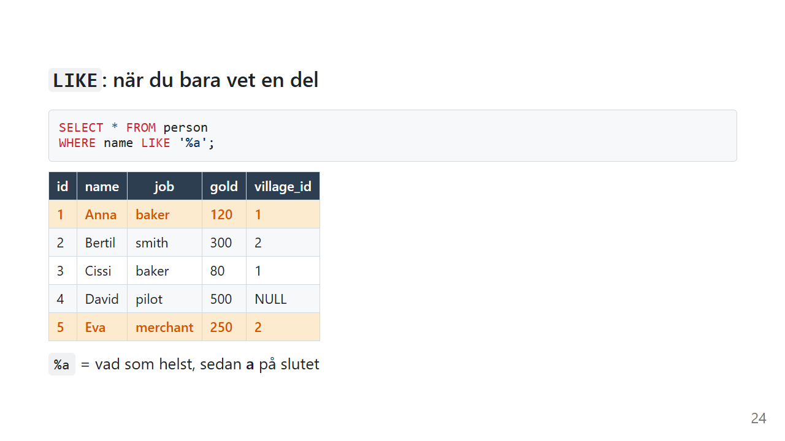

```sql
SELECT * FROM person
WHERE name LIKE '%a';
```

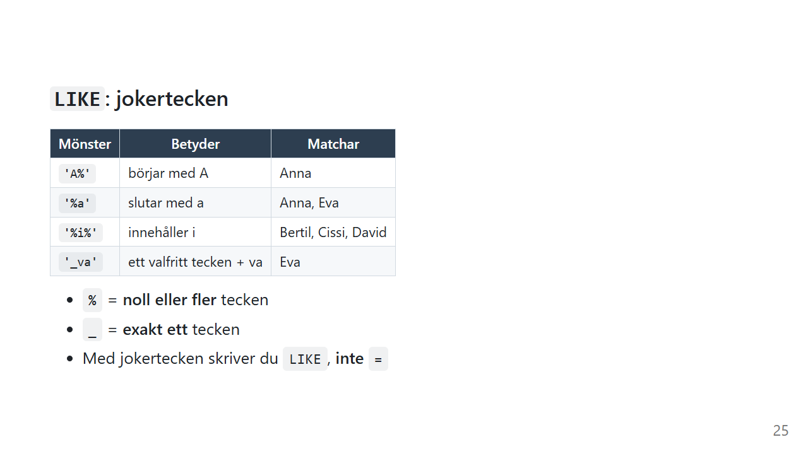

| Mönster | Betyder | Matchar |
|---|---|---|
| `'A%'` | börjar med A | Anna |
| `'%a'` | slutar med a | Anna, Eva |
| `'%i%'` | innehåller i | Bertil, Cissi, David |
| `'_va'` | ett valfritt tecken, sedan va | Eva |

- `%` betyder **noll eller fler** tecken
- `_` betyder **exakt ett** tecken
- Med jokertecken skriver du `LIKE`, **inte** `=`

`LIKE` är perfekt när du vet förnamnet men inte efternamnet (`name LIKE 'Anna%'`), eller när ett värde *innehåller* något du letar efter (`plate LIKE '%ABC%'`).

I SQLite skiljer `LIKE` inte på stora och små bokstäver för a–z, så `'a%'` matchar också Anna. I andra databaser beror det på inställningarna.

## `BETWEEN`: ett intervall

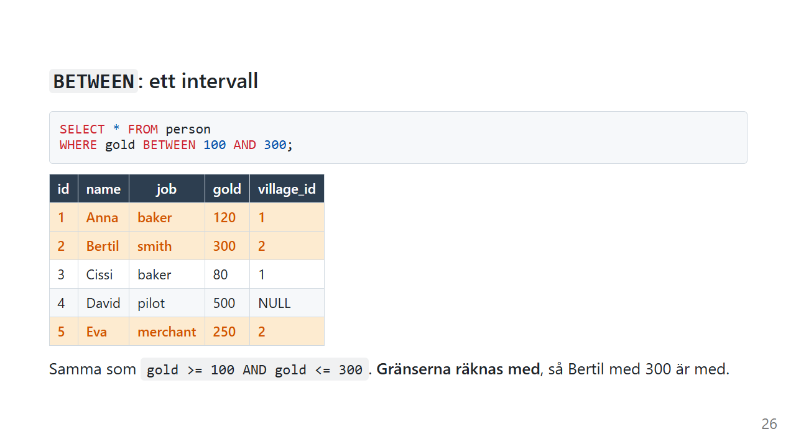

```sql
SELECT * FROM person
WHERE gold BETWEEN 100 AND 300;
```

Det är samma sak som `gold >= 100 AND gold <= 300`. **Gränserna räknas med**, så Bertil med exakt 300 är med. Resultatet är Anna, Bertil och Eva.

`BETWEEN` fungerar också på datum: `WHERE order_date BETWEEN '2026-01-01' AND '2026-01-31'`.

## `NULL`: inget värde

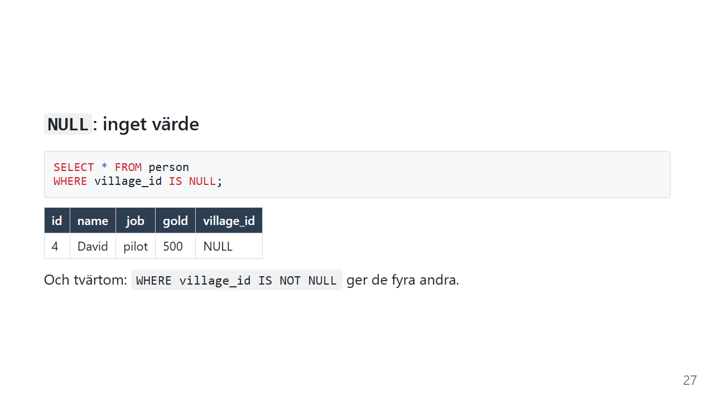

```sql
SELECT * FROM person
WHERE village_id IS NULL;
```

Det ger David. Och tvärtom: `IS NOT NULL` ger de fyra andra.

### ⚠️ Fällan: `= NULL`

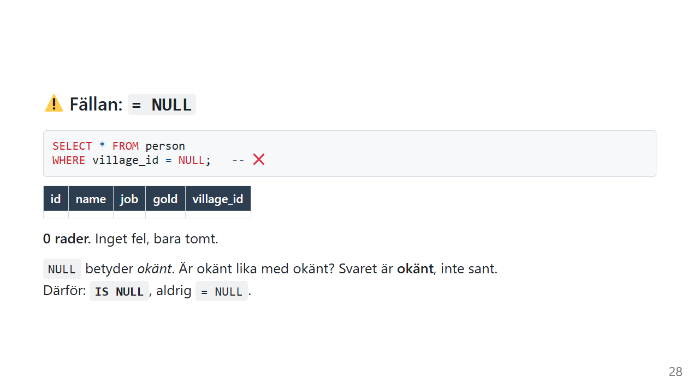

```sql
-- ❌ Ger 0 rader. Inget felmeddelande, bara tomt.
SELECT * FROM person
WHERE village_id = NULL;
```

`NULL` betyder *okänt*. Är okänt lika med okänt? Svaret är **okänt**, inte sant. Och dörrvakten släpper bara in rader där svaret är *sant*.

Därför: **`IS NULL`**, aldrig `= NULL`.

### Clean Code: WHERE

> Så här skriver du villkor som går att läsa, och som säger det du menar.

```sql
-- ❌ Allt på en rad, och vad gäller egentligen?
SELECT * FROM person WHERE job='baker' OR job='pilot' AND gold>100 AND village_id IS NOT NULL
```

```sql
-- ✅ Ett villkor per rad, och parenteserna visar tanken
SELECT name, job, gold
FROM person
WHERE job IN ('baker', 'pilot')
  AND gold > 100
  AND village_id IS NOT NULL;
```

- **Ett villkor per rad**, med `AND` eller `OR` först på raden. Då ser du direkt hur de hänger ihop.
- **Parenteser** så fort du blandar `AND` och `OR`, även när du tror att det inte behövs
- **`IN`** i stället för många `OR` på samma kolumn
- **Mellanslag runt operatorer**: `gold > 100`, inte `gold>100`

> 💬 *Det här är hur jag brukar formatera villkor. Har ditt team en annan stil som är lika läsbar? Kör på den.*

## Vanliga misstag

| Misstag | Vad händer? | Gör så här i stället |
|---|---|---|
| `WHERE village_id = NULL` | 0 rader, inget felmeddelande | `WHERE village_id IS NULL` |
| `AND` och `OR` utan parenteser | Fel rader smiter med | Sätt parenteser |
| `WHERE job = "baker"` | Dubbla citattecken betyder *kolumnnamn* i SQL | `'baker'` med enkla citattecken |
| `WHERE name = 'Ann%'` | Letar efter texten `Ann%` bokstavligen | `WHERE name LIKE 'Ann%'` |
| `WHERE gold > '100'` | Jämför tal med text, vilket kan ge konstiga resultat | Tal utan citattecken: `gold > 100` |
| `WHERE village_id NOT IN (1)` och förvänta sig David | `NULL` är varken i eller utanför listan, så David försvinner | Lägg till `OR village_id IS NULL` |

## Sammanfattning

- `WHERE` väljer **rader**. Varje rad testas, och bara de där villkoret är **sant** kommer med.
- Text inom `'enkla citattecken'` och tal utan.
- `AND` kräver båda, `OR` kräver minst ett och `IN` är ett kortare `OR`.
- `AND` binder hårdare än `OR`, så **sätt parenteser**.
- `LIKE` med `%` och `_` när du bara vet en del.
- `BETWEEN` räknar med gränserna.
- `IS NULL`, aldrig `= NULL`.

## Övningar

Använd [övningsdatan](ovningsdata.md).

### 🟢 Övning 1: Inte bagare

Visa alla som **inte** är bagare.

<details>
<summary>💡 Klicka här för ett lösningsförslag</summary>

Din lösning kan se annorlunda ut och ändå vara helt korrekt!

```sql
SELECT *
FROM person
WHERE job <> 'baker';
```

Resultatet är Bertil, David och Eva. `!=` fungerar lika bra i de flesta databaser.

</details>

### 🟢 Övning 2: Fattigast

Visa namn och guld för alla som har mindre än 100 guld.

<details>
<summary>💡 Klicka här för ett lösningsförslag</summary>

Din lösning kan se annorlunda ut och ändå vara helt korrekt!

```sql
SELECT name, gold
FROM person
WHERE gold < 100;
```

Resultatet är Cissi med 80.

</details>

### 🟢 Övning 3: Bokstaven i

Vilka personer har bokstaven `i` någonstans i namnet?

<details>
<summary>💡 Klicka här för ett lösningsförslag</summary>

Din lösning kan se annorlunda ut och ändå vara helt korrekt!

```sql
SELECT name
FROM person
WHERE name LIKE '%i%';
```

Resultatet är Bertil, Cissi och David. `%` på båda sidor betyder "var som helst i namnet".

</details>

### 🟡 Övning 4: Bagare och smeder med pengar

Visa alla bagare och smeder som har **minst** 100 guld.

<details>
<summary>💡 Klicka här för ett lösningsförslag</summary>

Din lösning kan se annorlunda ut och ändå vara helt korrekt!

```sql
SELECT *
FROM person
WHERE job IN ('baker', 'smith')
  AND gold >= 100;
```

Resultatet är Anna och Bertil. Med `OR` i stället för `IN` hade du behövt parenteser:

```sql
SELECT *
FROM person
WHERE (job = 'baker' OR job = 'smith')
  AND gold >= 100;
```

</details>

### 🟡 Övning 5: Bofasta som inte bakar

Visa alla som bor i en by men inte är bagare.

<details>
<summary>💡 Klicka här för ett lösningsförslag</summary>

Din lösning kan se annorlunda ut och ändå vara helt korrekt!

```sql
SELECT *
FROM person
WHERE village_id IS NOT NULL
  AND job <> 'baker';
```

Resultatet är Bertil och Eva. David är inte bagare, men han bor inte i någon by.

</details>

### 🔴 Övning 6: Var är David?

Någon vill se alla som **inte** bor i by 1 och skriver:

```sql
SELECT *
FROM person
WHERE village_id NOT IN (1);
```

Resultatet blir Bertil och Eva. Men David bor ju inte i by 1 heller! Varför saknas han, och hur ser en fråga ut som tar med honom?

<details>
<summary>💡 Klicka här för ett lösningsförslag</summary>

Din lösning kan se annorlunda ut och ändå vara helt korrekt!

Davids `village_id` är `NULL`, alltså *okänt*. Är okänt skilt från 1? Svaret är *okänt*, inte sant, och dörrvakten släpper bara in det som är sant. Det är samma sak som med `= NULL`.

Du måste fråga efter `NULL` uttryckligen:

```sql
SELECT *
FROM person
WHERE village_id NOT IN (1)
   OR village_id IS NULL;
```

Nu blir resultatet Bertil, David och Eva.

Det här är en av de vanligaste buggarna i riktig SQL. Den syns inte förrän det råkar finnas `NULL` i datan.

</details>

---

Föregående: [SELECT](select.md) · [Tillbaka till översikten](index.md) · Nästa: [ORDER BY](order-by.md)
