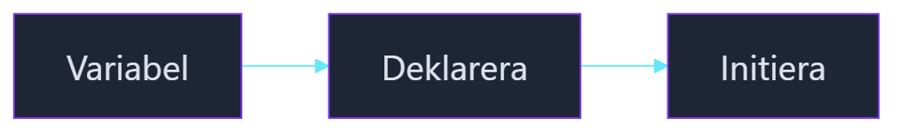

---
title: Variabler
layout: default
author: Campus Mölndal
author_github: CampusMolndalEducation
author_url: "https://github.com/CampusMolndalEducation"
school: Campus Mölndal
date: "2025-08-18 15:37:40"
updated: "2025-09-06 23:35:21"
parent: C# bok
nav_order: 20
has_children: True
---
# Variabler

En variabel är en behållare som används för att lagra data. I C# måste alla variabler deklareras innan de kan användas. Detta innebär att du måste ange vilken typ av data som variabeln kommer att lagra.



<!-- mermaid: diagrams/index_1.mmd -->

## Exempel

```csharp
// Deklarera en variabel av typen int.
int number = 1138;

// Deklarera en variabel av typen string.
string name = "Obi Wan Kenobi";

// Deklarera en variabel av typen bool.
bool isJedi = true;

// Deklarera en variabel av typen double.
double pi = 3.14;

// Deklarera en variabel av typen char.
char letter = 'J';
```

I detta exempel har vi deklarerat fem variabler. Den första är en int, vilket innebär att den kan lagra heltal. Den andra är en sträng, vilket innebär att den kan lagra text. Den tredje är en bool, vilket innebär att den kan lagra sant eller falskt. Den fjärde är en double, vilket innebär att den kan lagra decimaltal. Den femte är en char, vilket innebär att den kan lagra ett tecken.
