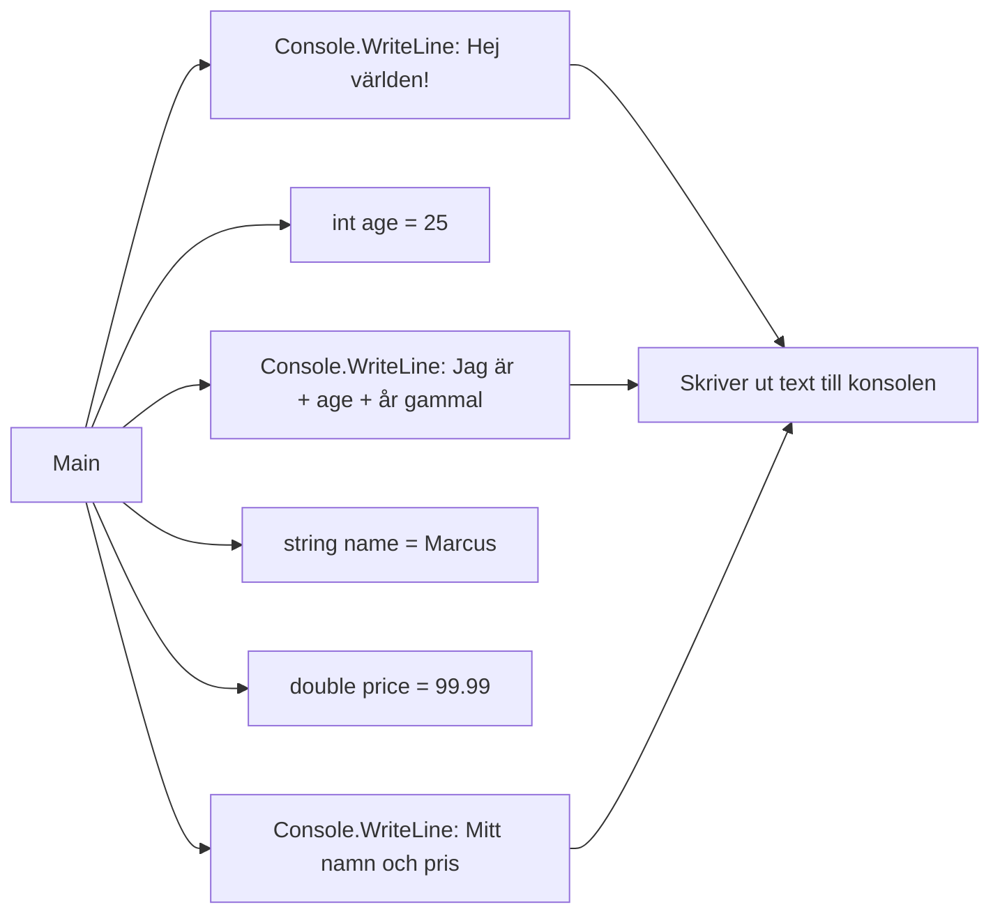

# Enkla utskrifter

## 🧠 Syfte

Det här kapitlet är din introduktion till att prata med datorn!  Vi ska lära oss hur man får C-Sharp att
visa text och siffror på skärmen.  Tänk dig det som att lära din dator att prata –  först enkla
meningar, sen mer komplexa konversationer!  Det är grundläggande, men superviktigt för allt framtida
programmerande.

## 💻 Koden

```csharp

using System;

public class HelloWorld
{
    public static void Main(string[] args)
    {
        Console.WriteLine("Hej världen!"); // Skriver ut en hälsning
        int age = 25;
        Console.WriteLine("Jag är " + age + " år gammal."); // Skriver ut en mening med ett värde
        string name = "Marcus";
        double price = 99.99;
        Console.WriteLine($"Mitt namn är {name} och priset är {price:C}"); // String interpolation - smidigare sätt!
    }
}

```

## 📋 Förklaring

Låt oss bryta ner koden steg för steg.  Det är enklare än du tror!

1. **`using System;`**:  Den här raden importerar `System`-biblioteket.  Tänk på det som att hämta
en verktygslåda med färdiga verktyg (funktioner) för att göra saker som att skriva ut text.  Vi
behöver den för `Console.WriteLine`.

2. **`public class HelloWorld`**: Vi skapar en klass som heter `HelloWorld`.  En klass är som en
ritning för ett hus – den beskriver vad programmet ska göra.  "HelloWorld" är bara ett namn, vi
kunde lika gärna ha kallat den "MittFörstaProgram".

3. **`public static void Main(string[] args)`**:  Detta är huvudfunktionen, där allt börjar.  Tänk
på den som "huvudentrén" till ditt program.  Koden inuti `Main`-funktionen körs först.

4. **`Console.WriteLine("Hej världen!");`**:  Här ser vi den magiska delen! `Console.WriteLine` är
ett av våra verktyg från `System`-biblioteket.  Den tar en textsträng (texten inom citationstecken)
och skriver ut den på konsolen (kommandotolken eller liknande).  "Hej världen!" är en klassisk
första utskrift för alla programmerare.  Känn dig stolt!

5. **`int age = 25;`**:  Vi deklarerar en variabel som heter `age` och tilldelar den värdet 25.  En
variabel är som en behållare för data.  `int` betyder att det är ett heltal (inga decimaler).

6. **`Console.WriteLine("Jag är " + age + " år gammal.");`**:  Här skriver vi ut en mening som
inkluderar värdet av variabeln `age`.  Vi använder plustecknet (`+`) för att "limma ihop" strängar
och tal.

7. **`string name = "Marcus";`  `double price = 99.99;`**: Vi skapar variabler för namn (`string`
för text) och pris (`double` för decimaltal).

8. **`Console.WriteLine($"Mitt namn är {name} och priset är {price:C}");`**:  Det här är "string
interpolation" – ett smartare sätt att lägga in variabler i strängar.  Klammerparenteserna `{}` runt
`name` och `price` säger åt datorn att ersätta dem med värdena från variablerna.  `{price:C}`
formaterar priset som valuta (kronor).



Detta diagram visar flödet av programmet.


**Tänk dig det så här:** `Console.WriteLine` är som en skrivare. Du ger den text eller variabler, och den skriver ut det på skärmen.

**Vanliga misstag:**

* **Glömma semikolon:**  C-Sharp kräver semikolon (`;`) i slutet av varje rad. Glömmer du det, får du ett felmeddelande.
* **Felaktig syntax:** Se upp för stavfel och felaktig användning av parenteser och citationstecken.

**Proffstips:**  Använd alltid meningsfulla namn för dina variabler (som `age`, `name`, `price`), så blir koden lättare att förstå.  String interpolation (`$"..."`) är mycket mer läsbart än att använda "+".


## 📚 Sammanfattning

* Vi lärde oss hur man använder `Console.WriteLine` för att skriva ut text till konsolen.
* Vi lärde oss att använda variabler för att lagra data.
* Vi lärde oss att använda string interpolation för att skriva ut variabler i strängar.

Du har tagit ditt första steg in i C-Sharp-världen!  Snyggt jobbat!

## 😄 Obligatoriskt pappaskämt

Vad kallar man en programmerare som inte kan sova?  En stack overflow!

---
Nu har du verktygen. Använd dem, missbruka dem, lär dig av misstagen. Det är vägen.
